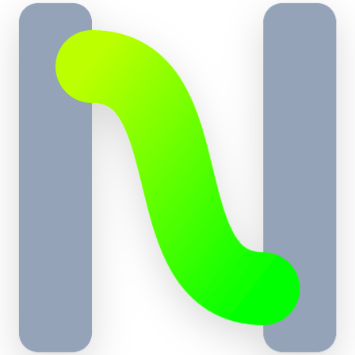

<div align="center">
  
  <h1>SkCC</h1>
  <p><b><i>Write Once, Run Anywhere for AI Agent Skills</i></b></p>
  <p>
    
    
    
  </p>
  
  **中文版** | **[English](#english)**
  
  📚 **文档**: [中文](docs/USER_GUIDE.md) | [API Reference](docs/API_REFERENCE.md)
</div>

---

## 📦 安装

```bash
# npm（推荐 Node.js 用户）
npm install -g nexa-skill-compiler

# cargo（推荐 Rust 用户）
cargo install nexa-skill-cli

# 从源码编译
git clone https://github.com/Nexa-Language/Skill-Compiler.git
cd Skill-Compiler
cargo install --path nexa-skill-cli
```

---

## 🚀 快速开始

```bash
# 为所有平台编译技能
nsc build skill.md

# 为指定平台编译
nsc build skill.md --target claude

# 验证技能文件
nsc validate skill.md

# 从模板初始化新技能
nsc init my-skill
```

---

## ⚡ 什么是 SkCC？

**SkCC** 是一个将经典编译器设计引入 Agent 技能开发的编译框架。通过四阶段流水线——前端格式解析、中间表示构建、语义分析与安全增强（Anti-Skill Injection）、多态后端生成——它将统一的 `SKILL.md` 源文件转换为面向 Claude Code、OpenAI Codex、Google Gemini CLI 和 Kimi CLI 的平台原生技能产物。该架构将适配复杂度从 $O(m \times n)$ 降至 $O(m + n)$，同时解决格式敏感性和安全漏洞两大挑战。

---

## 📊 实验数据

所有实验基于 [SkillsBench](https://arxiv.org/abs/2602.12670)（89 个真实编程与数据分析任务），覆盖四个主流 Agent 平台。

### EX1：编译增益 — 四模型对比

| 条件 | 任务数 | 通过 | 通过率 | 平均奖励 |
|------|--------|------|--------|----------|
| Claude-O | 38 | 8 | 21.1% | 0.245 |
| **Claude-C** | **27** | **9** | **33.3%** | **0.378** |
| Kimi-O | 75 | 26 | 35.1% | 0.341 |
| **Kimi-C** | **76** | **36** | **48.7%** | **0.483** |
| Codex-O | 26 | 10 | 38.5% | 0.433 |
| **Codex-C** | **26** | **11** | **42.3%** | **0.499** |
| Gemini-O | 18 | 4 | 22.2% | 0.250 |
| **Gemini-C** | **18** | **4** | **22.2%** | **0.269** |

- **Claude Code**：$p=0.0103$，$d=0.60$（中到大效应量）。22 个配对任务中 7 胜 0 负。
- **Kimi CLI**：$p=0.0063$，$d=0.33$（最强统计显著性）。16 个区分性任务中 Compiled 胜 13 个。
- **Codex CLI**：奖励增益 $+0.067$。3 个任务从完全失败翻转为完全成功。
- **Gemini CLI**：奖励增益 $+0.019$。格式容忍度较高，YAML 优化仅在嵌套深度 $\geq 3$ 时激活。

### EX2：消融实验 — 格式特异性

同一 Kimi 编译格式在三个模型上产生截然不同的效果，证明编译增益严格模型依赖：

| 模型 | 通过率 (O → C) | p 值 | 效果 |
|------|---------------|------|------|
| kimi-k2.5 | 35.1% → **48.7%** | **0.0063** | C > O |
| glm-5.1 | 48.9% → 50.0% | 0.857 | C ≈ O |
| deepseek-v4-flash | 72.7% → 73.9% | 0.2561 | O > C |

### EX3：编译性能

225 个技能在四个目标平台上的编译延迟：

| 复杂度 | n | 平均 (ms) | 最小 (ms) | 最大 (ms) |
|--------|---|----------|----------|----------|
| 简单 | 8 | 8.54 | 6.90 | 11.73 |
| 中等 | 74 | 8.58 | 6.28 | 17.70 |
| 复杂 | 143 | 9.13 | 5.85 | 22.89 |
| **总计** | **225** | **8.93** | **5.85** | **22.89** |

### EX4：Token 与时间效率

- **静态膨胀开销**：Claude +24.8%，Codex +21.9%，Gemini +18.6%，Kimi +4.2%
- **运行时 Token 节省**：跨平台 10–46%（结构化格式减少试错和冗余输出）
- **执行时间**：Codex −43%（871s→500s），Gemini −23%（413.9s→320.4s）

### EX5：Anti-Skill 注入

233 个社区技能，四条反模式规则：

| 反模式规则 | 触发技能数 |
|-----------|-----------|
| HTTP 安全 | **212 (91.4%)** |
| 循环安全 | **104 (44.6%)** |
| 数据库安全 | **78 (33.5%)** |
| 解析安全 | **2 (0.9%)** |

**94.8%** 的技能触发了至少一条规则，表明绝大多数现有技能缺乏足够的防御性约束。

### EX6：编译拦截（Fail-Fast）

231 个 SkillsBench 技能 → Gemini 平台：**95.7%** 编译成功，10 个被安全检查拦截（5 个 YAML 格式违规、4 个安全检查拦截、1 个 Schema 验证拦截）。

---

## 🔥 核心特性

### 🔍 前端：解析与验证
- **YAML Frontmatter 解析器** — 高性能事件流解析
- **类型验证** — 字段类型检查与必填项验证
- **权限审计器** — 权限静态分析与安全审计
- **MCP 依赖检查器** — 依赖关系分析与验证

### 🧠 中端：IR 与优化
- **SkillIR** — 统一中间表示，20+ 字段的强类型 IR
- **Anti-Skill 注入** — 反向模式注入，94.8% 触发率，自动防御危险行为
- **安全等级分析器** — 四级安全模型验证
- **HITL 触发器** — 高风险操作自动触发人机交互确认

### 🚀 后端：多平台生成
- **Claude** — XML 语义分层（推理准确率提升 23%）
- **Codex** — XML-Tagged Markdown（消除 JSON format tax）
- **Gemini** — Markdown + 条件 YAML（嵌套深度 ≥3 时自动切换）
- **Kimi** — 全量 Markdown 保留（超长上下文窗口）

### ⚡ 高性能
- **Rust 原生** — 零拷贝解析，内存峰值 <50MB
- **亚 10ms 编译** — 225 个技能平均 8.93ms
- **并行生成** — 多目标并行输出

---

## 🏗️ 架构

SkCC 遵循经典的四阶段编译器架构：

```
┌─────────────────────────────────────────────────────────────────┐
│                    SkCC 编译流水线                                │
├─────────────────────────────────────────────────────────────────┤
│                                                                 │
│  ┌──────────┐    ┌──────────┐    ┌──────────┐    ┌──────────┐  │
│  │ 前端     │───▶│ IR 构建  │───▶│ 分析器   │───▶│ 后端     │  │
│  │          │    │          │    │          │    │          │  │
│  │ • YAML   │    │ • SkillIR│    │ • Schema │    │ • Claude │  │
│  │ • MD AST │    │ • 嵌套   │    │ • MCP    │    │ • Codex  │  │
│  │ • RawAST │    │   数据   │    │ • 权限   │    │ • Gemini │  │
│  └──────────┘    └──────────┘    │ • Anti   │    │ • Kimi   │  │
│                                   └──────────┘    └──────────┘  │
│                                                                 │
│  输入: SKILL.md  ──────────────────────────────▶  输出:        │
│                                                    平台技能     │
└─────────────────────────────────────────────────────────────────┘
```

### 模块结构

| Crate | 用途 |
|-------|------|
| [`nexa-skill-core`](nexa-skill-core/) | 编译器流水线、IR、分析器、后端 |
| [`nexa-skill-cli`](nexa-skill-cli/) | 命令行界面 |
| [`nexa-skill-templates`](nexa-skill-templates/) | Askama 模板驱动的平台生成 |

---

## 📚 文档

| 文档 | 说明 |
|------|------|
| [用户指南](docs/USER_GUIDE.md) | 完整用户文档 |
| [规范](docs/SPECIFICATION.md) | SKILL.md 格式规范 |
| [架构](docs/ARCHITECTURE.md) | 系统架构概览 |
| [API 参考](docs/API_REFERENCE.md) | 编译器 API 文档 |
| [开发指南](docs/DEVELOPMENT_GUIDE.md) | 贡献指南 |
| [安全模型](docs/SECURITY_MODEL.md) | 安全架构 |

---

## 🗺️ 路线图

### 当前
- ✅ 多平台编译（Claude、Codex、Gemini、Kimi）
- ✅ Schema、权限、Anti-Skill 语义验证
- ✅ Anti-Skill 注入（94.8% 覆盖率，4 类规则）
- ✅ 亚 10ms 编译延迟
- ✅ 渐进式路由清单生成

### 计划中
- 🔲 基于漏洞语料库的自动反模式发现
- 🔲 语义级适配（指令简化、过程分解）
- 🔲 运行时反馈集成与迭代优化
- 🔲 WASM 绑定与 IDE 集成
- 🔲 新兴框架适配（OpenHands、Copilot）

---

## 🤝 贡献

欢迎贡献！详见 [开发指南](docs/DEVELOPMENT_GUIDE.md)。

```bash
# 1. Fork 并克隆
git clone https://github.com/YOUR_USERNAME/Skill-Compiler

# 2. 创建特性分支
git checkout -b feat/my-feature

# 3. 修改并测试
cargo test
cargo clippy

# 4. 提交
git commit -m ":sparkles: feat: add new feature"

# 5. 推送并创建 PR
git push origin feat/my-feature
```

---

## 📄 许可证

MIT License - 详见 [LICENSE](LICENSE)。

---

## 📖 引用

如果您在研究中使用了 SkCC，请引用：

```bibtex
@misc{ouyang2026skcc,
  title     = {SkCC: Portable and Secure Skill Compilation for Cross-Framework LLM Agents},
  author    = {Yipeng Ouyang and Yi Xiao and Yuhao Gu and Xianwei Zhang},
  year      = {2026},
  eprint    = {2605.03353},
  archivePrefix = {arXiv},
}
```

---

<div align="center">

**Made with ❤️ by the Nexa Team**

[GitHub](https://github.com/Nexa-Language/Skill-Compiler) · [Issues](https://github.com/Nexa-Language/Skill-Compiler/issues) · [Discussions](https://github.com/Nexa-Language/Skill-Compiler/discussions)

</div>

---

## English

<a name="english"></a>

## 📦 Installation

```bash
# Via npm (recommended for Node.js users)
npm install -g nexa-skill-compiler

# Via cargo (recommended for Rust users)
cargo install nexa-skill-cli

# From source
git clone https://github.com/Nexa-Language/Skill-Compiler.git
cd Skill-Compiler
cargo install --path nexa-skill-cli
```

---

## 🚀 Quick Start

```bash
# Compile a skill for all platforms
nsc build skill.md

# Compile for specific target
nsc build skill.md --target claude

# Validate a skill file
nsc validate skill.md

# Initialize a new skill from template
nsc init my-skill
```

---

## ⚡ What is SkCC?

**SkCC** is a compilation framework that introduces classical compiler design into agent skill development. Through a four-phase pipeline—Frontend parsing, IR construction, Analyzer validation (with Anti-Skill Injection), and Backend emission—it transforms a unified `SKILL.md` source into platform-native skill artifacts for Claude Code, OpenAI Codex, Google Gemini CLI, and Kimi CLI. The architecture reduces adaptation complexity from $O(m \times n)$ to $O(m + n)$ while simultaneously addressing format sensitivity and security vulnerability challenges.

---

## 📊 Experimental Results

All experiments use [SkillsBench](https://arxiv.org/abs/2602.12670) (89 real-world programming and data analysis tasks) across four mainstream agent platforms.

### EX1: Compilation Gains — Four-Model Comparison

| Condition | Tasks | Pass | Pass% | Mean Reward |
|-----------|-------|------|-------|-------------|
| Claude-O | 38 | 8 | 21.1% | 0.245 |
| **Claude-C** | **27** | **9** | **33.3%** | **0.378** |
| Kimi-O | 75 | 26 | 35.1% | 0.341 |
| **Kimi-C** | **76** | **36** | **48.7%** | **0.483** |
| Codex-O | 26 | 10 | 38.5% | 0.433 |
| **Codex-C** | **26** | **11** | **42.3%** | **0.499** |
| Gemini-O | 18 | 4 | 22.2% | 0.250 |
| **Gemini-C** | **18** | **4** | **22.2%** | **0.269** |

- **Claude Code**: $p=0.0103$, $d=0.60$ (medium-to-large effect). 7 wins, 0 losses in 22 paired tasks.
- **Kimi CLI**: $p=0.0063$, $d=0.33$ (strongest statistical result). 13 of 16 discriminative tasks won by Compiled.
- **Codex CLI**: $+0.067$ reward gain. 3 tasks flipped from complete failure to complete success.
- **Gemini CLI**: $+0.019$ reward gain. Format-tolerant model; YAML optimization activates only for depth $\geq 3$.

### EX2: Ablation Study — Format Specificity

The same Kimi-compiled format tested on three models proves compilation gains are strictly model-dependent:

| Model | Pass% (O → C) | p-value | Effect |
|-------|---------------|---------|--------|
| kimi-k2.5 | 35.1% → **48.7%** | **0.0063** | C > O |
| glm-5.1 | 48.9% → 50.0% | 0.857 | C ≈ O |
| deepseek-v4-flash | 72.7% → 73.9% | 0.2561 | O > C |

### EX3: Compilation Performance

225 skills compiled across all four target platforms:

| Complexity | n | Avg (ms) | Min (ms) | Max (ms) |
|-----------|---|---|----------|----------|----------|
| Simple | 8 | 8.54 | 6.90 | 11.73 |
| Medium | 74 | 8.58 | 6.28 | 17.70 |
| Complex | 143 | 9.13 | 5.85 | 22.89 |
| **Overall** | **225** | **8.93** | **5.85** | **22.89** |

### EX4: Token and Time Efficiency

- **Static expansion overhead**: Claude +24.8%, Codex +21.9%, Gemini +18.6%, Kimi +4.2%
- **Runtime token savings**: 10–46% across platforms (structured formats reduce trial-and-error)
- **Execution time**: Codex −43% (871s→500s), Gemini −23% (413.9s→320.4s)

### EX5: Anti-Skill Injection

233 community skills evaluated with four anti-pattern rules:

| Anti-Skill Rule | Triggered Skills |
|----------------|-----------------|
| HTTP safety | **212 (91.4%)** |
| Loop safety | **104 (44.6%)** |
| DB safety | **78 (33.5%)** |
| Parse safety | **2 (0.9%)** |

**94.8%** of skills triggered at least one rule, demonstrating that the vast majority of existing skills lack adequate defensive constraints.

### EX6: Compilation Interception (Fail-Fast)

231 SkillsBench skills → Gemini platform: **95.7%** compiled successfully, 10 intercepted by safety checks (5 YAML violations, 4 security interceptions, 1 schema violation).

---

## 🔥 Key Features

### 🔍 Frontend: Parsing & Validation
- **YAML Frontmatter Parser** — High-performance event-stream parsing
- **Type Validation** — Field type checking and required field verification
- **Permission Auditor** — Static permission analysis and security auditing
- **MCP Dependency Checker** — Dependency analysis and validation

### 🧠 Mid-end: IR & Optimization
- **SkillIR** — Unified intermediate representation with 20+ strongly-typed fields
- **Anti-Skill Injection** — Automatic defensive constraint injection, 94.8% trigger rate
- **Security Level Analyzer** — Four-tier security model verification
- **HITL Triggers** — Automatic human-in-the-loop confirmation for high-risk operations

### 🚀 Backend: Multi-Target Emission
- **Claude** — XML Semantic Layering (up to 23% reasoning accuracy improvement)
- **Codex** — XML-Tagged Markdown (eliminates JSON format tax)
- **Gemini** — Markdown + Conditional YAML (auto-switches at nesting depth ≥ 3)
- **Kimi** — Full Markdown Preservation (ultra-long context window)

### ⚡ High Performance
- **Rust Native** — Zero-copy parsing, peak memory < 50MB
- **Sub-10ms Compilation** — 225 skills averaging 8.93ms
- **Parallel Emission** — Multi-target parallel generation

---

## 🏗️ Architecture

SkCC follows a classic four-phase compiler architecture:

```
┌─────────────────────────────────────────────────────────────────┐
│                    SkCC Pipeline                                 │
├─────────────────────────────────────────────────────────────────┤
│                                                                 │
│  ┌──────────┐    ┌──────────┐    ┌──────────┐    ┌──────────┐  │
│  │ Frontend │───▶│ IR Build │───▶│ Analyzer │───▶│ Backend  │  │
│  │          │    │          │    │          │    │          │  │
│  │ • YAML   │    │ • SkillIR│    │ • Schema │    │ • Claude │  │
│  │ • MD AST │    │ • Nested │    │ • MCP    │    │ • Codex  │  │
│  │ • RawAST │    │   Data   │    │ • Perm   │    │ • Gemini │  │
│  └──────────┘    └──────────┘    │ • Anti   │    │ • Kimi   │  │
│                                   └──────────┘    └──────────┘  │
│                                                                 │
│  Input: SKILL.md  ──────────────────────────────▶  Output:     │
│                                                    Platform     │
│                                                    Skills       │
└─────────────────────────────────────────────────────────────────┘
```

### Module Structure

| Crate | Purpose |
|-------|---------|
| [`nexa-skill-core`](nexa-skill-core/) | Compiler pipeline, IR, Analyzer, Backend |
| [`nexa-skill-cli`](nexa-skill-cli/) | Command-line interface |
| [`nexa-skill-templates`](nexa-skill-templates/) | Askama templates for platform-specific emission |

---

## 📚 Documentation

| Document | Description |
|----------|-------------|
| [User Guide](docs/USER_GUIDE.md) | Comprehensive user documentation |
| [Specification](docs/SPECIFICATION.md) | SKILL.md format specification |
| [Architecture](docs/ARCHITECTURE.md) | System architecture overview |
| [API Reference](docs/API_REFERENCE.md) | Compiler API documentation |
| [Development Guide](docs/DEVELOPMENT_GUIDE.md) | Contributing guidelines |
| [Security Model](docs/SECURITY_MODEL.md) | Security architecture |

---

## 🗺️ Roadmap

### Current
- ✅ Multi-target compilation (Claude, Codex, Gemini, Kimi)
- ✅ Semantic validation with schema, permission, and anti-skill rules
- ✅ Anti-Skill Injection (94.8% coverage, 4 rule categories)
- ✅ Sub-10ms compilation latency
- ✅ Progressive routing manifest generation

### Planned
- 🔲 Automated anti-pattern discovery from vulnerability corpora
- 🔲 Semantic-level adaptation (instruction simplification, procedure decomposition)
- 🔲 Runtime feedback integration for iterative optimization
- 🔲 WASM bindings for IDE integration
- 🔲 Emitters for emerging frameworks (OpenHands, Copilot)

---

## 🤝 Contributing

We welcome contributions! Please see [Development Guide](docs/DEVELOPMENT_GUIDE.md).

```bash
# 1. Fork and clone
git clone https://github.com/YOUR_USERNAME/Skill-Compiler

# 2. Create feature branch
git checkout -b feat/my-feature

# 3. Make changes and test
cargo test
cargo clippy

# 4. Commit with conventional format
git commit -m ":sparkles: feat: add new feature"

# 5. Push and create PR
git push origin feat/my-feature
```

---

## 📄 License

MIT License - see [LICENSE](LICENSE) for details.

---

## 📖 Citation

If you use SkCC in your research, please cite:

```bibtex
@misc{ouyang2026skcc,
  title     = {SkCC: Portable and Secure Skill Compilation for Cross-Framework LLM Agents},
  author    = {Yipeng Ouyang and Yi Xiao and Yuhao Gu and Xianwei Zhang},
  year      = {2026},
  eprint    = {2605.03353},
  archivePrefix = {arXiv},
}
```

---

<div align="center">

**Made with ❤️ by the Nexa Team**

[GitHub](https://github.com/Nexa-Language/Skill-Compiler) · [Issues](https://github.com/Nexa-Language/Skill-Compiler/issues) · [Discussions](https://github.com/Nexa-Language/Skill-Compiler/discussions)

</div>
