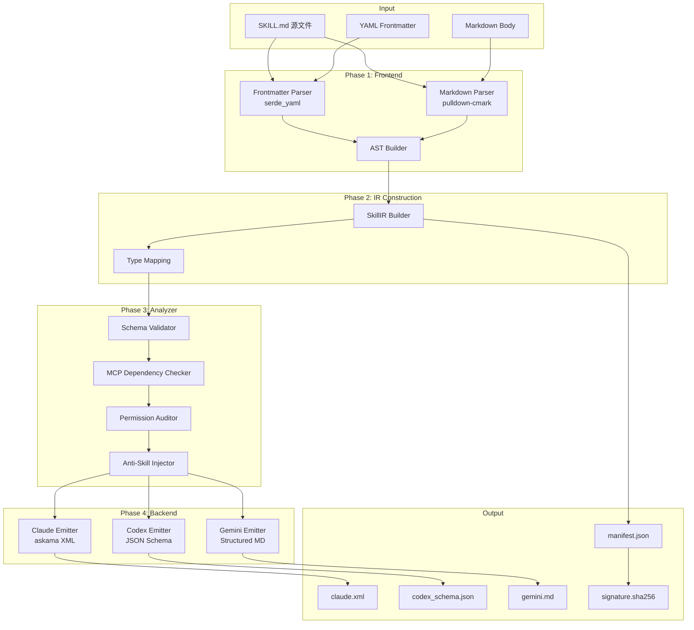
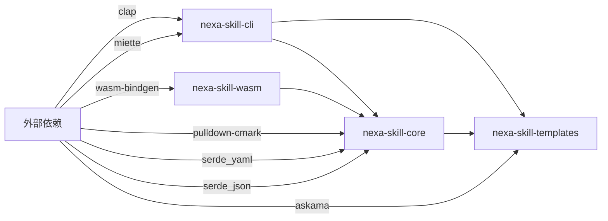
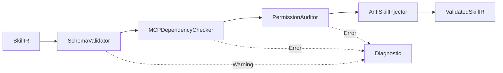
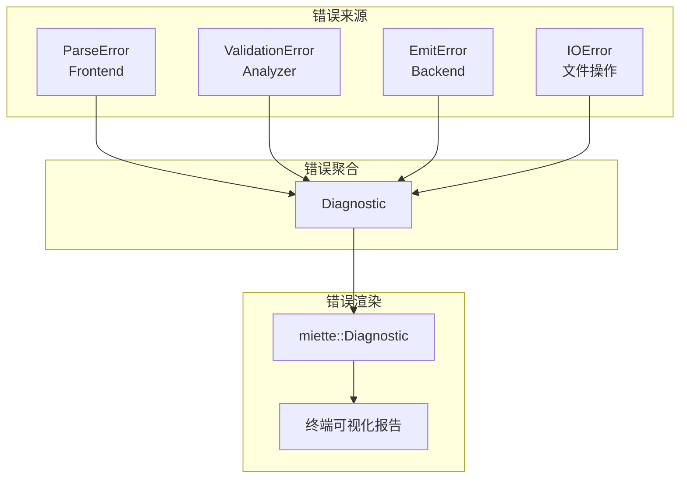
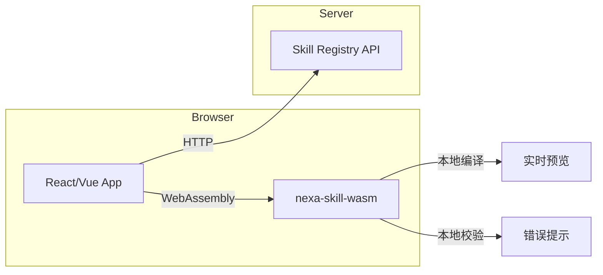

# 系统架构总览

> **Nexa Skill Compiler (NSC) 的整体架构设计、模块划分与数据流**

---

## 1. 架构愿景

NSC 采用经典编译器的**四阶段管线架构**，将人类可读的 `SKILL.md` 源文件转化为 AI Agent 可执行的结构化产物。整体设计遵循以下原则：

- **关注点分离 (Separation of Concerns)**：每个阶段职责明确，边界清晰
- **强类型中间表示 (Strongly-typed IR)**：所有阶段通过 `SkillIR` 进行数据交换
- **零拷贝优化 (Zero-copy Optimization)**：利用 Rust 生命周期实现高效字符串处理
- **可扩展后端 (Extensible Backend)**：通过 `Emitter` Trait 支持新平台适配

---

## 2. 系统架构图



---

## 3. 模块划分

NSC 采用 Rust 的 **Crate 模块化架构**，每个编译阶段对应一个独立的 Crate：

### 3.1 Crate 结构

```text
nexa-skill-compiler/
├── nexa-skill-cli/           # CLI 入口 (clap, miette)
│   ├── src/
│   │   ├── main.rs           # 程序入口
│   │   ├── commands/         # 命令定义
│   │   │   ├── build.rs      # build 命令
│   │   │   ├── check.rs      # check 命令
│   │   │   └── validate.rs   # validate 命令
│   │   └── config.rs         # 配置管理
│   └── Cargo.toml
│
├── nexa-skill-core/          # 核心编译逻辑
│   ├── src/
│   │   ├── lib.rs            # 库入口
│   │   ├── frontend/         # Phase 1: 前端解析
│   │   │   ├── mod.rs
│   │   │   ├── frontmatter.rs
│   │   │   ├── markdown.rs
│   │   │   └── ast.rs
│   │   ├── ir/               # Phase 2: 中间表示
│   │   │   ├── mod.rs
│   │   │   ├── skill_ir.rs
│   │   │   ├── procedure.rs
│   │   │   └── constraint.rs
│   │   ├── analyzer/         # Phase 3: 语义分析
│   │   │   ├── mod.rs
│   │   │   ├── schema.rs
│   │   │   ├── mcp.rs
│   │   │   ├── permission.rs
│   │   │   └── anti_skill.rs
│   │   ├── backend/          # Phase 4: 后端生成
│   │   │   ├── mod.rs
│   │   │   ├── emitter.rs    # Emitter Trait
│   │   │   ├── claude.rs
│   │   │   ├── codex.rs
│   │   │   └── gemini.rs
│   │   └── error/            # 错误处理
│   │       ├── mod.rs
│   │       ├── diagnostic.rs
│   │       └── codes.rs
│   └── Cargo.toml
│
├── nexa-skill-templates/     # Askama 模板
│   ├── templates/
│   │   ├── claude_xml.html
│   │   └── gemini_md.html
│   └── Cargo.toml
│
├── nexa-skill-wasm/          # WASM 绑定 (可选)
│   ├── src/
│   │   └── lib.rs
│   └── Cargo.toml
│
└── tests/                    # 集成测试
    ├── fixtures/             # 测试用 SKILL.md
    └── integration/
```

### 3.2 模块依赖关系



---

## 4. 数据流详解

### 4.1 Phase 1: Frontend (前端解析)

**职责**：将原始 `SKILL.md` 物理文件解构为内存中的语法树。

**输入**：`SKILL.md` 文件路径或目录路径

**输出**：`RawAST`（原始抽象语法树）

**关键组件**：

| 组件 | 功能 | 技术实现 |
|------|------|----------|
| `FrontmatterParser` | 提取 YAML 元数据 | `serde_yaml` + 正则分割 |
| `MarkdownParser` | 解析 Markdown Body | `pulldown-cmark` Event Stream |
| `ASTBuilder` | 组装 RawAST | 状态机模式匹配 |

**数据流**：

```text
SKILL.md
    │
    ├─── FrontmatterParser ────► FrontmatterMeta (struct)
    │        (提取 --- 区域)
    │
    └─── MarkdownParser ────► Event Stream
             (pulldown-cmark)
             │
             └─── ASTBuilder ────► RawAST
                    (状态机匹配)
```

### 4.2 Phase 2: IR Construction (中间表示构建)

**职责**：将 `RawAST` 映射为强类型的 `SkillIR`。

**输入**：`RawAST`

**输出**：`SkillIR`（核心中间表示）

**关键转换**：

```rust
// RawAST → SkillIR 的核心映射逻辑
impl From<RawAST> for SkillIR {
    fn from(raw: RawAST) -> Self {
        SkillIR {
            name: raw.frontmatter.name,
            version: raw.frontmatter.version,
            description: raw.frontmatter.description,
            mcp_servers: raw.frontmatter.mcp_servers.unwrap_or_default(),
            input_schema: raw.frontmatter.input_schema,
            hitl_required: raw.frontmatter.hitl_required.unwrap_or(false),
            pre_conditions: raw.frontmatter.pre_conditions.unwrap_or_default(),
            post_conditions: raw.frontmatter.post_conditions.unwrap_or_default(),
            fallbacks: raw.frontmatter.fallbacks.unwrap_or_default(),
            context_gathering: extract_context_gathering(&raw.body),
            procedures: extract_procedures(&raw.body),
            few_shot_examples: extract_examples(&raw.body),
        }
    }
}
```

### 4.3 Phase 3: Analyzer (语义分析)

**职责**：对 `SkillIR` 进行防呆设计和一致性审计。

**输入**：`SkillIR`

**输出**：`ValidatedSkillIR`（经过验证和增强的 IR）

**分析器链 (Analyzer Chain)**：



| 分析器 | 检查内容 | 错误级别 |
|--------|----------|----------|
| `SchemaValidator` | input_schema 与 Examples 参数一致性 | Warning |
| `MCPDependencyChecker` | MCP 服务器是否在 Allowlist | Error |
| `PermissionAuditor` | 权限声明与高危操作匹配 | Error |
| `AntiSkillInjector` | 自动注入安全约束 | Silent |

### 4.4 Phase 4: Backend (后端生成)

**职责**：将 `ValidatedSkillIR` 序列化为特定平台的原生表示。

**输入**：`ValidatedSkillIR` + Target Flag

**输出**：平台特定产物文件

**Emitter Trait 定义**：

```rust
pub trait Emitter {
    /// 目标平台标识
    fn target(&self) -> TargetPlatform;
    
    /// 将 ValidatedSkillIR 发射为字符串
    fn emit(&self, ir: &ValidatedSkillIR) -> Result<String, EmitError>;
    
    /// 发射产物文件扩展名
    fn file_extension(&self) -> &'static str;
    
    /// 是否需要生成 manifest.json
    fn requires_manifest(&self) -> bool { true }
}
```

---

## 5. 核心数据结构

### 5.1 SkillIR 完整定义

```rust
/// Nexa Skill Compiler 的核心中间表示
/// 
/// 这是编译管线中所有阶段的数据交换载体
#[derive(Debug, Clone, Serialize, Deserialize)]
pub struct SkillIR {
    // ===== 元数据与路由 =====
    /// 技能唯一标识符 (kebab-case)
    pub name: String,
    /// 版本号 (语义化版本)
    pub version: String,
    /// 触发条件与功能描述
    pub description: String,
    
    // ===== 接口与 MCP =====
    /// MCP 服务器依赖列表
    pub mcp_servers: Vec<String>,
    /// 输入参数 JSON Schema
    pub input_schema: Option<serde_json::Value>,
    /// 输出参数 JSON Schema
    pub output_schema: Option<serde_json::Value>,
    
    // ===== 安全与控制 =====
    /// 是否需要 Human-In-The-Loop 审批
    pub hitl_required: bool,
    /// 执行前必须满足的条件
    pub pre_conditions: Vec<String>,
    /// 执行后必须验证的条件
    pub post_conditions: Vec<String>,
    /// 错误恢复策略
    pub fallbacks: Vec<String>,
    /// 权限声明列表
    pub permissions: Vec<Permission>,
    
    // ===== 执行逻辑 =====
    /// 上下文收集步骤
    pub context_gathering: Vec<String>,
    /// 标准作业程序步骤
    pub procedures: Vec<ProcedureStep>,
    /// Few-shot 示例
    pub few_shot_examples: Vec<Example>,
    
    // ===== 编译期注入 =====
    /// Anti-Skill 约束 (由 Analyzer 注入)
    pub anti_skill_constraints: Vec<Constraint>,
}

/// 执行步骤定义
#[derive(Debug, Clone, Serialize, Deserialize)]
pub struct ProcedureStep {
    /// 步骤序号
    pub order: u32,
    /// 步骤指令文本
    pub instruction: String,
    /// 是否为关键步骤 (失败需停止)
    pub is_critical: bool,
    /// 步骤级别约束
    pub constraints: Vec<String>,
}

/// 权限声明
#[derive(Debug, Clone, Serialize, Deserialize)]
pub struct Permission {
    /// 权限类型 (network, fs, db, etc.)
    pub kind: PermissionKind,
    /// 权限范围
    pub scope: String,
}

/// Anti-Skill 约束
#[derive(Debug, Clone, Serialize, Deserialize)]
pub struct Constraint {
    /// 约束来源 (pattern_id)
    pub source: String,
    /// 约束内容
    pub content: String,
    /// 约束级别 (warning, error, block)
    pub level: ConstraintLevel,
}
```

### 5.2 编译产物 Manifest

```rust
/// 编译产物元数据清单
#[derive(Debug, Clone, Serialize, Deserialize)]
pub struct Manifest {
    /// 技能名称
    pub name: String,
    /// 版本号
    pub version: String,
    /// 编译时间戳
    pub compiled_at: DateTime<Utc>,
    /// 编译器版本
    pub compiler_version: String,
    /// 目标平台列表
    pub targets: Vec<TargetPlatform>,
    /// 源文件哈希
    pub source_hash: String,
    /// 依赖的 MCP 服务器
    pub mcp_servers: Vec<String>,
    /// 安全等级
    pub security_level: SecurityLevel,
}
```

---

## 6. 错误处理架构

NSC 采用分层错误处理策略，所有错误最终汇聚为 `Diagnostic` 结构，由 `miette` 渲染为终端可视化报告。



**错误分类与处理策略**：

| 错误类型 | 处理策略 | 用户可见性 |
|----------|----------|------------|
| `ParseError` | 立即终止，显示精确行号 | ✅ 必须显示 |
| `ValidationError` | 收集所有错误后统一显示 | ✅ 必须显示 |
| `Warning` | 继续编译，但记录警告 | ✅ 显示但不阻断 |
| `EmitError` | 终止当前目标，继续其他目标 | ✅ 显示目标失败原因 |
| `IOError` | 立即终止 | ✅ 显示文件路径 |

---

## 7. WASM 架构 (可选扩展)

NSC 核心库可编译为 WebAssembly，用于浏览器端实时校验和预览。



**WASM 功能范围**：

- ✅ Frontend 解析
- ✅ IR 构建
- ✅ Analyzer 校验
- ✅ Backend 生成（部分）
- ❌ 文件系统操作（需通过 JS Bridge）

---

## 8. 性能考量

### 8.1 零拷贝解析

利用 Rust 的生命周期机制，在解析 Markdown 时使用 `&str` 引用而非 `String` 拷贝：

```rust
// pulldown-cmark 事件流中的文本引用
fn extract_text(event: &Event<'_>) -> &'_ str {
    match event {
        Event::Text(text) => text.as_ref(),
        Event::Code(code) => code.as_ref(),
        _ => "",
    }
}
```

### 8.2 并行编译

对于多目标编译，使用 `rayon` 实现并行发射：

```rust
use rayon::prelude::*;

fn emit_parallel(ir: &ValidatedSkillIR, targets: &[TargetPlatform]) -> Vec<EmitResult> {
    targets.par_iter()
        .map(|target| target.emit(ir))
        .collect()
}
```

### 8.3 内存预算

| 阶段 | 预估内存占用 | 优化策略 |
|------|-------------|----------|
| Frontend | ~2MB per file | 流式解析，不保留全文 |
| IR | ~500KB per skill | Arc 共享字符串 |
| Analyzer | ~100KB | 无额外分配 |
| Backend | ~1MB per target | 模板预编译 |

---

## 9. 扩展机制

### 9.1 自定义 Emitter

开发者可通过实现 `Emitter` Trait 来支持新的目标平台：

```rust
// 示例：自定义 Kimi Emitter
pub struct KimiEmitter;

impl Emitter for KimiEmitter {
    fn target(&self) -> TargetPlatform {
        TargetPlatform::Kimi
    }
    
    fn emit(&self, ir: &ValidatedSkillIR) -> Result<String, EmitError> {
        // Kimi 偏好纯文本，直接输出完整 Markdown
        let mut output = String::new();
        output.push_str(&format!("# {}\n\n", ir.name));
        output.push_str(&ir.description);
        output.push_str("\n\n## Procedures\n");
        for step in &ir.procedures {
            output.push_str(&format!("{}. {}\n", step.order, step.instruction));
        }
        Ok(output)
    }
    
    fn file_extension(&self) -> &'static str {
        "md"
    }
}
```

### 9.2 自定义 Analyzer

通过实现 `Analyzer` Trait 添加自定义校验逻辑：

```rust
pub trait Analyzer {
    fn analyze(&self, ir: &mut SkillIR) -> Result<Vec<Diagnostic>, AnalyzeError>;
}

// 示例：自定义命名规范检查器
pub struct NamingConventionAnalyzer;

impl Analyzer for NamingConventionAnalyzer {
    fn analyze(&self, ir: &mut SkillIR) -> Result<Vec<Diagnostic>, AnalyzeError> {
        let mut diagnostics = Vec::new();
        
        // 检查 name 是否符合 kebab-case
        if !is_kebab_case(&ir.name) {
            diagnostics.push(Diagnostic::warning(
                "name should be in kebab-case format",
                "naming-convention"
            ));
        }
        
        Ok(diagnostics)
    }
}
```

---

## 10. 相关文档

- [COMPILER_PIPELINE.md](COMPILER_PIPELINE.md) - 编译管线各阶段详细实现
- [IR_DESIGN.md](IR_DESIGN.md) - SkillIR 数据结构完整定义
- [BACKEND_ADAPTERS.md](BACKEND_ADAPTERS.md) - 各平台 Emitter 实现细节
- [ERROR_HANDLING.md](ERROR_HANDLING.md) - 错误处理与诊断系统
- [API_REFERENCE.md](API_REFERENCE.md) - 公开 Trait 和接口定义