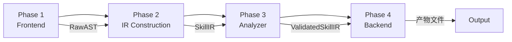
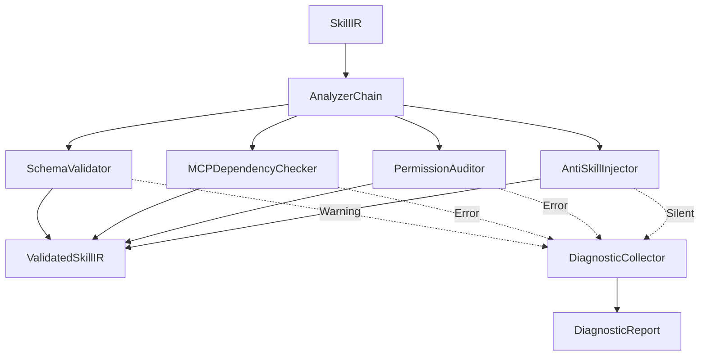

# 编译管线详细设计

> **Nexa Skill Compiler 四阶段编译管线的完整实现细节**

---

## 1. 管线总览

NSC 编译管线严格划分为四个阶段，每个阶段职责明确、边界清晰：



| 阶段 | 输入 | 输出 | 核心职责 |
|------|------|------|----------|
| **Frontend** | `SKILL.md` 文件 | `RawAST` | 词法/语法解析，AST 构建 |
| **IR Construction** | `RawAST` | `SkillIR` | 类型映射，结构化转换 |
| **Analyzer** | `SkillIR` | `ValidatedSkillIR` | 语义验证，安全审计，约束注入 |
| **Backend** | `ValidatedSkillIR` | 产物文件 | 多态发射，平台适配 |

---

## 2. Phase 1: Frontend (前端解析)

### 2.1 阶段职责

Frontend 负责将原始的 `SKILL.md` 物理文件解构为内存中的语法树。核心任务包括：

1. **Frontmatter 剥离**：提取 YAML 元数据区域
2. **Body 流式解析**：使用事件流解析 Markdown
3. **AST 组装**：构建 `RawAST` 结构

### 2.2 技术实现

#### 2.2.1 Frontmatter 解析器

**实现策略**：使用正则表达式分割 `---` 区域，交由 `serde_yaml` 解析。

```rust
// nexa-skill-core/src/frontend/frontmatter.rs

use serde_yaml;
use regex::Regex;

/// Frontmatter 元数据结构
#[derive(Debug, Clone, Deserialize)]
pub struct FrontmatterMeta {
    // 必选字段
    pub name: String,
    pub description: String,
    
    // 可选字段
    pub version: Option<String>,
    pub license: Option<String>,
    pub compatibility: Option<String>,
    pub metadata: Option<serde_json::Map<String, serde_json::Value>>,
    pub allowed_tools: Option<String>,
    
    // NSC 扩展字段
    pub mcp_servers: Option<Vec<String>>,
    pub input_schema: Option<serde_json::Value>,
    pub output_schema: Option<serde_json::Value>,
    pub hitl_required: Option<bool>,
    pub pre_conditions: Option<Vec<String>>,
    pub post_conditions: Option<Vec<String>>,
    pub fallbacks: Option<Vec<String>>,
    pub permissions: Option<Vec<PermissionDecl>>,
    pub security_level: Option<String>,
}

/// 权限声明结构
#[derive(Debug, Clone, Deserialize)]
pub struct PermissionDecl {
    pub kind: String,
    pub scope: String,
}

/// 从文件内容提取 Frontmatter
pub fn extract_frontmatter(content: &str) -> Result<(FrontmatterMeta, &str), ParseError> {
    // 正则匹配 --- 区域
    let frontmatter_regex = Regex::new(r"^---\s*\n(.*?)\n---\s*\n")?;
    
    let captures = frontmatter_regex
        .captures(content)
        .ok_or(ParseError::MissingFrontmatter)?;
    
    let yaml_content = captures.get(1)
        .ok_or(ParseError::EmptyFrontmatter)?
        .as_str();
    
    // 解析 YAML
    let meta: FrontmatterMeta = serde_yaml::from_str(yaml_content)
        .map_err(|e| ParseError::YamlParseError(e.to_string()))?;
    
    // 返回元数据和剩余 Body 内容
    let body_start = captures.get(0).unwrap().end();
    let body = &content[body_start..];
    
    Ok((meta, body))
}
```

#### 2.2.2 Markdown 解析器

**实现策略**：使用 `pulldown-cmark` 创建事件流，通过状态机提取核心指令块。

```rust
// nexa-skill-core/src/frontend/markdown.rs

use pulldown_cmark::{Event, Tag, HeadingLevel, Parser, CodeBlockKind};

/// Markdown Body 解析结果
#[derive(Debug, Clone, Default)]
pub struct MarkdownBody {
    pub sections: Vec<Section>,
    pub procedures: Vec<RawProcedureStep>,
    pub examples: Vec<RawExample>,
    pub code_blocks: Vec<CodeBlock>,
}

/// 章节结构
#[derive(Debug, Clone)]
pub struct Section {
    pub level: u8,
    pub title: String,
    pub content: String,
}

/// 原始执行步骤
#[derive(Debug, Clone)]
pub struct RawProcedureStep {
    pub order: u32,
    pub text: String,
    pub is_critical: bool,
}

/// 原始示例
#[derive(Debug, Clone)]
pub struct RawExample {
    pub title: Option<String>,
    pub user_input: String,
    pub agent_response: String,
}

/// 代码块
#[derive(Debug, Clone)]
pub struct CodeBlock {
    pub language: Option<String>,
    pub content: String,
}

/// 解析 Markdown Body
pub fn parse_markdown_body(body: &str) -> Result<MarkdownBody, ParseError> {
    let parser = Parser::new(body);
    let mut result = MarkdownBody::default();
    
    // 状态机状态
    #[derive(Debug, Clone, Copy, PartialEq)]
    enum ParseState {
        Default,
        InHeading(u8),
        InProcedureList,
        InExampleBlockquote,
        InCodeBlock(Option<String>),
    }
    
    let mut state = ParseState::Default;
    let mut current_section_title = String::new();
    let mut current_content = String::new();
    let mut procedure_counter = 0u32;
    let mut current_code_block = String::new();
    let mut current_code_lang: Option<String> = None;
    
    for event in parser {
        match event {
            // 标题事件
            Event::Start(Tag::Heading(level, ..)) => {
                // 保存上一个章节
                if !current_section_title.is_empty() {
                    result.sections.push(Section {
                        level: match state {
                            ParseState::InHeading(l) => l,
                            _ => 0,
                        },
                        title: current_section_title.clone(),
                        content: current_content.trim().to_string(),
                    });
                }
                current_section_title.clear();
                current_content.clear();
                state = ParseState::InHeading(match level {
                    HeadingLevel::H1 => 1,
                    HeadingLevel::H2 => 2,
                    HeadingLevel::H3 => 3,
                    HeadingLevel::H4 => 4,
                    HeadingLevel::H5 => 5,
                    HeadingLevel::H6 => 6,
                });
            }
            
            Event::End(Tag::Heading(..)) => {
                state = ParseState::Default;
            }
            
            // 文本事件
            Event::Text(text) => {
                match state {
                    ParseState::InHeading(_) => {
                        current_section_title.push_str(&text);
                    }
                    ParseState::InProcedureList => {
                        // 检查是否为 CRITICAL 标记
                        let text_str = text.as_ref();
                        let is_critical = text_str.contains("[CRITICAL]");
                        let clean_text = text_str.replace("[CRITICAL]", "").trim().to_string();
                        
                        if !clean_text.is_empty() {
                            procedure_counter += 1;
                            result.procedures.push(RawProcedureStep {
                                order: procedure_counter,
                                text: clean_text,
                                is_critical,
                            });
                        }
                    }
                    ParseState::InCodeBlock(_) => {
                        current_code_block.push_str(&text);
                    }
                    _ => {
                        current_content.push_str(&text);
                    }
                }
            }
            
            // 列表事件
            Event::Start(Tag::List(Some(_))) => {
                // 有序列表，可能是 Procedures
                if current_section_title.contains("Procedure") 
                    || current_section_title.contains("步骤")
                    || current_section_title.contains("执行") {
                    state = ParseState::InProcedureList;
                    procedure_counter = 0;
                }
            }
            
            Event::End(Tag::List(Some(_))) => {
                state = ParseState::Default;
            }
            
            // 代码块事件
            Event::Start(Tag::CodeBlock(kind)) => {
                current_code_block.clear();
                current_code_lang = match kind {
                    CodeBlockKind::Fenced(lang) => Some(lang.to_string()),
                    CodeBlockKind::Indented => None,
                };
                state = ParseState::InCodeBlock(current_code_lang.clone());
            }
            
            Event::End(Tag::CodeBlock(_)) => {
                result.code_blocks.push(CodeBlock {
                    language: current_code_lang.clone(),
                    content: current_code_block.trim().to_string(),
                });
                state = ParseState::Default;
            }
            
            // 引用块事件（用于 Examples）
            Event::Start(Tag::Blockquote) => {
                if current_section_title.contains("Example") 
                    || current_section_title.contains("示例") {
                    state = ParseState::InExampleBlockquote;
                }
            }
            
            Event::End(Tag::Blockquote) => {
                state = ParseState::Default;
            }
            
            _ => {}
        }
    }
    
    // 保存最后一个章节
    if !current_section_title.is_empty() {
        result.sections.push(Section {
            level: 0,
            title: current_section_title,
            content: current_content.trim().to_string(),
        });
    }
    
    Ok(result)
}
```

#### 2.2.3 AST Builder

**实现策略**：组合 Frontmatter 和 Markdown Body 解析结果，构建 `RawAST`。

```rust
// nexa-skill-core/src/frontend/ast.rs

use super::{FrontmatterMeta, MarkdownBody};

/// 原始抽象语法树
/// 
/// Frontend 阶段的输出，包含未验证的原始数据
#[derive(Debug, Clone)]
pub struct RawAST {
    /// 文件路径
    pub source_path: String,
    /// Frontmatter 元数据
    pub frontmatter: FrontmatterMeta,
    /// Markdown Body 解析结果
    pub body: MarkdownBody,
    /// 源文件哈希（用于完整性校验）
    pub source_hash: String,
}

/// AST 构建器
pub struct ASTBuilder;

impl ASTBuilder {
    /// 从文件路径构建 RawAST
    pub fn build_from_file(path: &str) -> Result<RawAST, ParseError> {
        let content = std::fs::read_to_string(path)
            .map_err(|e| ParseError::FileReadError(path.to_string(), e.to_string()))?;
        
        Self::build_from_content(path, &content)
    }
    
    /// 从内容字符串构建 RawAST
    pub fn build_from_content(path: &str, content: &str) -> Result<RawAST, ParseError> {
        // 计算源文件哈希
        let source_hash = Self::compute_hash(content);
        
        // 解析 Frontmatter
        let (frontmatter, body_content) = extract_frontmatter(content)?;
        
        // 解析 Markdown Body
        let body = parse_markdown_body(body_content)?;
        
        Ok(RawAST {
            source_path: path.to_string(),
            frontmatter,
            body,
            source_hash,
        })
    }
    
    /// 计算 SHA-256 哈希
    fn compute_hash(content: &str) -> String {
        use sha2::{Sha256, Digest};
        let mut hasher = Sha256::new();
        hasher.update(content.as_bytes());
        format!("{:x}", hasher.finalize())
    }
}
```

### 2.3 错误处理

Frontend 阶段的错误类型定义：

```rust
// nexa-skill-core/src/error/parse_error.rs

use miette::{Diagnostic, SourceSpan};
use thiserror::Error;

#[derive(Debug, Error, Diagnostic)]
pub enum ParseError {
    #[error("Missing YAML frontmatter")]
    #[diagnostic(code(nsc::parse::missing_frontmatter))]
    MissingFrontmatter,
    
    #[error("Empty frontmatter section")]
    #[diagnostic(code(nsc::parse::empty_frontmatter))]
    EmptyFrontmatter,
    
    #[error("YAML parse error: {0}")]
    #[diagnostic(code(nsc::parse::yaml_error))]
    YamlParseError(String),
    
    #[error("Failed to read file '{0}': {1}")]
    #[diagnostic(code(nsc::parse::file_read_error))]
    FileReadError(String, String),
    
    #[error("Missing required section: {0}")]
    #[diagnostic(code(nsc::parse::missing_section), help("Add a '{0}' section to your SKILL.md"))]
    MissingSection(String),
    
    #[error("Invalid procedure format at line {line}")]
    #[diagnostic(code(nsc::parse::invalid_procedure))]
    InvalidProcedureFormat {
        line: usize,
        #[source_code]
        src: String,
        #[label("here")]
        span: SourceSpan,
    },
}
```

---

## 3. Phase 2: IR Construction (中间表示构建)

### 3.1 阶段职责

IR Construction 负责将 `RawAST` 映射为强类型的 `SkillIR`。核心任务包括：

1. **类型映射**：将原始字符串转换为强类型枚举
2. **结构化转换**：组装 `SkillIR` 各字段
3. **默认值填充**：处理可选字段的默认值

### 3.2 技术实现

#### 3.2.1 IR Builder

```rust
// nexa-skill-core/src/ir/builder.rs

use crate::frontend::{RawAST, FrontmatterMeta, MarkdownBody, RawProcedureStep};
use crate::ir::{SkillIR, ProcedureStep, Permission, PermissionKind, Constraint};

/// IR 构建器
pub struct IRBuilder;

impl IRBuilder {
    /// 从 RawAST 构建 SkillIR
    pub fn build(raw: RawAST) -> Result<SkillIR, IRError> {
        // 验证必选字段
        Self::validate_required_fields(&raw.frontmatter)?;
        
        // 构建 SkillIR
        let ir = SkillIR {
            // 元数据
            name: raw.frontmatter.name,
            version: raw.frontmatter.version.unwrap_or_else(|| "1.0.0".to_string()),
            description: raw.frontmatter.description,
            
            // MCP 与接口
            mcp_servers: raw.frontmatter.mcp_servers.unwrap_or_default(),
            input_schema: raw.frontmatter.input_schema,
            output_schema: raw.frontmatter.output_schema,
            
            // 安全与控制
            hitl_required: raw.frontmatter.hitl_required.unwrap_or(false),
            pre_conditions: raw.frontmatter.pre_conditions.unwrap_or_default(),
            post_conditions: raw.frontmatter.post_conditions.unwrap_or_default(),
            fallbacks: raw.frontmatter.fallbacks.unwrap_or_default(),
            permissions: Self::map_permissions(raw.frontmatter.permissions),
            
            // 执行逻辑
            context_gathering: Self::extract_context_gathering(&raw.body),
            procedures: Self::map_procedures(raw.body.procedures),
            few_shot_examples: Self::map_examples(raw.body.examples),
            
            // 编译期注入（初始为空，由 Analyzer 填充）
            anti_skill_constraints: Vec::new(),
            
            // 元信息
            source_path: raw.source_path,
            source_hash: raw.source_hash,
        };
        
        Ok(ir)
    }
    
    /// 验证必选字段
    fn validate_required_fields(meta: &FrontmatterMeta) -> Result<(), IRError> {
        // name 校验
        if meta.name.is_empty() {
            return Err(IRError::MissingRequiredField("name"));
        }
        if !Self::is_valid_name(&meta.name) {
            return Err(IRError::InvalidNameFormat(meta.name.clone()));
        }
        
        // description 校验
        if meta.description.is_empty() {
            return Err(IRError::MissingRequiredField("description"));
        }
        if meta.description.len() > 1024 {
            return Err(IRError::DescriptionTooLong(meta.description.len()));
        }
        
        Ok(())
    }
    
    /// 校验 name 格式 (kebab-case)
    fn is_valid_name(name: &str) -> bool {
        if name.is_empty() || name.len() > 64 {
            return false;
        }
        
        // 不能以连字符开头或结尾
        if name.starts_with('-') || name.ends_with('-') {
            return false;
        }
        
        // 不能包含连续连字符
        if name.contains("--") {
            return false;
        }
        
        // 仅允许小写字母、数字、连字符
        name.chars().all(|c| c.is_ascii_lowercase() || c.is_ascii_digit() || c == '-')
    }
    
    /// 映射权限声明
    fn map_permissions(permissions: Option<Vec<PermissionDecl>>) -> Vec<Permission> {
        permissions.unwrap_or_default()
            .into_iter()
            .map(|p| Permission {
                kind: Self::parse_permission_kind(&p.kind),
                scope: p.scope,
            })
            .collect()
    }
    
    /// 解析权限类型
    fn parse_permission_kind(kind: &str) -> PermissionKind {
        match kind.to_lowercase().as_str() {
            "network" => PermissionKind::Network,
            "fs" | "filesystem" => PermissionKind::FileSystem,
            "db" | "database" => PermissionKind::Database,
            "exec" | "execute" => PermissionKind::Execute,
            "mcp" => PermissionKind::MCP,
            _ => PermissionKind::Unknown,
        }
    }
    
    /// 映射执行步骤
    fn map_procedures(raw_steps: Vec<RawProcedureStep>) -> Vec<ProcedureStep> {
        raw_steps
            .into_iter()
            .map(|step| ProcedureStep {
                order: step.order,
                instruction: step.text,
                is_critical: step.is_critical,
                constraints: Vec::new(),
            })
            .collect()
    }
    
    /// 提取上下文收集步骤
    fn extract_context_gathering(body: &MarkdownBody) -> Vec<String> {
        body.sections
            .iter()
            .find(|s| s.title.contains("Context") || s.title.contains("上下文"))
            .map(|s| Self::parse_list_items(&s.content))
            .unwrap_or_default()
    }
    
    /// 映射示例
    fn map_examples(raw_examples: Vec<RawExample>) -> Vec<Example> {
        raw_examples
            .into_iter()
            .map(|ex| Example {
                title: ex.title,
                user_input: ex.user_input,
                agent_response: ex.agent_response,
            })
            .collect()
    }
    
    /// 解析列表项
    fn parse_list_items(content: &str) -> Vec<String> {
        content.lines()
            .filter(|line| line.starts_with("- ") || line.starts_with("* "))
            .map(|line| line.trim_start_matches("- ").trim_start_matches("* ").trim().to_string())
            .collect()
    }
}
```

#### 3.2.2 IR 错误类型

```rust
// nexa-skill-core/src/error/ir_error.rs

use miette::Diagnostic;
use thiserror::Error;

#[derive(Debug, Error, Diagnostic)]
pub enum IRError {
    #[error("Missing required field: {0}")]
    #[diagnostic(code(nsc::ir::missing_field))]
    MissingRequiredField(String),
    
    #[error("Invalid name format: '{0}'. Must be kebab-case, 1-64 chars, no leading/trailing hyphens")]
    #[diagnostic(code(nsc::ir::invalid_name))]
    InvalidNameFormat(String),
    
    #[error("Description too long: {0} characters (max 1024)")]
    #[diagnostic(code(nsc::ir::description_length))]
    DescriptionTooLong(usize),
    
    #[error("Invalid permission kind: {0}")]
    #[diagnostic(code(nsc::ir::invalid_permission))]
    InvalidPermissionKind(String),
}
```

---

## 4. Phase 3: Analyzer (语义分析)

### 4.1 阶段职责

Analyzer 负责对 `SkillIR` 进行防呆设计和一致性审计。核心任务包括：

1. **Schema 校验**：检查 input_schema 与 Examples 参数一致性
2. **MCP 依赖审计**：验证 MCP 服务器在 Allowlist 中
3. **权限审计**：检查权限声明与高危操作匹配
4. **Anti-Skill 注入**：自动注入安全约束

### 4.2 分析器链架构



### 4.3 技术实现

#### 4.3.1 Analyzer Trait 定义

```rust
// nexa-skill-core/src/analyzer/mod.rs

use crate::ir::SkillIR;
use crate::error::Diagnostic;

/// 分析器 Trait
/// 
/// 所有分析器必须实现此接口
pub trait Analyzer {
    /// 分析器名称
    fn name(&self) -> &'static str;
    
    /// 执行分析
    /// 
    /// 返回诊断列表（警告和错误）
    fn analyze(&self, ir: &mut SkillIR) -> Result<Vec<Diagnostic>, AnalyzeError>;
    
    /// 分析器优先级（数字越小优先级越高）
    fn priority(&self) -> u8 {
        100
    }
}

/// 分析器链
pub struct AnalyzerChain {
    analyzers: Vec<Box<dyn Analyzer>>,
}

impl AnalyzerChain {
    /// 创建分析器链
    pub fn new() -> Self {
        Self {
            analyzers: vec![
                Box::new(SchemaValidator::new()),
                Box::new(MCPDependencyChecker::new()),
                Box::new(PermissionAuditor::new()),
                Box::new(AntiSkillInjector::new()),
            ],
        }
    }
    
    /// 执行所有分析器
    pub fn run(mut self, ir: SkillIR) -> Result<ValidatedSkillIR, AnalyzeError> {
        let mut all_diagnostics = Vec::new();
        let mut sorted_analyzers: Vec<_> = self.analyzers.into_iter().collect();
        
        // 按优先级排序
        sorted_analyzers.sort_by_key(|a| a.priority());
        
        // 依次执行
        for analyzer in sorted_analyzers {
            let diagnostics = analyzer.analyze(&mut ir)?;
            all_diagnostics.extend(diagnostics);
        }
        
        // 检查是否有阻断性错误
        let has_errors = all_diagnostics.iter().any(|d| d.is_error());
        if has_errors {
            return Err(AnalyzeError::ValidationFailed(all_diagnostics));
        }
        
        Ok(ValidatedSkillIR {
            inner: ir,
            diagnostics: all_diagnostics,
        })
    }
}
```

#### 4.3.2 Schema Validator

```rust
// nexa-skill-core/src/analyzer/schema.rs

use crate::analyzer::Analyzer;
use crate::ir::SkillIR;
use crate::error::{Diagnostic, AnalyzeError};

/// Schema 校验器
/// 
/// 检查 input_schema 与 Examples 参数一致性
pub struct SchemaValidator;

impl SchemaValidator {
    pub fn new() -> Self {
        Self
    }
}

impl Analyzer for SchemaValidator {
    fn name(&self) -> &'static str {
        "schema-validator"
    }
    
    fn priority(&self) -> u8 {
        10  // 高优先级
    }
    
    fn analyze(&self, ir: &mut SkillIR) -> Result<Vec<Diagnostic>, AnalyzeError> {
        let mut diagnostics = Vec::new();
        
        // 如果没有 input_schema，跳过校验
        if ir.input_schema.is_none() {
            return Ok(diagnostics);
        }
        
        let schema = ir.input_schema.as_ref().unwrap();
        
        // 提取 schema 中定义的参数名
        let schema_params = Self::extract_schema_params(schema);
        
        // 检查 Examples 中使用的参数
        for example in &ir.few_shot_examples {
            let used_params = Self::extract_example_params(&example.user_input);
            
            for param in used_params {
                if !schema_params.contains(&param) {
                    diagnostics.push(Diagnostic::warning(
                        format!("Example uses parameter '{}' not defined in input_schema", param),
                        "schema-mismatch",
                    ));
                }
            }
        }
        
        Ok(diagnostics)
    }
}

impl SchemaValidator {
    /// 从 JSON Schema 提取参数名
    fn extract_schema_params(schema: &serde_json::Value) -> Vec<String> {
        schema
            .get("properties")
            .and_then(|props| props.as_object())
            .map(|obj| obj.keys().cloned().collect())
            .unwrap_or_default()
    }
    
    /// 从示例文本提取参数名（简单实现）
    fn extract_example_params(text: &str) -> Vec<String> {
        // 查找 {{param}} 格式的参数引用
        let param_regex = regex::Regex::new(r"\{\{(\w+)\}}").unwrap();
        param_regex
            .captures_iter(text)
            .map(|cap| cap[1].to_string())
            .collect()
    }
}
```

#### 4.3.3 MCP Dependency Checker

```rust
// nexa-skill-core/src/analyzer/mcp.rs

use crate::analyzer::Analyzer;
use crate::ir::SkillIR;
use crate::error::{Diagnostic, AnalyzeError};

/// MCP 依赖检查器
/// 
/// 验证 MCP 服务器在 Allowlist 中
pub struct MCPDependencyChecker {
    /// MCP 服务器白名单
    allowlist: Vec<String>,
}

impl MCPDependencyChecker {
    pub fn new() -> Self {
        Self {
            // 默认白名单（可从配置文件加载）
            allowlist: vec![
                "filesystem-server",
                "github-server",
                "postgres-server",
                "neon-postgres-admin",
                "github-pr-creator",
            ],
        }
    }
    
    /// 从配置文件加载白名单
    pub fn with_allowlist(allowlist: Vec<String>) -> Self {
        Self { allowlist }
    }
}

impl Analyzer for MCPDependencyChecker {
    fn name(&self) -> &'static str {
        "mcp-dependency-checker"
    }
    
    fn priority(&self) -> u8 {
        20
    }
    
    fn analyze(&self, ir: &mut SkillIR) -> Result<Vec<Diagnostic>, AnalyzeError> {
        let mut diagnostics = Vec::new();
        
        for server in &ir.mcp_servers {
            if !self.allowlist.contains(server) {
                diagnostics.push(Diagnostic::error(
                    format!("MCP server '{}' is not in the allowlist", server),
                    "mcp-not-allowed",
                ));
            }
        }
        
        Ok(diagnostics)
    }
}
```

#### 4.3.4 Permission Auditor

```rust
// nexa-skill-core/src/analyzer/permission.rs

use crate::analyzer::Analyzer;
use crate::ir::SkillIR;
use crate::error::{Diagnostic, AnalyzeError};

/// 权限审计器
/// 
/// 检查权限声明与高危操作匹配
pub struct PermissionAuditor {
    /// 高危词汇列表
    dangerous_keywords: Vec<String>,
}

impl PermissionAuditor {
    pub fn new() -> Self {
        Self {
            dangerous_keywords: vec![
                "rm -rf",
                "DROP",
                "DELETE",
                "TRUNCATE",
                "UPDATE",
                "ALTER",
                "GRANT",
                "shutdown",
                "reboot",
                "format",
            ],
        }
    }
}

impl Analyzer for PermissionAuditor {
    fn name(&self) -> &'static str {
        "permission-auditor"
    }
    
    fn priority(&self) -> u8 {
        30
    }
    
    fn analyze(&self, ir: &mut SkillIR) -> Result<Vec<Diagnostic>, AnalyzeError> {
        let mut diagnostics = Vec::new();
        
        // 检查 Procedures 中的高危词汇
        for step in &ir.procedures {
            for keyword in &self.dangerous_keywords {
                if step.instruction.contains(keyword) {
                    // 检查是否有对应权限声明
                    let required_permission = Self::keyword_to_permission(keyword);
                    let has_permission = ir.permissions.iter().any(|p| {
                        p.kind == required_permission.kind && 
                        p.scope.contains(&required_permission.scope)
                    });
                    
                    if !has_permission {
                        diagnostics.push(Diagnostic::error(
                            format!(
                                "Procedure step {} contains dangerous keyword '{}' but no matching permission declared",
                                step.order, keyword
                            ),
                            "missing-permission",
                        ));
                    }
                }
            }
        }
        
        // 检查 security_level 与 hitl_required 一致性
        if ir.security_level == SecurityLevel::Critical && !ir.hitl_required {
            diagnostics.push(Diagnostic::error(
                "Critical security level requires hitl_required to be true",
                "security-level-mismatch",
            ));
        }
        
        Ok(diagnostics)
    }
}

impl PermissionAuditor {
    /// 将高危词汇映射到所需权限
    fn keyword_to_permission(keyword: &str) -> RequiredPermission {
        match keyword {
            "rm -rf" | "format" => RequiredPermission { kind: PermissionKind::FileSystem, scope: "write" },
            "DROP" | "DELETE" | "TRUNCATE" | "UPDATE" | "ALTER" | "GRANT" => RequiredPermission { kind: PermissionKind::Database, scope: "write" },
            "shutdown" | "reboot" => RequiredPermission { kind: PermissionKind::Execute, scope: "system" },
            _ => RequiredPermission { kind: PermissionKind::Unknown, scope: "" },
        }
    }
}

struct RequiredPermission {
    kind: PermissionKind,
    scope: &'static str,
}
```

#### 4.3.5 Anti-Skill Injector

```rust
// nexa-skill-core/src/analyzer/anti_skill.rs

use crate::analyzer::Analyzer;
use crate::ir::{SkillIR, Constraint, ConstraintLevel};
use crate::error::{Diagnostic, AnalyzeError};
use std::collections::HashMap;

/// Anti-Skill 注入器
/// 
/// 自动注入安全约束
pub struct AntiSkillInjector {
    /// 反向模式库
    anti_patterns: HashMap<String, AntiPattern>,
}

/// 反向模式定义
#[derive(Debug, Clone)]
struct AntiPattern {
    id: String,
    trigger_keywords: Vec<String>,
    constraint_content: String,
    constraint_level: ConstraintLevel,
}

impl AntiSkillInjector {
    pub fn new() -> Self {
        Self {
            anti_patterns: Self::load_default_patterns(),
        }
    }
    
    /// 加载默认反向模式库
    fn load_default_patterns() -> HashMap<String, AntiPattern> {
        let mut patterns = HashMap::new();
        
        // HTTP 请求相关
        patterns.insert("http-timeout".to_string(), AntiPattern {
            id: "http-timeout",
            trigger_keywords: vec!["HTTP GET", "HTTP POST", "fetch", "request", "curl"],
            constraint_content: "ANTI-SKILL: Never execute an HTTP request without a timeout parameter (default 10s). Do not retry more than 3 times on 403 Forbidden errors to avoid IP blocking.".to_string(),
            constraint_level: ConstraintLevel::Warning,
        });
        
        // HTML 解析相关
        patterns.insert("html-parse".to_string(), AntiPattern {
            id: "html-parse",
            trigger_keywords: vec!["BeautifulSoup", "HTML parse", "parse HTML", "scrape"],
            constraint_content: "ANTI-SKILL: Do not attempt to parse raw JavaScript variables using HTML parsers. Fallback to Regex if <script> tags are encountered.".to_string(),
            constraint_level: ConstraintLevel::Warning,
        });
        
        // 数据库操作相关
        patterns.insert("db-cascade".to_string(), AntiPattern {
            id: "db-cascade",
            trigger_keywords: vec!["CASCADE", "drop table", "delete from"],
            constraint_content: "ANTI-SKILL: Never use CASCADE without explicit user approval. Always list affected tables before executing.".to_string(),
            constraint_level: ConstraintLevel::Block,
        });
        
        // 文件操作相关
        patterns.insert("file-delete".to_string(), AntiPattern {
            id: "file-delete",
            trigger_keywords: vec!["rm", "delete file", "remove file", "unlink"],
            constraint_content: "ANTI-SKILL: Always confirm file deletion with user. Never delete files outside declared scope.".to_string(),
            constraint_level: ConstraintLevel::Error,
        });
        
        patterns
    }
}

impl Analyzer for AntiSkillInjector {
    fn name(&self) -> &'static str {
        "anti-skill-injector"
    }
    
    fn priority(&self) -> u8 {
        40  // 最后执行，确保所有约束已收集
    }
    
    fn analyze(&self, ir: &mut SkillIR) -> Result<Vec<Diagnostic>, AnalyzeError> {
        // 遍历所有 Procedures
        for step in &ir.procedures {
            for (pattern_id, pattern) in &self.anti_patterns {
                // 检查是否触发关键词
                let triggered = pattern.trigger_keywords.iter().any(|keyword| {
                    step.instruction.to_lowercase().contains(&keyword.to_lowercase())
                });
                
                if triggered {
                    // 注入约束
                    ir.anti_skill_constraints.push(Constraint {
                        source: pattern_id.clone(),
                        content: pattern.constraint_content.clone(),
                        level: pattern.constraint_level,
                    });
                }
            }
        }
        
        // Anti-Skill 注入不产生诊断信息（静默执行）
        Ok(Vec::new())
    }
}
```

### 4.4 ValidatedSkillIR 结构

```rust
// nexa-skill-core/src/ir/validated.rs

use crate::ir::SkillIR;
use crate::error::Diagnostic;

/// 经过验证的 SkillIR
/// 
/// Analyzer 阶段的输出，包含所有诊断信息
#[derive(Debug, Clone)]
pub struct ValidatedSkillIR {
    /// 内部 SkillIR
    pub inner: SkillIR,
    /// 诊断信息列表
    pub diagnostics: Vec<Diagnostic>,
}

impl ValidatedSkillIR {
    /// 获取所有警告
    pub fn warnings(&self) -> Vec<&Diagnostic> {
        self.diagnostics.iter().filter(|d| d.is_warning()).collect()
    }
    
    /// 获取所有错误
    pub fn errors(&self) -> Vec<&Diagnostic> {
        self.diagnostics.iter().filter(|d| d.is_error()).collect()
    }
    
    /// 是否有阻断性错误
    pub fn has_blocking_errors(&self) -> bool {
        self.diagnostics.iter().any(|d| d.is_error())
    }
    
    /// 获取内部 SkillIR 的引用
    pub fn as_ref(&self) -> &SkillIR {
        &self.inner
    }
}
```

---

## 5. Phase 4: Backend (后端生成)

### 4.1 阶段职责

Backend 负责将 `ValidatedSkillIR` 序列化为特定平台的原生表示。核心任务包括：

1. **Emitter 选择**：根据 Target Flag 选择对应 Emitter
2. **模板渲染**：使用 Askama 模板引擎生成输出
3. **产物组装**：生成完整的目录结构和 Manifest

### 4.2 技术实现

详见 [BACKEND_ADAPTERS.md](BACKEND_ADAPTERS.md)。

---

## 6. 管线编排

### 6.1 Compiler Orchestrator

```rust
// nexa-skill-core/src/compiler.rs

use crate::frontend::ASTBuilder;
use crate::ir::{IRBuilder, ValidatedSkillIR};
use crate::analyzer::AnalyzerChain;
use crate::backend::{Emitter, EmitterRegistry};
use crate::error::{CompileError, CompileResult};

/// 编译器编排器
pub struct Compiler {
    /// Emitter 注册表
    emitter_registry: EmitterRegistry,
}

impl Compiler {
    pub fn new() -> Self {
        Self {
            emitter_registry: EmitterRegistry::default(),
        }
    }
    
    /// 编译单个文件
    pub fn compile_file(
        &self,
        input_path: &str,
        targets: &[TargetPlatform],
        output_dir: &str,
    ) -> CompileResult<CompileOutput> {
        // Phase 1: Frontend
        let raw_ast = ASTBuilder::build_from_file(input_path)?;
        
        // Phase 2: IR Construction
        let skill_ir = IRBuilder::build(raw_ast)?;
        
        // Phase 3: Analyzer
        let validated_ir = AnalyzerChain::new().run(skill_ir)?;
        
        // Phase 4: Backend
        let outputs = self.emit_all(&validated_ir, targets)?;
        
        // 组装产物
        self.assemble_output(&validated_ir, outputs, output_dir)
    }
    
    /// 编译目录
    pub fn compile_dir(
        &self,
        input_dir: &str,
        targets: &[TargetPlatform],
        output_dir: &str,
    ) -> CompileResult<Vec<CompileOutput>> {
        let mut results = Vec::new();
        
        // 遍历目录中的所有 SKILL.md 文件
        for entry in std::fs::read_dir(input_dir)? {
            let path = entry?.path();
            if path.is_dir() {
                let skill_file = path.join("SKILL.md");
                if skill_file.exists() {
                    let output = self.compile_file(
                        &skill_file.to_string_lossy(),
                        targets,
                        output_dir,
                    )?;
                    results.push(output);
                }
            }
        }
        
        Ok(results)
    }
    
    /// 发射所有目标
    fn emit_all(
        &self,
        ir: &ValidatedSkillIR,
        targets: &[TargetPlatform],
    ) -> CompileResult<Vec<(TargetPlatform, String)>> {
        let mut outputs = Vec::new();
        
        for target in targets {
            let emitter = self.emitter_registry.get(target)?;
            let content = emitter.emit(ir)?;
            outputs.push((target.clone(), content));
        }
        
        Ok(outputs)
    }
    
    /// 组装产物目录
    fn assemble_output(
        &self,
        ir: &ValidatedSkillIR,
        outputs: Vec<(TargetPlatform, String)>,
        output_dir: &str,
    ) -> CompileResult<CompileOutput> {
        // 创建输出目录
        let skill_name = &ir.as_ref().name;
        let skill_output_dir = std::path::Path::new(output_dir).join(skill_name);
        std::fs::create_dir_all(&skill_output_dir)?;
        
        // 写入 manifest.json
        let manifest = Manifest::from_ir(ir);
        let manifest_path = skill_output_dir.join("manifest.json");
        std::fs::write(&manifest_path, serde_json::to_string_pretty(&manifest)?)?;
        
        // 写入目标产物
        let target_dir = skill_output_dir.join("target");
        std::fs::create_dir_all(&target_dir)?;
        
        for (target, content) in outputs {
            let file_name = format!("{}{}", target.slug(), target.extension());
            std::fs::write(target_dir.join(file_name), content)?;
        }
        
        // 写入签名文件
        let signature = self.compute_signature(&skill_output_dir)?;
        let meta_dir = skill_output_dir.join("meta");
        std::fs::create_dir_all(&meta_dir)?;
        std::fs::write(meta_dir.join("signature.sha256"), signature)?;
        
        Ok(CompileOutput {
            skill_name: skill_name.clone(),
            output_dir: skill_output_dir.to_string_lossy().to_string(),
            targets: outputs.iter().map(|(t, _)| t.clone()).collect(),
        })
    }
}
```

---

## 7. 相关文档

- [IR_DESIGN.md](IR_DESIGN.md) - SkillIR 数据结构完整定义
- [BACKEND_ADAPTERS.md](BACKEND_ADAPTERS.md) - Emitter 实现细节
- [ERROR_HANDLING.md](ERROR_HANDLING.md) - 错误处理与诊断系统
- [SECURITY_MODEL.md](SECURITY_MODEL.md) - Anti-Skill 注入机制