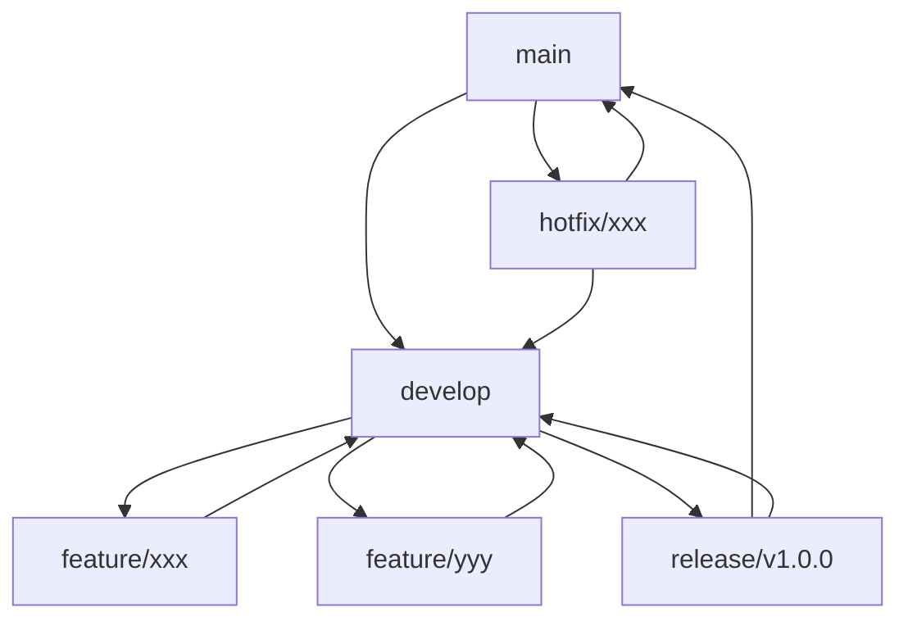

# 开发指南

> **环境配置、项目结构、编码规范、Git 工作流与贡献指南**

---

## 1. 开发环境配置

### 1.1 系统要求

| 要求 | 版本 | 说明 |
|------|------|------|
| **操作系统** | Linux / macOS / Windows (WSL2) | 推荐 Ubuntu 22.04 |
| **Rust** | 1.75+ (Edition 2024) | 使用 rustup 安装 |
| **Cargo** | 最新版 | 随 Rust 安装 |
| **Git** | 2.40+ | 版本控制 |

### 1.2 Rust 环境安装

```bash
# 安装 rustup
curl --proto '=https' --tlsv1.2 -sSf https://sh.rustup.rs | sh

# 添加所需组件
rustup component add rustfmt clippy rust-analyzer

# 安装 nightly 工具链（用于某些高级特性）
rustup toolchain install nightly

# 验证安装
rustc --version
cargo --version
```

### 1.3 项目克隆与初始化

```bash
# 克隆仓库
git clone https://github.com/nexa-org/nexa-skill-compiler
cd nexa-skill-compiler

# 构建项目
cargo build

# 运行测试
cargo test

# 运行 clippy 检查
cargo clippy

# 格式化代码
cargo fmt
```

### 1.4 IDE 配置

**VS Code 推荐扩展**：

```json
// .vscode/extensions.json
{
  "recommendations": [
    "rust-lang.rust-analyzer",
    "tamasfe.evenbettertoml",
    "serayuzgur.crates",
    "usernamehw.errorlens",
    "vadimcn.vscode-lldb"
  ]
}
```

**VS Code 设置**：

```json
// .vscode/settings.json
{
  "editor.formatOnSave": true,
  "rust-analyzer.checkOnSave.command": "clippy",
  "rust-analyzer.cargo.features": "all",
  "[rust]": {
    "editor.defaultFormatter": "rust-lang.rust-analyzer"
  }
}
```

---

## 2. 项目结构

### 2.1 目录结构

```text
nexa-skill-compiler/
├── Cargo.toml                 # Workspace 配置
├── Cargo.lock                 # 依赖锁定
├── README.md                  # 项目说明
├── LICENSE                    # 许可证
├── .gitignore                 # Git 忽略配置
├── .github/                   # GitHub 配置
│   └── workflows/             # CI/CD 工作流
│
├── docs/                      # 文档目录
│   ├── README.md
│   ├── ARCHITECTURE.md
│   └── ...
│
├── reference/                 # 参考资料
│   └── ...
│
├── nexa-skill-cli/            # CLI 入口
│   ├── Cargo.toml
│   └── src/
│       ├── main.rs            # 程序入口
│       ├── commands/          # 命令实现
│       │   ├── mod.rs
│       │   ├── build.rs
│       │   ├── check.rs
│       │   └── validate.rs
│       ├── config.rs          # 配置管理
│       └── error_renderer.rs  # 错误渲染
│
├── nexa-skill-core/           # 核心编译逻辑
│   ├── Cargo.toml
│   └── src/
│       ├── lib.rs             # 库入口
│       ├── frontend/          # Phase 1: 前端解析
│       │   ├── mod.rs
│       │   ├── frontmatter.rs
│       │   ├── markdown.rs
│       │   └── ast.rs
│       ├── ir/                # Phase 2: 中间表示
│       │   ├── mod.rs
│       │   ├── skill_ir.rs
│       │   ├── procedure.rs
│       │   ├── permission.rs
│       │   └── constraint.rs
│       ├── analyzer/          # Phase 3: 语义分析
│       │   ├── mod.rs
│       │   ├── schema.rs
│       │   ├── mcp.rs
│       │   ├── permission.rs
│       │   └── anti_skill.rs
│       ├── backend/           # Phase 4: 后端生成
│       │   ├── mod.rs
│       │   ├── emitter.rs
│       │   ├── claude.rs
│       │   ├── codex.rs
│       │   └── gemini.rs
│       ├── security/          # 安全模块
│       │   ├── mod.rs
│       │   ├── permission.rs
│       │   ├── level.rs
│       │   ├── anti_skill.rs
│       │   └── hitl.rs
│       ├── error/             # 错误处理
│       │   ├── mod.rs
│       │   ├── diagnostic.rs
│       │   └── codes.rs
│       └── compiler.rs        # 编译器编排
│
├── nexa-skill-templates/      # Askama 模板
│   ├── Cargo.toml
│   └── templates/
│       ├── claude_xml.html
│       └── gemini_md.html
│
├── nexa-skill-wasm/           # WASM 绑定（可选）
│   ├── Cargo.toml
│   └── src/
│       └── lib.rs
│
├── tests/                     # 测试目录
│   ├── fixtures/              # 测试固件
│   ├── integration/           # 集成测试
│   └── e2e/                   # 端到端测试
│
└── benches/                   # 性能基准测试
    └── compilation_benchmark.rs
```

### 2.2 Workspace 配置

```toml
# Cargo.toml

[workspace]
resolver = "2"
members = [
    "nexa-skill-cli",
    "nexa-skill-core",
    "nexa-skill-templates",
    "nexa-skill-wasm",
]

[workspace.package]
version = "1.0.0"
edition = "2024"
rust-version = "1.75"
authors = ["Nexa Dev Team <dev@nexa.ai>"]
license = "MIT"
repository = "https://github.com/nexa-org/nexa-skill-compiler"

[workspace.dependencies]
# 序列化
serde = { version = "1.0", features = ["derive"] }
serde_json = "1.0"
serde_yaml = "0.9"

# Markdown 解析
pulldown-cmark = "0.10"

# 错误处理
thiserror = "1.0"
miette = { version = "7.0", features = ["fancy"] }

# CLI
clap = { version = "4.5", features = ["derive"] }

# 模板
askama = "0.12"

# 异步运行时
tokio = { version = "1.0", features = ["full"] }

# 日志
tracing = "0.1"
tracing-subscriber = "0.3"

# 测试
tempfile = "3.10"
pretty_assertions = "1.4"

# 内部 crate
nexa-skill-core = { path = "nexa-skill-core" }
nexa-skill-templates = { path = "nexa-skill-templates" }
```

---

## 3. 编码规范

### 3.1 Rust 代码风格

**格式化**：
- 使用 `rustfmt` 自动格式化
- 遵循 Rust 标准命名约定

```rust
// 好的命名示例

// 类型名：PascalCase
pub struct SkillIR { }
pub enum SecurityLevel { }

// 函数和变量：snake_case
pub fn parse_frontmatter() { }
let skill_name = "test-skill";

// 常量：SCREAMING_SNAKE_CASE
const MAX_DESCRIPTION_LENGTH: usize = 1024;

// 模块名：snake_case
mod anti_skill;
mod permission_auditor;
```

**Early Return**：
```rust
// 推荐：使用 Early Return
fn validate_name(name: &str) -> Result<(), Error> {
    if name.is_empty() {
        return Err(Error::EmptyName);
    }
    
    if name.len() > 64 {
        return Err(Error::NameTooLong);
    }
    
    if !is_kebab_case(name) {
        return Err(Error::InvalidFormat);
    }
    
    Ok(())
}

// 不推荐：深层嵌套
fn validate_name_nested(name: &str) -> Result<(), Error> {
    if !name.is_empty() {
        if name.len() <= 64 {
            if is_kebab_case(name) {
                Ok(())
            } else {
                Err(Error::InvalidFormat)
            }
        } else {
            Err(Error::NameTooLong)
        }
    } else {
        Err(Error::EmptyName)
    }
}
```

**错误处理**：
```rust
// 推荐：使用 ? 操作符传播错误
fn compile_file(path: &str) -> Result<Output, CompileError> {
    let content = std::fs::read_to_string(path)?;
    let ast = parse_content(&content)?;
    let ir = build_ir(ast)?;
    let output = emit(ir)?;
    Ok(output)
}

// 不推荐：静默吞咽错误
fn compile_file_bad(path: &str) -> Option<Output> {
    let content = std::fs::read_to_string(path).ok()?;
    // ...
}
```

### 3.2 文档注释规范

```rust
/// 解析 SKILL.md 文件的 YAML Frontmatter
/// 
/// # Arguments
/// 
/// * `content` - SKILL.md 文件的完整内容
/// 
/// # Returns
/// 
/// 返回元组 `(FrontmatterMeta, &str)`，包含解析出的元数据和剩余的 Body 内容
/// 
/// # Errors
/// 
/// 当 Frontmatter 缺失、为空或 YAML 格式错误时返回 `ParseError`
/// 
/// # Example
/// 
/// ```
/// use nexa_skill_core::frontend::extract_frontmatter;
/// 
/// let content = r#"---
/// name: test-skill
/// description: A test skill
/// ---
/// # Test
/// "#;
/// 
/// let (meta, body) = extract_frontmatter(content)?;
/// assert_eq!(meta.name, "test-skill");
/// ```
pub fn extract_frontmatter(content: &str) -> Result<(FrontmatterMeta, &str), ParseError> {
    // ...
}
```

### 3.3 Clippy 规则

```toml
# .clippy.toml

# 允许的 lint 级别
avoid-breaking-exported-api = "warn"
missing-docs-in-crate-items = "warn"
```

```rust
// 允许特定的 clippy 警告
#[allow(clippy::too_many_arguments)]
fn complex_function(
    arg1: &str,
    arg2: &str,
    // ...
) -> Result<(), Error> {
    // ...
}
```

---

## 4. Git 工作流

### 4.1 分支策略



| 分支类型 | 命名规范 | 用途 |
|----------|----------|------|
| `main` | `main` | 生产分支，只接受 merge |
| `develop` | `develop` | 开发分支，集成最新功能 |
| `feature/*` | `feature/xxx` | 功能开发 |
| `release/*` | `release/v1.0.0` | 发布准备 |
| `hotfix/*` | `hotfix/xxx` | 紧急修复 |

### 4.2 Commit 规范

遵循 Conventional Commits 规范：

```text
:<gitmoji>: <type>(<scope>): <subject>

<body>

<footer>
```

**Type 类型**：

| Type | 描述 | 示例 |
|------|------|------|
| `feat` | 新功能 | `:sparkles: feat(claude): add XML emitter` |
| `fix` | Bug 修复 | `:bug: fix(parser): handle empty frontmatter` |
| `refactor` | 重构 | `:recycle: refactor(ir): simplify SkillIR structure` |
| `docs` | 文档 | `:memo: docs(readme): update installation guide` |
| `test` | 测试 | `:white_check_mark: test(analyzer): add permission tests` |
| `chore` | 杂项 | `:wrench: chore(deps): update dependencies` |

**Commit 示例**：

```text
:sparkles: feat(backend): add Gemini emitter

Implement GeminiEmitter to generate structured Markdown output
for Gemini CLI platform.

- Add GeminiEmitter struct and Emitter trait implementation
- Create askama template for Gemini Markdown
- Add integration tests for Gemini output

Closes #123
```

### 4.3 Pull Request 流程

1. **创建分支**：
   ```bash
   git checkout develop
   git pull origin develop
   git checkout -b feature/new-emitter
   ```

2. **开发和提交**：
   ```bash
   # 编写代码...
   cargo test
   cargo clippy
   cargo fmt
   
   git add .
   git commit -m ":sparkles: feat(backend): add new emitter"
   ```

3. **推送和创建 PR**：
   ```bash
   git push origin feature/new-emitter
   # 在 GitHub 上创建 Pull Request
   ```

4. **代码审查**：
   - 等待 CI 通过
   - 响应审查意见
   - 进行必要的修改

5. **合并**：
   - 使用 Squash and Merge 合并到 develop
   - 删除功能分支

---

## 5. 发布流程

### 5.1 版本号规范

遵循语义化版本 (SemVer)：

- `MAJOR.MINOR.PATCH`
- `MAJOR`：不兼容的 API 变更
- `MINOR`：向后兼容的功能新增
- `PATCH`：向后兼容的问题修复

### 5.2 发布检查清单

```markdown
## 发布检查清单

### 代码质量
- [ ] 所有测试通过 (`cargo test`)
- [ ] Clippy 无警告 (`cargo clippy`)
- [ ] 格式化正确 (`cargo fmt --check`)
- [ ] 文档完整 (`cargo doc`)

### 版本更新
- [ ] 更新 Cargo.toml 版本号
- [ ] 更新 CHANGELOG.md
- [ ] 更新 README.md 版本信息

### 发布准备
- [ ] 创建 release 分支
- [ ] 创建 Git tag
- [ ] 构建 release 版本 (`cargo build --release`)
- [ ] 测试 release 版本

### 发布执行
- [ ] 合并到 main
- [ ] 推送 tag 到 GitHub
- [ ] 创建 GitHub Release
- [ ] 发布到 crates.io
```

### 5.3 发布命令

```bash
# 1. 更新版本号
# 编辑 Cargo.toml

# 2. 更新 CHANGELOG
# 编辑 CHANGELOG.md

# 3. 创建 tag
git tag -a v1.0.0 -m "Release v1.0.0"
git push origin v1.0.0

# 4. 发布到 crates.io
cargo publish --dry-run  # 先预览
cargo publish

# 5. 创建 GitHub Release
# 在 GitHub 界面创建 Release
```

---

## 6. 调试技巧

### 6.1 日志调试

```rust
use tracing::{debug, info, warn, error};

fn compile_file(path: &str) -> Result<Output, Error> {
    debug!("Starting compilation for: {}", path);
    
    let content = std::fs::read_to_string(path)
        .map_err(|e| {
            error!("Failed to read file: {}", e);
            Error::FileRead(path.to_string(), e.to_string())
        })?;
    
    debug!("File content length: {} bytes", content.len());
    
    // ...
    
    info!("Compilation completed successfully");
    Ok(output)
}
```

### 6.2 单元测试调试

```rust
#[test]
fn debug_parse_frontmatter() {
    let content = r#"---
name: test-skill
description: Test
---
"#;
    
    // 使用 dbg! 宏打印调试信息
    let result = dbg!(extract_frontmatter(content));
    
    assert!(result.is_ok());
}
```

### 6.3 性能分析

```bash
# 使用 flamegraph 生成火焰图
cargo install flamegraph
cargo flamegraph --root --bin nexa-skill -- build --claude test.md

# 使用 cargo instruments (macOS)
cargo instruments -t time -- build --claude test.md
```

---

## 7. 常见问题

### 7.1 编译问题

**问题**：`error: linking with cc failed`
```bash
# 解决：安装构建工具
# Ubuntu
sudo apt install build-essential

# macOS
xcode-select --install
```

**问题**：`error: cannot find crate`
```bash
# 解决：清理并重新构建
cargo clean
cargo build
```

### 7.2 测试问题

**问题**：测试失败但本地通过
```bash
# 解决：确保测试隔离
cargo test -- --test-threads=1
```

### 7.3 依赖问题

**问题**：依赖版本冲突
```bash
# 解决：更新依赖树
cargo update
cargo tree  # 查看依赖树
```

---

## 8. 相关文档

- [ARCHITECTURE.md](ARCHITECTURE.md) - 系统架构
- [TESTING_STRATEGY.md](TESTING_STRATEGY.md) - 测试策略
- [API_REFERENCE.md](API_REFERENCE.md) - API 参考
- [ROADMAP.md](ROADMAP.md) - 项目路线图