# 错误处理与诊断系统

> **错误分类、诊断报告格式、错误恢复策略与 miette 集成**

---

## 1. 错误处理概述

NSC 采用分层错误处理策略，所有错误最终汇聚为 `Diagnostic` 结构，由 `miette` 渲染为终端可视化报告。设计遵循以下原则：

| 原则 | 描述 |
|------|------|
| **精确定位** | 错误报告包含精确的文件名、行号、列号 |
| **上下文展示** | 显示错误周围的代码片段，帮助用户理解问题 |
| **修复建议** | 每个错误附带可操作的修复建议 |
| **分级处理** | 区分 Error（阻断）、Warning（提示）、Advice（建议） |

---

## 2. 错误分类体系

### 2.1 错误层级结构

```mermaid
graph TB
    A[NSC Error Hierarchy]
    
    A --> B[ParseError<br/>Frontend 阶段]
    A --> C[IRError<br/>IR Construction 阶段]
    A --> D[AnalyzeError<br/>Analyzer 阶段]
    A --> E[EmitError<br/>Backend 阶段]
    A --> F[IOError<br/>文件操作]
    
    B --> B1[MissingFrontmatter]
    B --> B2[YamlParseError]
    B --> B3[MissingSection]
    B --> B4[InvalidProcedureFormat]
    
    C --> C1[InvalidNameFormat]
    C --> C2[DescriptionTooLong]
    C --> C3[InvalidSchema]
    C --> C4[MissingRequiredField]
    
    D --> D1[MCPNotAllowed]
    D --> D2[MissingPermission]
    D --> D3[SecurityLevelMismatch]
    D --> D4[SchemaMismatch]
    
    E --> E1[UnsupportedTarget]
    E --> E2[TemplateError]
    E --> E3[SerializationError]
    
    F --> F1[FileNotFound]
    F --> F2[PermissionDenied]
    F --> F3[DiskFull]
```



### 2.2 错误级别定义

```rust
// nexa-skill-core/src/error/level.rs

/// 错误级别
/// 
/// 决定错误的处理方式和显示样式
#[derive(Debug, Clone, Copy, PartialEq, Eq, Serialize, Deserialize)]
#[serde(rename_all = "lowercase")]
pub enum ErrorLevel {
    /// 错误：阻断编译流程
    /// 
    /// 必须修复后才能继续
    Error,
    
    /// 警告：不阻断编译
    /// 
    /// 建议修复，但可以继续编译
    Warning,
    
    /// 建议：可选修复
    /// 
    /// 提供改进建议，不影响编译
    Advice,
}

impl ErrorLevel {
    /// 是否阻断编译
    pub fn is_blocking(&self) -> bool {
        matches!(self, ErrorLevel::Error)
    }
    
    /// 获取 miette Severity
    pub fn to_severity(&self) -> miette::Severity {
        match self {
            ErrorLevel::Error => miette::Severity::Error,
            ErrorLevel::Warning => miette::Severity::Warning,
            ErrorLevel::Advice => miette::Severity::Advice,
        }
    }
    
    /// 获取 ANSI 颜色代码
    pub fn ansi_color(&self) -> &'static str {
        match self {
            ErrorLevel::Error => "\x1b[31m",   // 红色
            ErrorLevel::Warning => "\x1b[33m", // 黄色
            ErrorLevel::Advice => "\x1b[36m",  // 青色
        }
    }
    
    /// 获取图标
    pub fn icon(&self) -> &'static str {
        match self {
            ErrorLevel::Error => "❌",
            ErrorLevel::Warning => "⚠️",
            ErrorLevel::Advice => "💡",
        }
    }
}
```

---

## 3. Diagnostic 结构设计

### 3.1 核心 Diagnostic 定义

```rust
// nexa-skill-core/src/error/diagnostic.rs

use miette::{Diagnostic, SourceSpan};
use thiserror::Error;
use serde::{Serialize, Deserialize};

/// NSC 诊断信息
/// 
/// 所有错误和警告的统一载体
#[derive(Debug, Clone, Error, Diagnostic, Serialize, Deserialize)]
pub struct Diagnostic {
    /// 错误消息
    #[error("{message}")]
    message: String,
    
    /// 错误代码
    #[diagnostic(code)]
    code: String,
    
    /// 错误级别
    #[diagnostic(severity)]
    level: ErrorLevel,
    
    /// 修复建议
    #[diagnostic(help)]
    help: Option<String>,
    
    /// 错误位置
    #[source_code]
    source_code: Option<String>,
    
    /// 标签（指向具体位置）
    #[label]
    label: Option<String>,
    
    /// 源文件路径
    file_path: Option<String>,
    
    /// 行号（1-based）
    line: Option<usize>,
    
    /// 列号（1-based）
    column: Option<usize>,
    
    /// 相关 URL（文档链接）
    url: Option<String>,
}

impl Diagnostic {
    /// 创建错误级别诊断
    pub fn error(message: impl Into<String>, code: impl Into<String>) -> Self {
        Self {
            message: message.into(),
            code: code.into(),
            level: ErrorLevel::Error,
            help: None,
            source_code: None,
            label: None,
            file_path: None,
            line: None,
            column: None,
            url: None,
        }
    }
    
    /// 创建警告级别诊断
    pub fn warning(message: impl Into<String>, code: impl Into<String>) -> Self {
        Self {
            message: message.into(),
            code: code.into(),
            level: ErrorLevel::Warning,
            help: None,
            source_code: None,
            label: None,
            file_path: None,
            line: None,
            column: None,
            url: None,
        }
    }
    
    /// 创建建议级别诊断
    pub fn advice(message: impl Into<String>, code: impl Into<String>) -> Self {
        Self {
            message: message.into(),
            code: code.into(),
            level: ErrorLevel::Advice,
            help: None,
            source_code: None,
            label: None,
            file_path: None,
            line: None,
            column: None,
            url: None,
        }
    }
    
    /// 设置修复建议
    pub fn with_help(mut self, help: impl Into<String>) -> Self {
        self.help = Some(help.into());
        self
    }
    
    /// 设置源代码位置
    pub fn with_source(mut self, file_path: impl Into<String>, content: impl Into<String>) -> Self {
        self.file_path = Some(file_path.into());
        self.source_code = Some(content.into());
        self
    }
    
    /// 设置标签位置
    pub fn with_label(mut self, label: impl Into<String>, line: usize, column: usize) -> Self {
        self.label = Some(label.into());
        self.line = Some(line);
        self.column = Some(column);
        self
    }
    
    /// 设置文档链接
    pub fn with_url(mut self, url: impl Into<String>) -> Self {
        self.url = Some(url.into());
        self
    }
    
    /// 是否为阻断性错误
    pub fn is_blocking(&self) -> bool {
        self.level.is_blocking()
    }
    
    /// 是否为错误级别
    pub fn is_error(&self) -> bool {
        self.level == ErrorLevel::Error
    }
    
    /// 是否为警告级别
    pub fn is_warning(&self) -> bool {
        self.level == ErrorLevel::Warning
    }
}
```

### 3.2 DiagnosticCollector

```rust
// nexa-skill-core/src/error/collector.rs

use std::collections::HashMap;
use crate::error::Diagnostic;

/// 诊断信息收集器
/// 
/// 收集并分类所有诊断信息
pub struct DiagnosticCollector {
    /// 所有诊断信息
    diagnostics: Vec<Diagnostic>,
    
    /// 按文件分组的诊断信息
    by_file: HashMap<String, Vec<usize>>,
    
    /// 按错误代码分组的诊断信息
    by_code: HashMap<String, Vec<usize>>,
}

impl DiagnosticCollector {
    /// 创建新的收集器
    pub fn new() -> Self {
        Self {
            diagnostics: Vec::new(),
            by_file: HashMap::new(),
            by_code: HashMap::new(),
        }
    }
    
    /// 添加诊断信息
    pub fn add(&mut self, diagnostic: Diagnostic) {
        let index = self.diagnostics.len();
        self.diagnostics.push(diagnostic.clone());
        
        // 按文件分组
        if let Some(file) = &diagnostic.file_path {
            self.by_file.entry(file.clone())
                .or_default()
                .push(index);
        }
        
        // 按错误代码分组
        self.by_code.entry(diagnostic.code.clone())
            .or_default()
            .push(index);
    }
    
    /// 获取所有诊断信息
    pub fn all(&self) -> &[Diagnostic] {
        &self.diagnostics
    }
    
    /// 获取所有错误
    pub fn errors(&self) -> Vec<&Diagnostic> {
        self.diagnostics.iter().filter(|d| d.is_error()).collect()
    }
    
    /// 获取所有警告
    pub fn warnings(&self) -> Vec<&Diagnostic> {
        self.diagnostics.iter().filter(|d| d.is_warning()).collect()
    }
    
    /// 获取指定文件的诊断信息
    pub fn for_file(&self, file: &str) -> Vec<&Diagnostic> {
        self.by_file.get(file)
            .map(|indices| indices.iter().map(|i| &self.diagnostics[*i]).collect())
            .unwrap_or_default()
    }
    
    /// 获取指定错误代码的诊断信息
    pub fn for_code(&self, code: &str) -> Vec<&Diagnostic> {
        self.by_code.get(code)
            .map(|indices| indices.iter().map(|i| &self.diagnostics[*i]).collect())
            .unwrap_or_default()
    }
    
    /// 是否有阻断性错误
    pub fn has_blocking_errors(&self) -> bool {
        self.diagnostics.iter().any(|d| d.is_blocking())
    }
    
    /// 获取统计摘要
    pub fn summary(&self) -> DiagnosticSummary {
        DiagnosticSummary {
            total: self.diagnostics.len(),
            errors: self.errors().len(),
            warnings: self.warnings().len(),
            files_affected: self.by_file.len(),
            unique_codes: self.by_code.len(),
        }
    }
}

/// 诊断信息统计摘要
#[derive(Debug, Clone, Serialize, Deserialize)]
pub struct DiagnosticSummary {
    pub total: usize,
    pub errors: usize,
    pub warnings: usize,
    pub files_affected: usize,
    pub unique_codes: usize,
}
```

---

## 4. 各阶段错误定义

### 4.1 ParseError (Frontend 阶段)

```rust
// nexa-skill-core/src/error/parse_error.rs

use miette::{Diagnostic, SourceSpan};
use thiserror::Error;

/// Frontend 解析错误
#[derive(Debug, Error, Diagnostic)]
pub enum ParseError {
    /// 缺少 YAML Frontmatter
    #[error("Missing YAML frontmatter")]
    #[diagnostic(
        code(nsc::parse::missing_frontmatter),
        help("Add YAML frontmatter at the beginning of the file, enclosed by ---")
    )]
    MissingFrontmatter {
        #[source_code]
        src: String,
    },
    
    /// YAML 解析错误
    #[error("YAML parse error: {message}")]
    #[diagnostic(
        code(nsc::parse::yaml_error),
        help("Check YAML syntax: indentation, quotes, and special characters")
    )]
    YamlParseError {
        message: String,
        #[source_code]
        src: String,
        #[label("error location")]
        span: SourceSpan,
    },
    
    /// 缺少必选章节
    #[error("Missing required section: {section}")]
    #[diagnostic(
        code(nsc::parse::missing_section),
        help("Add a '{section}' section to your SKILL.md")
    )]
    MissingSection {
        section: String,
        #[source_code]
        src: String,
        #[label("expected here")]
        span: SourceSpan,
    },
    
    /// 无效的 Procedure 格式
    #[error("Invalid procedure format at line {line}")]
    #[diagnostic(
        code(nsc::parse::invalid_procedure),
        help("Procedures must be numbered list items (1., 2., 3., ...)")
    )]
    InvalidProcedureFormat {
        line: usize,
        #[source_code]
        src: String,
        #[label("invalid format")]
        span: SourceSpan,
    },
    
    /// Frontmatter 为空
    #[error("Empty frontmatter section")]
    #[diagnostic(
        code(nsc::parse::empty_frontmatter),
        help("Add required fields (name, description) to the frontmatter")
    )]
    EmptyFrontmatter,
    
    /// 文件读取错误
    #[error("Failed to read file '{path}': {reason}")]
    #[diagnostic(
        code(nsc::parse::file_read_error),
        help("Check if the file exists and you have read permissions")
    )]
    FileReadError {
        path: String,
        reason: String,
    },
}
```

### 4.2 IRError (IR Construction 阶段)

```rust
// nexa-skill-core/src/error/ir_error.rs

use miette::{Diagnostic, SourceSpan};
use thiserror::Error;

/// IR 构建错误
#[derive(Debug, Error, Diagnostic)]
pub enum IRError {
    /// 缺少必选字段
    #[error("Missing required field: {field}")]
    #[diagnostic(
        code(nsc::ir::missing_field),
        help("Add the '{field}' field to your frontmatter")
    )]
    MissingRequiredField {
        field: String,
        #[source_code]
        src: String,
        #[label("missing field")]
        span: SourceSpan,
    },
    
    /// 无效的 name 格式
    #[error("Invalid name format: '{name}'")]
    #[diagnostic(
        code(nsc::ir::invalid_name),
        help("Name must be kebab-case: lowercase letters, numbers, hyphens. 1-64 chars, no leading/trailing hyphens.")
    )]
    InvalidNameFormat {
        name: String,
        #[source_code]
        src: String,
        #[label("invalid name")]
        span: SourceSpan,
    },
    
    /// Description 过长
    #[error("Description too long: {length} characters (max 1024)")]
    #[diagnostic(
        code(nsc::ir::description_length),
        help("Shorten the description to 1024 characters or less")
    )]
    DescriptionTooLong {
        length: usize,
        #[source_code]
        src: String,
        #[label("{length} chars")]
        span: SourceSpan,
    },
    
    /// 无效的 JSON Schema
    #[error("Invalid JSON Schema: {reason}")]
    #[diagnostic(
        code(nsc::ir::invalid_schema),
        help("Ensure input_schema is a valid JSON Schema object")
    )]
    InvalidSchema {
        reason: String,
        #[source_code]
        src: String,
        #[label("schema definition")]
        span: SourceSpan,
    },
    
    /// 无效的权限声明
    #[error("Invalid permission declaration: {reason}")]
    #[diagnostic(
        code(nsc::ir::invalid_permission),
        help("Permission format: kind:scope (e.g., network:https://api.example.com/*)")
    )]
    InvalidPermission {
        reason: String,
        #[source_code]
        src: String,
        #[label("permission declaration")]
        span: SourceSpan,
    },
    
    /// name 与目录名不匹配
    #[error("Skill name '{name}' does not match directory name '{dir_name}'")]
    #[diagnostic(
        code(nsc::ir::name_mismatch),
        help("Rename the directory to match the skill name, or update the name field")
    )]
    NameMismatch {
        name: String,
        dir_name: String,
        #[source_code]
        src: String,
        #[label("name field")]
        span: SourceSpan,
    },
}
```

### 4.3 AnalyzeError (Analyzer 阶段)

```rust
// nexa-skill-core/src/error/analyze_error.rs

use miette::{Diagnostic, SourceSpan};
use thiserror::Error;

/// Analyzer 分析错误
#[derive(Debug, Error, Diagnostic)]
pub enum AnalyzeError {
    /// MCP 服务器不在白名单
    #[error("MCP server '{server}' is not in the allowlist")]
    #[diagnostic(
        code(nsc::analyze::mcp_not_allowed),
        help("Add '{server}' to the MCP allowlist in nsc.toml, or remove it from the skill")
    )]
    MCPNotAllowed {
        server: String,
        #[source_code]
        src: String,
        #[label("declared here")]
        span: SourceSpan,
    },
    
    /// 缺少权限声明
    #[error("Dangerous keyword '{keyword}' found without permission declaration")]
    #[diagnostic(
        code(nsc::analyze::missing_permission),
        help("Add a permission declaration for '{keyword}' operations in the permissions field")
    )]
    MissingPermission {
        keyword: String,
        #[source_code]
        src: String,
        #[label("dangerous keyword")]
        span: SourceSpan,
    },
    
    /// 安全等级与 HITL 不一致
    #[error("Security level '{level}' requires hitl_required to be true")]
    #[diagnostic(
        code(nsc::analyze::security_level_mismatch),
        help("Set hitl_required: true in the frontmatter, or lower the security_level")
    )]
    SecurityLevelMismatch {
        level: String,
        #[source_code]
        src: String,
        #[label("security_level")]
        span: SourceSpan,
    },
    
    /// Schema 与 Example 参数不匹配
    #[error("Example uses parameter '{param}' not defined in input_schema")]
    #[diagnostic(
        code(nsc::analyze::schema_mismatch),
        help("Add '{param}' to input_schema properties, or update the example")
    )]
    SchemaMismatch {
        param: String,
        #[source_code]
        src: String,
        #[label("parameter reference")]
        span: SourceSpan,
    },
    
    /// 验证失败（包含多个诊断）
    #[error("Validation failed with {count} errors")]
    #[diagnostic(code(nsc::analyze::validation_failed))]
    ValidationFailed {
        count: usize,
        #[related]
        diagnostics: Vec<Diagnostic>,
    },
}
```

### 4.4 EmitError (Backend 阶段)

```rust
// nexa-skill-core/src/error/emit_error.rs

use miette::Diagnostic;
use thiserror::Error;

/// Backend 发射错误
#[derive(Debug, Error, Diagnostic)]
pub enum EmitError {
    /// 不支持的目标平台
    #[error("Unsupported target platform: {platform}")]
    #[diagnostic(
        code(nsc::emit::unsupported_target),
        help("Available targets: claude, codex, gemini, kimi")
    )]
    UnsupportedTarget(String),
    
    /// 模板渲染错误
    #[error("Template rendering error: {reason}")]
    #[diagnostic(
        code(nsc::emit::template_error),
        help("Check template syntax and ensure all required variables are provided")
    )]
    TemplateError {
        reason: String,
        template: String,
    },
    
    /// 序列化错误
    #[error("Serialization error: {reason}")]
    #[diagnostic(
        code(nsc::emit::serialization_error),
        help("Check IR data structure for invalid values")
    )]
    SerializationError {
        reason: String,
    },
    
    /// 文件写入错误
    #[error("Failed to write output file '{path}': {reason}")]
    #[diagnostic(
        code(nsc::emit::file_write_error),
        help("Check disk space and write permissions")
    )]
    FileWriteError {
        path: String,
        reason: String,
    },
}
```

---

## 5. 错误报告渲染

### 5.1 Miette 渲染配置

```rust
// nexa-skill-cli/src/error_renderer.rs

use miette::{MietteHandler, MietteHandlerOpts};

/// 配置 miette 错误渲染器
pub fn configure_miette() {
    miette::set_hook(Box::new(|_| {
        Box::new(MietteHandlerOpts::new()
            .terminal_links(true)       // 启用终端链接
            .unicode(true)              // 启用 Unicode 图标
            .color(true)                // 启用颜色
            .break_words(true)          // 允许断词
            .wrap_lines(true)           // 允许换行
            .width(120)                 // 设置宽度
            .build())
    }))
}
```

### 5.2 错误报告示例

**基础错误报告**：
```text
Error: nsc::parse::missing_frontmatter

  × Missing YAML frontmatter
  help: Add YAML frontmatter at the beginning of the file, enclosed by ---
```

**带源代码的错误报告**：
```text
Error: nsc::ir::invalid_name

  × Invalid name format: 'Database-Migration'
   ╭─[database-migration.md:2:7]
  1 │ ---
  2 │ name: Database-Migration
   ·       ──────────────────── Must be lowercase kebab-case
  3 │ version: "1.0.0"
  4 │ description: Execute database migrations
   ╰────
  help: Name must be kebab-case: lowercase letters, numbers, hyphens. 1-64 chars.
```

**多错误报告**：
```text
Error: nsc::analyze::validation_failed

  × Validation failed with 3 errors

  ├── nsc::analyze::mcp_not_allowed
  │   × MCP server 'unknown-server' is not in the allowlist
  │   help: Add 'unknown-server' to the MCP allowlist in nsc.toml
  │
  ├── nsc::analyze::missing_permission
  │   × Dangerous keyword 'DROP' found without permission declaration
  │   help: Add a permission declaration for 'DROP' operations
  │
  ╰── nsc::analyze::security_level_mismatch
      × Security level 'critical' requires hitl_required to be true
      help: Set hitl_required: true in the frontmatter
```

---

## 6. 错误恢复策略

### 6.1 恢复策略定义

```rust
// nexa-skill-core/src/error/recovery.rs

/// 错误恢复策略
#[derive(Debug, Clone)]
pub enum RecoveryStrategy {
    /// 立即终止
    /// 
    /// 遇到阻断性错误时立即停止编译
    Abort,
    
    /// 跳过当前项
    /// 
    /// 跳过当前文件/步骤，继续处理其他项
    SkipCurrent,
    
    /// 使用默认值
    /// 
    /// 使用默认值替代缺失或无效的字段
    UseDefault { value: String },
    
    /// 请求用户输入
    /// 
    /// 在交互模式下请求用户提供值
    RequestInput { prompt: String },
    
    /// 尝试修复
    /// 
    /// 自动尝试修复问题（如格式化）
    AutoFix,
}

impl RecoveryStrategy {
    /// 根据错误类型选择恢复策略
    pub fn for_error(error: &Diagnostic) -> Self {
        match error.code.as_str() {
            // 阻断性错误
            "nsc::parse::missing_frontmatter" => RecoveryStrategy::Abort,
            "nsc::ir::missing_field" => RecoveryStrategy::Abort,
            "nsc::analyze::mcp_not_allowed" => RecoveryStrategy::SkipCurrent,
            
            // 可恢复错误
            "nsc::ir::invalid_name" => RecoveryStrategy::AutoFix,
            "nsc::parse::invalid_procedure" => RecoveryStrategy::AutoFix,
            
            // 警告级别
            "nsc::analyze::schema_mismatch" => RecoveryStrategy::SkipCurrent,
            
            // 默认终止
            _ => RecoveryStrategy::Abort,
        }
    }
}
```

### 6.2 错误恢复执行器

```rust
// nexa-skill-core/src/error/recovery_executor.rs

use crate::error::{Diagnostic, RecoveryStrategy};

/// 错误恢复执行器
pub struct RecoveryExecutor {
    /// 是否启用交互模式
    interactive: bool,
    
    /// 是否启用自动修复
    auto_fix: bool,
}

impl RecoveryExecutor {
    pub fn new(interactive: bool, auto_fix: bool) -> Self {
        Self { interactive, auto_fix }
    }
    
    /// 执行恢复策略
    pub fn execute(&self, error: &Diagnostic) -> RecoveryResult {
        let strategy = RecoveryStrategy::for_error(error);
        
        match strategy {
            RecoveryStrategy::Abort => {
                RecoveryResult::Abort
            }
            
            RecoveryStrategy::SkipCurrent => {
                RecoveryResult::Skip
            }
            
            RecoveryStrategy::UseDefault { value } => {
                RecoveryResult::Recovered(value)
            }
            
            RecoveryStrategy::RequestInput { prompt } => {
                if self.interactive {
                    // 请求用户输入
                    let input = self.request_user_input(&prompt);
                    RecoveryResult::Recovered(input)
                } else {
                    RecoveryResult::Abort
                }
            }
            
            RecoveryStrategy::AutoFix => {
                if self.auto_fix {
                    // 尝试自动修复
                    let fixed = self.attempt_auto_fix(error);
                    RecoveryResult::Recovered(fixed)
                } else {
                    RecoveryResult::Skip
                }
            }
        }
    }
    
    /// 请求用户输入
    fn request_user_input(&self, prompt: &str) -> String {
        // 使用 dialoguer 获取输入
        dialoguer::Input::new()
            .with_prompt(prompt)
            .interact_text()
            .unwrap_or_default()
    }
    
    /// 尝试自动修复
    fn attempt_auto_fix(&self, error: &Diagnostic) -> String {
        match error.code.as_str() {
            "nsc::ir::invalid_name" => {
                // 自动转换为 kebab-case
                error.message.to_lowercase()
                    .replace(" ", "-")
                    .replace("_", "-")
            }
            _ => String::new(),
        }
    }
}

/// 恢复结果
#[derive(Debug, Clone)]
pub enum RecoveryResult {
    /// 终止编译
    Abort,
    /// 跳过当前项
    Skip,
    /// 成功恢复（包含修复后的值）
    Recovered(String),
}
```

---

## 7. 错误代码体系

### 7.1 错误代码命名规范

错误代码采用分层命名：`nsc::<阶段>::<错误类型>`

| 阶段 | 代码前缀 | 示例 |
|------|----------|------|
| Parse | `nsc::parse::` | `nsc::parse::missing_frontmatter` |
| IR | `nsc::ir::` | `nsc::ir::invalid_name` |
| Analyze | `nsc::analyze::` | `nsc::analyze::mcp_not_allowed` |
| Emit | `nsc::emit::` | `nsc::emit::unsupported_target` |
| IO | `nsc::io::` | `nsc::io::file_not_found` |

### 7.2 完整错误代码表

| 错误代码 | 描述 | 级别 | 阶段 |
|----------|------|------|------|
| `nsc::parse::missing_frontmatter` | 缺少 YAML Frontmatter | Error | Frontend |
| `nsc::parse::yaml_error` | YAML 解析错误 | Error | Frontend |
| `nsc::parse::missing_section` | 缺少必选章节 | Error | Frontend |
| `nsc::parse::invalid_procedure` | 无效的 Procedure 格式 | Error | Frontend |
| `nsc::parse::file_read_error` | 文件读取错误 | Error | Frontend |
| `nsc::ir::missing_field` | 缺少必选字段 | Error | IR |
| `nsc::ir::invalid_name` | 无效的 name 格式 | Error | IR |
| `nsc::ir::description_length` | Description 过长 | Error | IR |
| `nsc::ir::invalid_schema` | 无效的 JSON Schema | Error | IR |
| `nsc::ir::invalid_permission` | 无效的权限声明 | Error | IR |
| `nsc::ir::name_mismatch` | name 与目录名不匹配 | Warning | IR |
| `nsc::analyze::mcp_not_allowed` | MCP 服务器不在白名单 | Error | Analyzer |
| `nsc::analyze::missing_permission` | 缺少权限声明 | Error | Analyzer |
| `nsc::analyze::security_level_mismatch` | 安全等级与 HITL 不一致 | Error | Analyzer |
| `nsc::analyze::schema_mismatch` | Schema 与 Example 不匹配 | Warning | Analyzer |
| `nsc::emit::unsupported_target` | 不支持的目标平台 | Error | Backend |
| `nsc::emit::template_error` | 模板渲染错误 | Error | Backend |
| `nsc::emit::serialization_error` | 序列化错误 | Error | Backend |
| `nsc::emit::file_write_error` | 文件写入错误 | Error | Backend |

---

## 8. 日志系统

### 8.1 日志级别配置

```rust
// nexa-skill-cli/src/logging.rs

use tracing_subscriber::{EnvFilter, FmtSubscriber};

/// 配置日志系统
pub fn configure_logging(verbose: bool, quiet: bool) {
    let filter = if verbose {
        EnvFilter::new("debug")
    } else if quiet {
        EnvFilter::new("error")
    } else {
        EnvFilter::new("info")
    };
    
    tracing_subscriber::fmt()
        .with_env_filter(filter)
        .with_target(false)
        .with_thread_ids(false)
        .init();
}
```

### 8.2 日志输出示例

**Verbose 模式**：
```text
[DEBUG] Reading file: database-migration.md
[DEBUG] Parsing frontmatter...
[DEBUG] Frontmatter parsed successfully: name=database-migration
[DEBUG] Parsing markdown body...
[DEBUG] Found 4 procedures
[DEBUG] Building SkillIR...
[DEBUG] Running SchemaValidator...
[DEBUG] Running MCPDependencyChecker...
[DEBUG] Running PermissionAuditor...
[DEBUG] Running AntiSkillInjector...
[DEBUG] Injected 2 anti-skill constraints
[DEBUG] Emitting Claude target...
[DEBUG] Claude XML generated: 2456 bytes
[DEBUG] Writing output to ./build/database-migration/
[INFO] ✅ Compiled 'database-migration' successfully
```

**Normal 模式**：
```text
[INFO] Compiling database-migration.md...
[INFO] ✅ Compiled 'database-migration' to ./build/database-migration/
```

**Quiet 模式**：
```text
✅ Compiled 'database-migration'
```

---

## 9. CI/CD 集成

### 9.1 JSON 输出格式

用于 CI/CD 系统解析：

```json
{
  "version": "1.0.0",
  "timestamp": "2026-04-03T05:30:00Z",
  "command": "check",
  "input": "database-migration.md",
  "result": "failed",
  "summary": {
    "total": 5,
    "errors": 2,
    "warnings": 3,
    "passed": false
  },
  "diagnostics": [
    {
      "level": "error",
      "code": "nsc::ir::invalid_name",
      "message": "Invalid name format: 'Database-Migration'",
      "file": "database-migration.md",
      "line": 2,
      "column": 7,
      "help": "Name must be kebab-case: lowercase letters, numbers, hyphens."
    },
    {
      "level": "error",
      "code": "nsc::analyze::mcp_not_allowed",
      "message": "MCP server 'unknown-server' is not in the allowlist",
      "file": "database-migration.md",
      "line": 8,
      "column": 5,
      "help": "Add 'unknown-server' to the MCP allowlist in nsc.toml"
    }
  ]
}
```

### 9.2 GitHub Actions 集成示例

```yaml
# .github/workflows/skill-check.yml

name: Skill Check

on: [push, pull_request]

jobs:
  check:
    runs-on: ubuntu-latest
    steps:
      - uses: actions/checkout@v4
      
      - name: Install Nexa Skill Compiler
        run: |
          cargo install nexa-skill-cli
      
      - name: Check Skills
        run: |
          nexa-skill check --format json ./skills/ > check-result.json
          
      - name: Parse Results
        run: |
          result=$(jq -r '.result' check-result.json)
          if [ "$result" != "passed" ]; then
            echo "::error::Skill validation failed"
            jq -c '.diagnostics[] | select(.level == "error") | "::error file=\(.file),line=\(.line)::\(.message)"' check-result.json
            exit 1
          fi
```

---

## 10. 相关文档

- [CLI_DESIGN.md](CLI_DESIGN.md) - CLI 错误展示设计
- [COMPILER_PIPELINE.md](COMPILER_PIPELINE.md) - 各阶段错误处理
- [SECURITY_MODEL.md](SECURITY_MODEL.md) - 安全相关错误
- [TESTING_STRATEGY.md](TESTING_STRATEGY.md) - 错误测试覆盖