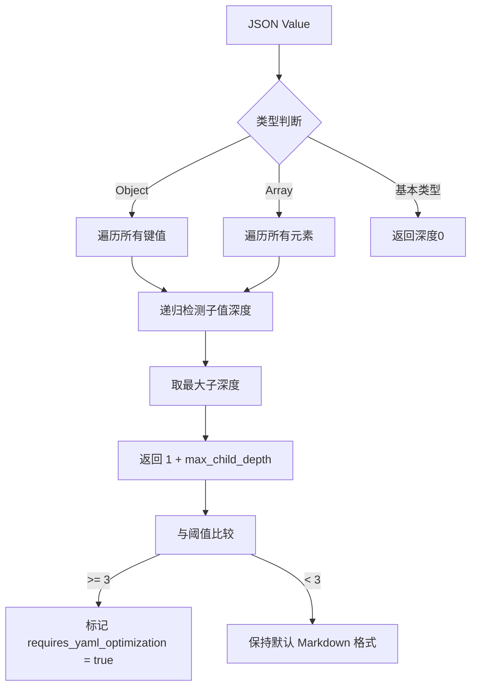

# 中间表示设计

> **SkillIR 数据结构的完整定义、类型系统与序列化规范**
>
> **重要更新**：基于《高级提示词工程格式与智能体技能架构》调研报告（2026-04），新增嵌套数据检测标记，支持AST优化决策。

> ✅ **实现状态声明 (Updated 2026-04-15):** 本文档描述的设计规格已全部在源码中实现。详见 [审查报告](../plans/REPO_AUDIT_REPORT.md)。实现状态如下：
>
> | 文档描述 | 实现状态 |
> |----------|---------|
> | `Arc<str>` 类型（零拷贝优化） | ✅ 已使用 `Arc<str>` |
> | `requires_yaml_optimization` 字段 | ✅ `SkillIR` 中已添加 |
> | `nested_data_depth` 字段 | ✅ `SkillIR` 中已添加 |
> | `NestedDataDetector` (Analyzer阶段) | ✅ `nested_data.rs` 已创建 |
> | `source_path` 使用 `Arc<str>` | ✅ 已使用 `Arc<str>` |

---

## 1. IR 设计哲学

中间表示（Intermediate Representation, IR）是编译器的神经中枢，承载着所有编译阶段的数据交换。NSC 的 IR 设计遵循以下原则：

| 原则 | 描述 | 学术依据 |
|------|------|----------|
| **强类型** | 所有字段都有明确的 Rust 类型定义，避免运行时类型错误 | Rust 类型系统优势 |
| **可序列化** | 通过 `serde` 支持 JSON/YAML 序列化，便于调试和持久化 | serde 生态 |
| **渐进式增强** | IR 在编译管线中逐步填充，Analyzer 阶段注入额外约束 | 编译器理论 |
| **零拷贝友好** | 关键字符串字段使用 `Arc<str>` 支持共享引用 | Rust 生命周期 |
| **AST优化标记** | 嵌套数据深度检测，为后端格式选择提供决策依据 | Gemini嵌套数据准确率测试 |

---

## 2. 核心数据结构

### 2.1 SkillIR 完整定义

```rust
// nexa-skill-core/src/ir/skill_ir.rs

use serde::{Serialize, Deserialize};
use std::sync::Arc;
use chrono::{DateTime, Utc};

/// Nexa Skill Compiler 核心中间表示
/// 
/// 这是编译管线中所有阶段的数据交换载体
#[derive(Debug, Clone, Serialize, Deserialize)]
pub struct SkillIR {
    // ===== 元数据与路由 =====
    
    /// 技能唯一标识符
    /// 
    /// 格式约束：kebab-case, 1-64字符
    pub name: Arc<str>,
    
    /// 版本号
    /// 
    /// 格式：语义化版本 (MAJOR.MINOR.PATCH)
    pub version: Arc<str>,
    
    /// 功能描述与触发条件
    /// 
    /// 长度约束：1-1024字符
    pub description: String,
    
    // ===== 接口与 MCP =====
    
    /// MCP 服务器依赖列表
    /// 
    /// 声明运行此技能需要挂载的 MCP 服务器
    #[serde(default, skip_serializing_if = "Vec::is_empty")]
    pub mcp_servers: Vec<Arc<str>>,
    
    /// 输入参数 JSON Schema
    /// 
    /// 定义技能接受的参数结构
    #[serde(skip_serializing_if = "Option::is_none")]
    pub input_schema: Option<serde_json::Value>,
    
    /// 输出参数 JSON Schema
    /// 
    /// 定义技能返回的数据结构
    #[serde(skip_serializing_if = "Option::is_none")]
    pub output_schema: Option<serde_json::Value>,
    
    // ===== 安全与控制 =====
    
    /// Human-In-The-Loop 审批标识
    /// 
    /// 如果为 true，执行前必须等待人类确认
    #[serde(default)]
    pub hitl_required: bool,
    
    /// 执行前必须满足的条件
    /// 
    /// 断言列表，所有条件必须满足才能执行
    #[serde(default, skip_serializing_if = "Vec::is_empty")]
    pub pre_conditions: Vec<String>,
    
    /// 执行后必须验证的条件
    /// 
    /// 断言列表，用于验证执行结果
    #[serde(default, skip_serializing_if = "Vec::is_empty")]
    pub post_conditions: Vec<String>,
    
    /// 错误恢复策略
    /// 
    /// 定义失败时的降级和恢复逻辑
    #[serde(default, skip_serializing_if = "Vec::is_empty")]
    pub fallbacks: Vec<String>,
    
    /// 权限声明列表
    /// 
    /// 声明技能所需的系统权限
    #[serde(default, skip_serializing_if = "Vec::is_empty")]
    pub permissions: Vec<Permission>,
    
    /// 安全等级
    /// 
    /// 影响编译期的审计强度
    #[serde(default = "default_security_level")]
    pub security_level: SecurityLevel,
    
    // ===== 执行逻辑 =====
    
    /// 上下文收集步骤
    /// 
    /// 执行前需要收集的信息
    #[serde(default, skip_serializing_if = "Vec::is_empty")]
    pub context_gathering: Vec<String>,
    
    /// 标准作业程序步骤
    /// 
    /// 核心执行逻辑，带编号的步骤列表
    #[serde(default, skip_serializing_if = "Vec::is_empty")]
    pub procedures: Vec<ProcedureStep>,
    
    /// Few-shot 示例
    /// 
    /// 输入输出示例，帮助 Agent 理解预期行为
    #[serde(default, skip_serializing_if = "Vec::is_empty")]
    pub few_shot_examples: Vec<Example>,
    
    // ===== 编译期注入 =====
    
    /// Anti-Skill 约束
    ///
    /// 由 Analyzer 阶段自动注入的安全约束
    #[serde(default, skip_serializing_if = "Vec::is_empty")]
    pub anti_skill_constraints: Vec<Constraint>,
    
    // ===== AST优化标记（新增）=====
    
    /// 是否需要YAML优化
    ///
    /// 当嵌套数据深度 >= 3 时，Gemini Emitter 应使用 YAML 格式
    /// 学术依据：YAML嵌套数据准确率 51.9% > Markdown 48.2% > JSON 43.1%
    #[serde(default, skip_serializing_if = "is_false")]
    pub requires_yaml_optimization: bool,
    
    /// 嵌套数据深度
    ///
    /// 由 NestedDataDetector 在 Analyzer 阶段计算
    /// 用于后端格式选择决策
    #[serde(skip_serializing_if = "Option::is_none")]
    pub nested_data_depth: Option<usize>,
    
    // ===== 元信息 =====
    
    /// 源文件路径
    #[serde(skip_serializing)]
    pub source_path: String,
    
    /// 源文件哈希
    /// 
    /// SHA-256，用于完整性校验
    #[serde(skip_serializing)]
    pub source_hash: String,
    
    /// 编译时间戳
    #[serde(skip_serializing_if = "Option::is_none")]
    pub compiled_at: Option<DateTime<Utc>>,
}

fn default_security_level() -> SecurityLevel {
    SecurityLevel::Medium
}
```

### 2.2 ProcedureStep 定义

```rust
// nexa-skill-core/src/ir/procedure.rs

use serde::{Serialize, Deserialize};

/// 执行步骤定义
/// 
/// 代表 SOP 中的一个原子操作
#[derive(Debug, Clone, Serialize, Deserialize)]
pub struct ProcedureStep {
    /// 步骤序号
    /// 
    /// 从 1 开始的顺序编号
    pub order: u32,
    
    /// 步骤指令文本
    /// 
    /// 具体的操作描述
    pub instruction: String,
    
    /// 关键步骤标识
    /// 
    /// 如果为 true，此步骤失败应停止整个流程
    #[serde(default)]
    pub is_critical: bool,
    
    /// 步骤级别约束
    /// 
    /// 仅应用于此步骤的额外约束
    #[serde(default, skip_serializing_if = "Vec::is_empty")]
    pub constraints: Vec<String>,
    
    /// 预期输出
    /// 
    /// 此步骤完成后应产生的结果
    #[serde(skip_serializing_if = "Option::is_none")]
    pub expected_output: Option<String>,
    
    /// 错误处理策略
    /// 
    /// 此步骤失败时的具体处理方式
    #[serde(skip_serializing_if = "Option::is_none")]
    pub on_error: Option<ErrorHandlingStrategy>,
}

/// 错误处理策略
#[derive(Debug, Clone, Serialize, Deserialize)]
pub enum ErrorHandlingStrategy {
    /// 停止整个流程
    Stop,
    /// 跳过此步骤继续
    Skip,
    /// 重试指定次数
    Retry { max_attempts: u32, delay_ms: u64 },
    /// 执行备用步骤
    Fallback { alternative_step: String },
    /// 请求用户干预
    RequestHumanInput,
}
```

### 2.3 Permission 定义

```rust
// nexa-skill-core/src/ir/permission.rs

use serde::{Serialize, Deserialize};

/// 权限声明
/// 
/// 定义技能所需的系统访问权限
#[derive(Debug, Clone, Serialize, Deserialize)]
pub struct Permission {
    /// 权限类型
    pub kind: PermissionKind,
    
    /// 权限范围
    /// 
    /// 格式取决于 kind：
    /// - Network: URL pattern (e.g., "https://api.github.com/*")
    /// - FileSystem: 文件路径 pattern (e.g., "/tmp/skill-*")
    /// - Database: "db_type:db_name:operation" (e.g., "postgres:staging:SELECT")
    /// - Execute: 命令 pattern (e.g., "git:*")
    /// - MCP: MCP 服务器名称
    pub scope: String,
    
    /// 权限描述
    #[serde(skip_serializing_if = "Option::is_none")]
    pub description: Option<String>,
}

/// 权限类型枚举
#[derive(Debug, Clone, Copy, PartialEq, Eq, Serialize, Deserialize)]
#[serde(rename_all = "lowercase")]
pub enum PermissionKind {
    /// 网络访问权限
    Network,
    
    /// 文件系统权限
    #[serde(alias = "fs")]
    FileSystem,
    
    /// 数据库权限
    #[serde(alias = "db")]
    Database,
    
    /// 命令执行权限
    #[serde(alias = "exec")]
    Execute,
    
    /// MCP 服务器权限
    MCP,
    
    /// 未知权限类型
    Unknown,
}

impl PermissionKind {
    /// 获取权限类型的显示名称
    pub fn display_name(&self) -> &'static str {
        match self {
            PermissionKind::Network => "网络访问",
            PermissionKind::FileSystem => "文件系统",
            PermissionKind::Database => "数据库",
            PermissionKind::Execute => "命令执行",
            PermissionKind::MCP => "MCP 服务器",
            PermissionKind::Unknown => "未知",
        }
    }
    
    /// 获取 scope 格式说明
    pub fn scope_format(&self) -> &'static str {
        match self {
            PermissionKind::Network => "URL pattern (e.g., https://api.example.com/*)",
            PermissionKind::FileSystem => "文件路径 pattern (e.g., /tmp/skill-*)",
            PermissionKind::Database => "db_type:db_name:operation (e.g., postgres:staging:SELECT)",
            PermissionKind::Execute => "命令 pattern (e.g., git:*)",
            PermissionKind::MCP => "MCP 服务器名称",
            PermissionKind::Unknown => "任意格式",
        }
    }
}
```

### 2.4 Constraint 定义

```rust
// nexa-skill-core/src/ir/constraint.rs

use serde::{Serialize, Deserialize};

/// Anti-Skill 约束
/// 
/// 由 Analyzer 阶段自动注入的安全约束
#[derive(Debug, Clone, Serialize, Deserialize)]
pub struct Constraint {
    /// 约束来源
    /// 
    /// 触发此约束的模式 ID
    pub source: String,
    
    /// 约束内容
    /// 
    /// 具体的约束指令文本
    pub content: String,
    
    /// 约束级别
    /// 
    /// 决定违反约束时的处理方式
    #[serde(default)]
    pub level: ConstraintLevel,
    
    /// 应用范围
    /// 
    /// 约束应用于哪些步骤
    #[serde(default)]
    pub scope: ConstraintScope,
}

/// 约束级别
#[derive(Debug, Clone, Copy, PartialEq, Eq, Serialize, Deserialize)]
#[serde(rename_all = "lowercase")]
pub enum ConstraintLevel {
    /// 警告级别
    /// 
    /// 违反时发出警告，但不阻断执行
    Warning,
    
    /// 错误级别
    /// 
    /// 违反时发出错误，阻断执行
    Error,
    
    /// 阻断级别
    /// 
    /// 强制阻止执行，必须人工干预
    Block,
}

/// 约束应用范围
#[derive(Debug, Clone, Serialize, Deserialize)]
#[serde(rename_all = "lowercase")]
pub enum ConstraintScope {
    /// 应用到所有步骤
    Global,
    
    /// 应用到特定步骤
    SpecificSteps { step_ids: Vec<u32> },
    
    /// 应用到特定关键词匹配的步骤
    KeywordMatch { keywords: Vec<String> },
}

impl Default for ConstraintLevel {
    fn default() -> Self {
        ConstraintLevel::Warning
    }
}

impl Default for ConstraintScope {
    fn default() -> Self {
        ConstraintScope::Global
    }
}
```

### 2.5 Example 定义

```rust
// nexa-skill-core/src/ir/example.rs

use serde::{Serialize, Deserialize};

/// Few-shot 示例
/// 
/// 输入输出示例，帮助 Agent 理解预期行为
#[derive(Debug, Clone, Serialize, Deserialize)]
pub struct Example {
    /// 示例标题
    #[serde(skip_serializing_if = "Option::is_none")]
    pub title: Option<String>,
    
    /// 用户输入
    /// 
    /// 示例中的用户请求
    pub user_input: String,
    
    /// Agent 响应
    /// 
    /// 示例中的 Agent 执行过程和结果
    pub agent_response: String,
    
    /// 示例标签
    /// 
    /// 用于分类和检索
    #[serde(default, skip_serializing_if = "Vec::is_empty")]
    pub tags: Vec<String>,
    
    /// 示例难度
    #[serde(skip_serializing_if = "Option::is_none")]
    pub difficulty: Option<ExampleDifficulty>,
}

/// 示例难度等级
#[derive(Debug, Clone, Copy, Serialize, Deserialize)]
#[serde(rename_all = "lowercase")]
pub enum ExampleDifficulty {
    /// 基础示例
    Basic,
    
    /// 中级示例
    Intermediate,
    
    /// 高级示例
    Advanced,
}
```

### 2.6 SecurityLevel 定义

```rust
// nexa-skill-core/src/ir/security_level.rs

use serde::{Serialize, Deserialize};

/// 安全等级
/// 
/// 影响编译期的审计强度和运行时的行为
#[derive(Debug, Clone, Copy, PartialEq, Eq, Serialize, Deserialize)]
#[serde(rename_all = "lowercase")]
pub enum SecurityLevel {
    /// 低安全等级
    /// 
    /// 仅基础格式校验，适合只读操作
    Low,
    
    /// 中等安全等级（默认）
    /// 
    /// 权限声明检查，适合一般操作
    Medium,
    
    /// 高安全等级
    /// 
    /// 强制 HITL，高危词汇扫描，适合写操作
    High,
    
    /// 关键安全等级
    /// 
    /// 禁止自动执行，必须人工审批，适合危险操作
    Critical,
}

impl SecurityLevel {
    /// 获取安全等级的审计强度描述
    pub fn audit_intensity(&self) -> &'static str {
        match self {
            SecurityLevel::Low => "仅基础格式校验",
            SecurityLevel::Medium => "权限声明检查",
            SecurityLevel::High => "强制 HITL，高危词汇扫描",
            SecurityLevel::Critical => "禁止自动执行，必须人工审批",
        }
    }
    
    /// 是否需要强制 HITL
    pub fn requires_hitl(&self) -> bool {
        matches!(self, SecurityLevel::High | SecurityLevel::Critical)
    }
    
    /// 是否禁止自动执行
    pub fn blocks_auto_execution(&self) -> bool {
        matches!(self, SecurityLevel::Critical)
    }
}

impl Default for SecurityLevel {
    fn default() -> Self {
        SecurityLevel::Medium
    }
}
```

---

## 3. ValidatedSkillIR 结构

### 3.1 定义

```rust
// nexa-skill-core/src/ir/validated.rs

use crate::ir::SkillIR;
use crate::error::Diagnostic;

/// 经过验证的 SkillIR
/// 
/// Analyzer 阶段的输出，包含所有诊断信息
#[derive(Debug, Clone)]
pub struct ValidatedSkillIR {
    /// 内部 SkillIR
    pub inner: SkillIR,
    
    /// 诊断信息列表
    /// 
    /// 包含所有警告和错误
    pub diagnostics: Vec<Diagnostic>,
    
    /// 验证时间戳
    pub validated_at: chrono::DateTime<chrono::Utc>,
}

impl ValidatedSkillIR {
    /// 创建新的 ValidatedSkillIR
    pub fn new(inner: SkillIR, diagnostics: Vec<Diagnostic>) -> Self {
        Self {
            inner,
            diagnostics,
            validated_at: chrono::Utc::now(),
        }
    }
    
    /// 获取所有警告
    pub fn warnings(&self) -> Vec<&Diagnostic> {
        self.diagnostics.iter().filter(|d| d.is_warning()).collect()
    }
    
    /// 获取所有错误
    pub fn errors(&self) -> Vec<&Diagnostic> {
        self.diagnostics.iter().filter(|d| d.is_error()).collect()
    }
    
    /// 是否有阻断性错误
    pub fn has_blocking_errors(&self) -> bool {
        self.diagnostics.iter().any(|d| d.is_error())
    }
    
    /// 获取内部 SkillIR 的引用
    pub fn as_ref(&self) -> &SkillIR {
        &self.inner
    }
    
    /// 获取内部 SkillIR 的可变引用
    pub fn as_mut(&mut self) -> &mut SkillIR {
        &mut self.inner
    }
    
    /// 转换为 JSON 字符串（用于调试）
    pub fn to_json(&self) -> Result<String, serde_json::Error> {
        serde_json::to_string_pretty(&self.inner)
    }
}
```

---

## 4. Manifest 结构

### 4.1 定义

```rust
// nexa-skill-core/src/ir/manifest.rs

use serde::{Serialize, Deserialize};
use chrono::{DateTime, Utc};

/// 编译产物元数据清单
/// 
/// 生成在产物目录的 manifest.json 中
#[derive(Debug, Clone, Serialize, Deserialize)]
pub struct Manifest {
    /// 技能名称
    pub name: String,
    
    /// 版本号
    pub version: String,
    
    /// 编译时间戳
    pub compiled_at: DateTime<Utc>,
    
    /// 编译器版本
    pub compiler_version: String,
    
    /// 目标平台列表
    pub targets: Vec<TargetInfo>,
    
    /// 源文件哈希
    pub source_hash: String,
    
    /// 依赖的 MCP 服务器
    #[serde(default, skip_serializing_if = "Vec::is_empty")]
    pub mcp_servers: Vec<String>,
    
    /// 安全等级
    pub security_level: String,
    
    /// 是否需要 HITL
    pub hitl_required: bool,
    
    /// 权限声明
    #[serde(default, skip_serializing_if = "Vec::is_empty")]
    pub permissions: Vec<PermissionSummary>,
    
    /// Anti-Skill 约束数量
    pub anti_skill_count: usize,
    
    /// 诊断信息摘要
    pub diagnostics_summary: DiagnosticsSummary,
}

/// 目标平台信息
#[derive(Debug, Clone, Serialize, Deserialize)]
pub struct TargetInfo {
    /// 平台名称
    pub platform: String,
    
    /// 产物文件名
    pub output_file: String,
    
    /// 产物文件大小（字节）
    pub file_size: usize,
    
    /// 产物文件哈希
    pub file_hash: String,
}

/// 权限摘要
#[derive(Debug, Clone, Serialize, Deserialize)]
pub struct PermissionSummary {
    pub kind: String,
    pub scope: String,
}

/// 诊断信息摘要
#[derive(Debug, Clone, Serialize, Deserialize)]
pub struct DiagnosticsSummary {
    /// 警告数量
    pub warnings: usize,
    
    /// 错误数量
    pub errors: usize,
    
    /// 是否通过验证
    pub passed: bool,
}

impl Manifest {
    /// 从 ValidatedSkillIR 创建 Manifest
    pub fn from_ir(ir: &ValidatedSkillIR, targets: &[TargetInfo]) -> Self {
        let inner = ir.as_ref();
        
        Self {
            name: inner.name.to_string(),
            version: inner.version.to_string(),
            compiled_at: chrono::Utc::now(),
            compiler_version: env!("CARGO_PKG_VERSION"),
            targets: targets.to_vec(),
            source_hash: inner.source_hash.clone(),
            mcp_servers: inner.mcp_servers.iter().map(|s| s.to_string()).collect(),
            security_level: inner.security_level.to_string(),
            hitl_required: inner.hitl_required,
            permissions: inner.permissions.iter().map(|p| PermissionSummary {
                kind: p.kind.to_string(),
                scope: p.scope.clone(),
            }).collect(),
            anti_skill_count: inner.anti_skill_constraints.len(),
            diagnostics_summary: DiagnosticsSummary {
                warnings: ir.warnings().len(),
                errors: ir.errors().len(),
                passed: !ir.has_blocking_errors(),
            },
        }
    }
}
```

---

## 5. 类型转换与映射

### 5.1 RawAST → SkillIR 映射表

| RawAST 字段 | SkillIR 字段 | 转换逻辑 |
|-------------|--------------|----------|
| `frontmatter.name` | `name` | 直接映射，验证 kebab-case |
| `frontmatter.version` | `version` | 默认值 "1.0.0" |
| `frontmatter.description` | `description` | 直接映射，验证长度 |
| `frontmatter.mcp_servers` | `mcp_servers` | 默认空数组，Arc 包装 |
| `frontmatter.input_schema` | `input_schema` | 直接映射 |
| `frontmatter.hitl_required` | `hitl_required` | 默认 false |
| `frontmatter.permissions` | `permissions` | 解析 PermissionKind |
| `body.procedures` | `procedures` | 解析编号和 CRITICAL 标记 |
| `body.examples` | `few_shot_examples` | 解析 User/Agent 对话 |

### 5.2 SkillIR → ValidatedSkillIR 映射表

| SkillIR 字段 | ValidatedSkillIR 字段 | 变化 |
|--------------|----------------------|------|
| `anti_skill_constraints` | `inner.anti_skill_constraints` | Analyzer 注入填充 |
| - | `diagnostics` | Analyzer 生成诊断 |
| - | `validated_at` | 添加验证时间戳 |

---

## 6. 序列化配置

### 6.1 Serde 属性配置

```rust
// 序列化配置示例

#[derive(Debug, Clone, Serialize, Deserialize)]
pub struct SkillIR {
    // 使用 kebab-case 序列化字段名
    #[serde(rename = "skill-name")]
    pub name: Arc<str>,
    
    // 跳过空值字段
    #[serde(skip_serializing_if = "Vec::is_empty")]
    pub mcp_servers: Vec<Arc<str>>,
    
    // 跳过 None 字段
    #[serde(skip_serializing_if = "Option::is_none")]
    pub input_schema: Option<serde_json::Value>,
    
    // 使用默认值
    #[serde(default)]
    pub hitl_required: bool,
    
    // 自定义默认值函数
    #[serde(default = "default_security_level")]
    pub security_level: SecurityLevel,
    
    // 跳过序列化（仅内部使用）
    #[serde(skip_serializing)]
    pub source_path: String,
}
```

### 6.2 JSON 序列化示例

```json
{
  "name": "database-migration",
  "version": "2.1.0",
  "description": "执行 PostgreSQL 数据库表结构修改...",
  "mcp_servers": [
    "neon-postgres-admin",
    "github-pr-creator"
  ],
  "input_schema": {
    "type": "object",
    "properties": {
      "target_table": { "type": "string" },
      "migration_type": { "enum": ["add_column", "drop_column"] }
    },
    "required": ["target_table"]
  },
  "hitl_required": true,
  "security_level": "high",
  "permissions": [
    { "kind": "database", "scope": "postgres:staging:ALTER" }
  ],
  "procedures": [
    {
      "order": 1,
      "instruction": "提取目标表的当前 Schema",
      "is_critical": false
    },
    {
      "order": 2,
      "instruction": "编写 SQL 迁移脚本",
      "is_critical": true
    }
  ],
  "anti_skill_constraints": [
    {
      "source": "db-cascade",
      "content": "Never use CASCADE without explicit user approval",
      "level": "block"
    }
  ]
}
```

---

## 7. IR 验证规则

### 7.1 字段验证规则表

| 字段 | 验证规则 | 错误级别 | 错误码 |
|------|----------|----------|--------|
| `name` | 非空, kebab-case, 1-64字符 | Error | `nsc::ir::invalid_name` |
| `version` | 语义化版本格式 | Warning | `nsc::ir::invalid_version` |
| `description` | 非空, ≤1024字符 | Error | `nsc::ir::description_length` |
| `input_schema` | 有效 JSON Schema | Error | `nsc::ir::invalid_schema` |
| `mcp_servers` | 服务器在白名单 | Warning | `nsc::ir::mcp_not_allowed` |
| `permissions` | 格式正确, 权限在安全基线 | Error | `nsc::ir::invalid_permission` |
| `procedures` | 非空, 有编号 | Error | `nsc::ir::missing_procedures` |
| `security_level` | 有效枚举值 | Warning | `nsc::ir::invalid_security_level` |

### 7.2 交叉验证规则

| 规则 | 描述 | 错误级别 |
|------|------|----------|
| **Schema-Example 一致性** | Examples 中的参数应在 input_schema 中定义 | Warning |
| **Permission-Keyword 匹配** | 高危关键词应有对应权限声明 | Error |
| **HITL-SecurityLevel 一致性** | Critical 级别必须设置 hitl_required=true | Error |
| **Procedure-Constraint 关联** | 约束应关联到存在的步骤 | Warning |

---

## 8. IR 扩展机制

### 8.1 自定义字段扩展

通过 `metadata` 字段支持自定义扩展：

```rust
// 扩展字段示例
pub struct SkillIR {
    // ... 标准字段 ...
    
    /// 扩展元数据
    /// 
    /// 用于存储非标准字段
    #[serde(default, skip_serializing_if = "Option::is_none")]
    pub extensions: Option<serde_json::Map<String, serde_json::Value>>,
}
```

### 8.2 自定义 Analyzer 注入

Analyzer 可以向 IR 注入自定义约束：

```rust
// 自定义 Analyzer 注入示例
impl Analyzer for CustomAnalyzer {
    fn analyze(&self, ir: &mut SkillIR) -> Result<Vec<Diagnostic>, AnalyzeError> {
        // 注入自定义约束
        ir.anti_skill_constraints.push(Constraint {
            source: "custom-rule",
            content: "Custom constraint content",
            level: ConstraintLevel::Warning,
            scope: ConstraintScope::Global,
        });
        
        Ok(Vec::new())
    }
}
```

---

## 9. 嵌套数据检测机制（新增）

### 9.1 学术依据

根据《高级提示词工程格式与智能体技能架构》调研报告，Gemini解析复杂嵌套数据的准确率存在显著差异：

| 数据格式 | 解析准确率 | 95%置信区间 | 词元效率 |
|----------|------------|-------------|----------|
| **YAML** | **51.9%** | [48.8%, 55.0%] | 中等 |
| Markdown | 48.2% | [45.1%, 51.3%] | 最优 |
| JSON | 43.1% | [40.1%, 46.2%] | 低 |
| XML | 33.8% | [30.9%, 36.8%] | 最低 |

> **关键发现**：当任务涉及高度结构化的嵌套数据时，YAML的高人类可读性和极简缩进层级结构使其能够以51.9%的最高准确率被模型解析。

### 9.2 NestedDataDetector 实现

```rust
// nexa-skill-core/src/analyzer/nested_data.rs

use serde_json::Value;

/// 嵌套数据检测器
///
/// 在编译期检测IR中是否存在深层嵌套的字典数据，
/// 为Gemini Emitter提供AST优化决策依据
pub struct NestedDataDetector {
    /// 嵌套深度阈值（超过此值触发YAML转换）
    depth_threshold: usize,
}

impl NestedDataDetector {
    pub fn new() -> Self {
        Self {
            depth_threshold: 3,  // 默认3层以上视为深层嵌套
        }
    }
    
    /// 检测JSON值的嵌套深度
    ///
    /// 递归计算Object和Array的嵌套层级
    pub fn detect_depth(value: &Value) -> usize {
        match value {
            Value::Object(map) => {
                let max_child_depth = map.values()
                    .map(Self::detect_depth)
                    .max()
                    .unwrap_or(0);
                1 + max_child_depth
            }
            Value::Array(arr) => {
                let max_child_depth = arr.iter()
                    .map(Self::detect_depth)
                    .max()
                    .unwrap_or(0);
                1 + max_child_depth
            }
            _ => 0,  // 基本类型无嵌套
        }
    }
    
    /// 检查IR中是否需要YAML优化
    pub fn requires_yaml_optimization(ir: &SkillIR) -> bool {
        // 检查input_schema
        if let Some(schema) = &ir.input_schema {
            if Self::detect_depth(schema) >= 3 {
                return true;
            }
        }
        
        // 检查output_schema
        if let Some(schema) = &ir.output_schema {
            if Self::detect_depth(schema) >= 3 {
                return true;
            }
        }
        
        // 检查示例中的结构化数据
        for example in &ir.few_shot_examples {
            // 简单启发式：检查是否包含JSON代码块
            if example.agent_response.contains("```json") {
                return true;
            }
        }
        
        false
    }
    
    /// 计算IR中的最大嵌套深度
    pub fn compute_max_depth(ir: &SkillIR) -> usize {
        let mut max_depth = 0;
        
        if let Some(schema) = &ir.input_schema {
            max_depth = std::cmp::max(max_depth, Self::detect_depth(schema));
        }
        
        if let Some(schema) = &ir.output_schema {
            max_depth = std::cmp::max(max_depth, Self::detect_depth(schema));
        }
        
        max_depth
    }
}
```

### 9.3 深度检测算法



### 9.4 深度阈值决策依据

| 阈值 | 适用场景 | 准确率提升 | 词元成本 |
|------|----------|------------|----------|
| 2层 | 极度保守 | +3.7% | +10% |
| **3层（默认）** | 平衡选择 | +3.7% | +10% |
| 4层 | 宽松策略 | 仅深层优化 | 仅深层+10% |
| 5层 | 极度宽松 | 仅超深层优化 | 仅超深层+10% |

> **决策依据**：选择3层作为默认阈值，因为：
> 1. 3层嵌套已足以让JSON的语法噪音干扰模型注意力
> 2. YAML的准确率优势在3层以上开始显著体现
> 3. 词元成本增加可控（约10%）

### 9.5 IR字段影响

| IR字段 | 检测逻辑 | 影响后端 |
|--------|----------|----------|
| `input_schema` | 递归检测Object/Array嵌套 | Gemini |
| `output_schema` | 递归检测Object/Array嵌套 | Gemini |
| `few_shot_examples` | 启发式检测JSON代码块 | Gemini |

---

## 10. 相关文档

- [COMPILER_PIPELINE.md](COMPILER_PIPELINE.md) - IR 构建阶段实现
- [BACKEND_ADAPTERS.md](BACKEND_ADAPTERS.md) - IR 到产物的转换，含AST优化策略
- [SECURITY_MODEL.md](SECURITY_MODEL.md) - 权限和约束系统
- [ROUTING_MANIFEST.md](ROUTING_MANIFEST.md) - 渐进式路由清单机制
- [API_REFERENCE.md](API_REFERENCE.md) - IR API 定义