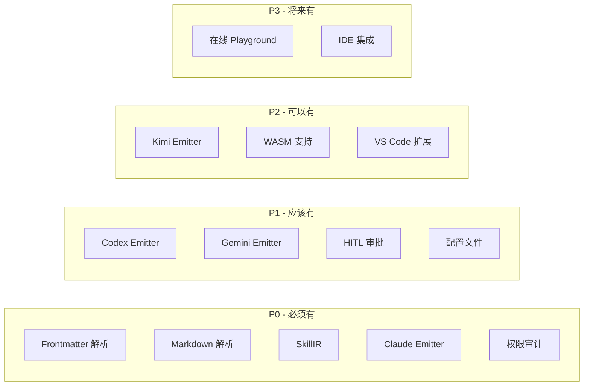

# 项目路线图

> **Nexa Skill Compiler 开发里程碑、功能规划与交付时间表**

---

## 1. 项目愿景

Nexa Skill Compiler (NSC) 致力于成为 AI Agent 技能开发的标准编译工具，实现：

- **标准化**：建立统一的 SKILL.md 规范
- **多平台**：支持所有主流 Agent 平台
- **安全性**：内置权限审计和安全约束
- **高性能**：毫秒级编译，支持大规模技能库

---

## 2. 里程碑规划

### Phase 1: MVP (最小可行产品)

**目标时间**：第 1-3 周

**核心交付物**：
- 基础编译管线
- 单文件编译支持
- Claude Emitter

**功能清单**：

| 功能 | 优先级 | 状态 |
|------|--------|------|
| YAML Frontmatter 解析 | P0 | 待开发 |
| Markdown Body 解析 | P0 | 待开发 |
| SkillIR 数据结构 | P0 | 待开发 |
| 基础验证器 | P0 | 待开发 |
| Claude XML Emitter | P0 | 待开发 |
| CLI `build` 命令 | P0 | 待开发 |
| CLI `check` 命令 | P1 | 待开发 |
| 错误报告系统 | P0 | 待开发 |
| 单元测试框架 | P1 | 待开发 |

**验收标准**：
- [ ] 能够解析符合规范的 SKILL.md 文件
- [ ] 能够生成有效的 Claude XML 产物
- [ ] 编译错误能够精确定位到源文件行号
- [ ] 核心模块测试覆盖率 ≥ 70%

---

### Phase 2: 多平台支持

**目标时间**：第 4-6 周

**核心交付物**：
- Codex Emitter
- Gemini Emitter
- 多目标并行编译

**功能清单**：

| 功能 | 优先级 | 状态 |
|------|--------|------|
| Codex JSON Schema Emitter | P0 | 待开发 |
| Gemini Markdown Emitter | P0 | 待开发 |
| Kimi Emitter | P1 | 待开发 |
| 多目标并行发射 | P0 | 待开发 |
| Emitter Registry | P0 | 待开发 |
| 目录批量编译 | P1 | 待开发 |
| CLI 多目标 Flag | P0 | 待开发 |
| 集成测试 | P1 | 待开发 |

**验收标准**：
- [ ] 支持 Claude、Codex、Gemini 三大平台
- [ ] 单文件多目标编译时间 < 200ms
- [ ] 目录批量编译支持
- [ ] 集成测试覆盖率 ≥ 60%

---

### Phase 3: 安全与约束系统

**目标时间**：第 7-9 周

**核心交付物**：
- 权限审计系统
- Anti-Skill 注入
- HITL 审批流程

**功能清单**：

| 功能 | 优先级 | 状态 |
|------|--------|------|
| 权限类型定义 | P0 | 待开发 |
| 权限审计器 | P0 | 待开发 |
| 安全等级系统 | P0 | 待开发 |
| Anti-Skill 模式库 | P0 | 待开发 |
| Anti-Skill 注入器 | P0 | 待开发 |
| HITL 管理器 | P1 | 待开发 |
| CLI 交互确认 | P1 | 待开发 |
| 安全审计日志 | P2 | 待开发 |

**验收标准**：
- [ ] 高危关键词检测准确率 ≥ 95%
- [ ] Anti-Skill 约束自动注入
- [ ] HITL 审批流程完整可用
- [ ] 安全模块测试覆盖率 ≥ 85%

---

### Phase 4: 开发者体验优化

**目标时间**：第 10-12 周

**核心交付物**：
- 完整 CLI 命令集
- 配置文件支持
- 错误诊断增强

**功能清单**：

| 功能 | 优先级 | 状态 |
|------|--------|------|
| CLI `validate` 命令 | P0 | 待开发 |
| CLI `init` 命令 | P1 | 待开发 |
| CLI `list` 命令 | P1 | 待开发 |
| CLI `clean` 命令 | P1 | 待开发 |
| 配置文件支持 (nsc.toml) | P0 | 待开发 |
| JSON 输出格式 | P1 | 待开发 |
| HTML 诊断报告 | P2 | 待开发 |
| 进度条展示 | P2 | 待开发 |

**验收标准**：
- [ ] CLI 命令完整可用
- [ ] 配置文件支持所有编译选项
- [ ] 错误报告清晰易懂
- [ ] 文档完整覆盖所有功能

---

### Phase 5: 扩展与生态

**目标时间**：第 13-15 周

**核心交付物**：
- WASM 支持
- 自定义 Emitter API
- 插件系统

**功能清单**：

| 功能 | 优先级 | 状态 |
|------|--------|------|
| WASM 绑定 | P1 | 待开发 |
| 自定义 Emitter API | P0 | 待开发 |
| 自定义 Analyzer API | P1 | 待开发 |
| 插件加载机制 | P2 | 待开发 |
| VS Code 扩展 | P2 | 待开发 |
| 在线 Playground | P3 | 待开发 |

**验收标准**：
- [ ] WASM 模块可在浏览器中运行
- [ ] 第三方可开发自定义 Emitter
- [ ] API 文档完整
- [ ] 示例代码可用

---

### Phase 6: 性能与稳定性

**目标时间**：第 16-18 周

**核心交付物**：
- 性能优化
- 稳定性增强
- 文档完善

**功能清单**：

| 功能 | 优先级 | 状态 |
|------|--------|------|
| 零拷贝优化 | P1 | 待开发 |
| 并行编译优化 | P1 | 待开发 |
| 内存使用优化 | P2 | 待开发 |
| 错误恢复机制 | P1 | 待开发 |
| 性能基准测试 | P1 | 待开发 |
| 压力测试 | P2 | 待开发 |
| 文档完善 | P0 | 待开发 |
| 示例技能库 | P1 | 待开发 |

**验收标准**：
- [ ] 单文件编译时间 < 100ms
- [ ] 1000 文件批量编译时间 < 30s
- [ ] 内存占用 < 100MB (单文件)
- [ ] 文档覆盖率 100%

---

## 3. 版本发布计划

### v0.1.0 - MVP Release

**发布时间**：第 3 周末

**包含功能**：
- 基础编译管线
- Claude Emitter
- CLI `build` 和 `check` 命令

**发布物**：
- `nexa-skill-cli` 二进制文件
- `nexa-skill-core` crate
- 基础文档

### v0.2.0 - Multi-Platform

**发布时间**：第 6 周末

**包含功能**：
- Codex、Gemini Emitter
- 多目标编译
- 目录批量编译

**发布物**：
- 更新的二进制文件和 crate
- 多平台编译文档

### v0.3.0 - Security

**发布时间**：第 9 周末

**包含功能**：
- 权限审计系统
- Anti-Skill 注入
- HITL 审批

**发布物**：
- 安全模块文档
- 安全最佳实践指南

### v0.4.0 - DX Enhancement

**发布时间**：第 12 周末

**包含功能**：
- 完整 CLI 命令集
- 配置文件支持
- 增强的错误报告

**发布物**：
- 用户手册
- 配置文件参考

### v0.5.0 - Extension

**发布时间**：第 15 周末

**包含功能**：
- WASM 支持
- 自定义 Emitter API
- 插件系统

**发布物**：
- API 参考文档
- 开发者指南

### v1.0.0 - Stable Release

**发布时间**：第 18 周末

**包含功能**：
- 所有核心功能
- 性能优化
- 完整文档

**发布物**：
- 稳定版二进制文件
- crates.io 发布
- 完整文档站点

---

## 4. 功能优先级矩阵

---

## 5. 风险与缓解

| 风险 | 影响 | 概率 | 缓解措施 |
|------|------|------|----------|
| Markdown 解析复杂度超预期 | 高 | 中 | 使用成熟的 pulldown-cmark 库 |
| 多平台格式差异大 | 中 | 高 | 设计灵活的 Emitter Trait |
| 安全审计误报率高 | 中 | 中 | 建立完善的测试用例库 |
| WASM 兼容性问题 | 低 | 中 | 提前进行 WASM 测试 |
| 性能不达标 | 高 | 低 | 设计阶段考虑性能优化 |

---

## 6. 资源需求

### 6.1 人力资源

| 角色 | 人数 | 职责 |
|------|------|------|
| 核心开发 | 2 | 编译器核心逻辑开发 |
| 测试工程师 | 1 | 测试用例编写、CI/CD |
| 文档工程师 | 1 | 文档编写、示例开发 |

### 6.2 技术资源

| 资源 | 用途 |
|------|------|
| GitHub Actions | CI/CD |
| crates.io | Crate 发布 |
| GitHub Pages | 文档站点 |

---

## 7. 成功指标

### 7.1 技术指标

| 指标 | 目标值 | 测量方式 |
|------|--------|----------|
| 编译速度 | < 100ms/文件 | Benchmark |
| 测试覆盖率 | ≥ 80% | cargo-tarpaulin |
| 错误定位精度 | 100% 行号准确 | 测试用例 |
| 内存占用 | < 100MB | 性能测试 |

### 7.2 用户指标

| 指标 | 目标值 | 测量方式 |
|------|--------|----------|
| GitHub Stars | > 500 | GitHub |
| crates.io 下载量 | > 1000/月 | crates.io |
| Issue 响应时间 | < 24h | GitHub |
| 文档满意度 | > 4.5/5 | 用户反馈 |

---

## 8. 后续规划

### v1.x 版本

- 更多 Agent 平台支持
- 性能持续优化
- 社区贡献集成

### v2.0 版本

- 可视化技能编辑器
- 技能市场/注册中心
- 多语言 SDK

---

## 9. 相关文档

- [ARCHITECTURE.md](ARCHITECTURE.md) - 系统架构
- [DEVELOPMENT_GUIDE.md](DEVELOPMENT_GUIDE.md) - 开发指南
- [TESTING_STRATEGY.md](TESTING_STRATEGY.md) - 测试策略
- [API_REFERENCE.md](API_REFERENCE.md) - API 参考