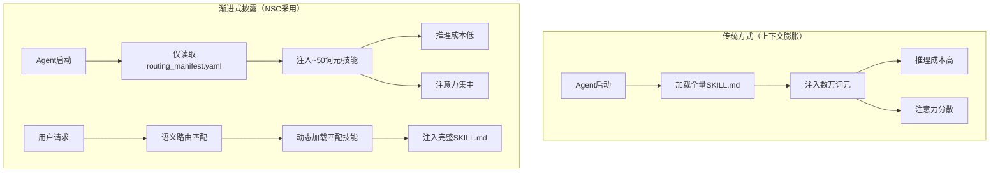

# 渐进式路由清单机制

> **Progressive Routing Manifest - 解决上下文膨胀的编译期优化**
>
> **学术依据**：Agent Skills开放标准通过"渐进式披露"（Progressive Disclosure）机制解决上下文膨胀问题，仅读取YAML前言实现轻量级路由发现。

---

## 1. 问题背景

### 1.1 上下文膨胀痛点

在Agent Skills开放标准之前，传统做法是将所有指令、代码规范、API参考文档打包放入一个全局的系统级配置文件（如 `agents.md` 或 `gemini.md`）中，在每次对话时一并发送给模型。这种做法迅速导致了**上下文膨胀（Context Bloat）**：

| 问题 | 影响 | 成本 |
|------|------|------|
| 无关背景信息 | 模型处理简单请求时需重新阅读数万计无关内容 | API调用成本大幅推高 |
| 注意力分散 | 模型注意力被稀释，频发幻觉 | 推理延迟增加 |
| 词元浪费 | 每次对话都加载全量技能库 | 经济效率低下 |

### 1.2 Agent Skills标准的解决方案

Agent Skills开放标准通过**渐进式披露（Progressive Disclosure）**机制彻底解决这一痛点：



---

## 2. 渐进式披露机制详解

### 2.1 初始化阶段

当用户启动 Claude Code 或 Gemini CLI 等终端智能体时，系统会扫描本地的技能目录。然而，系统在初始化阶段**绝对不会读取完整的 `SKILL.md` 文件内容**。

相反，智能体仅提取所有已启用技能的 YAML 前言中的 `name` 和 `description`，并将其注入到系统提示词中：

```text
初始化词元消耗对比：
- 传统方式：加载15个完整技能 ≈ 150,000 词元
- 渐进式披露：加载15个路由条目 ≈ 750 词元（每技能~50词元）
- 节省比例：99.5%
```

### 2.2 路由匹配阶段

在对话过程中，大语言模型会实时将其推理出的任务意图与这些简短的描述进行对比匹配：

| 匹配方式 | 描述 | 示例 |
|----------|------|------|
| **隐式调用** | 模型根据语义相似度自动匹配 | 用户说"帮我迁移数据库表结构" → 匹配 `database-migration` |
| **显式调用** | 用户在指令中@技能名称 | 用户说"@database-migration 执行迁移" → 直接匹配 |

### 2.3 动态加载阶段

一旦发现高度相关性（隐式调用）或用户直接@了该技能的名称（显式调用），智能体才会调用原生的 `activate_skill` 工具接口：


---

## 3. NSC 编译期生成机制

### 3.1 路由清单生成器

NSC 在编译整个技能目录时（`nexa-skill build --dir`），自动生成一个极简的路由清单文件：

```rust
// nexa-skill-core/src/backend/routing.rs

use crate::ir::ValidatedSkillIR;
use crate::error::EmitError;
use serde_yaml;
use chrono::Utc;

/// 路由清单生成器
pub struct RoutingManifestGenerator;

impl RoutingManifestGenerator {
    /// 为多个技能生成路由清单
    pub fn generate(
        skills: &[ValidatedSkillIR],
        output_dir: &str,
    ) -> Result<(), EmitError> {
        let manifest = RoutingManifest {
            generated_at: Utc::now().to_rfc3339(),
            total_skills: skills.len(),
            skills: skills.iter().map(|ir| {
                let inner = ir.as_ref();
                RoutingEntry {
                    name: inner.name.clone(),
                    description: inner.description.clone(),
                    path: format!("build/{}/target", inner.name),
                    security_level: inner.security_level,
                    hitl_required: inner.hitl_required,
                }
            }).collect(),
        };
        
        // 写入 YAML 格式
        let yaml_content = serde_yaml::to_string(&manifest)?;
        let manifest_path = std::path::Path::new(output_dir)
            .join("routing_manifest.yaml");
        std::fs::write(&manifest_path, yaml_content)?;
        
        tracing::info!(
            "Generated routing manifest with {} skills at {}",
            skills.len(),
            manifest_path.display()
        );
        
        Ok(())
    }
}

/// 路由清单结构
#[derive(Debug, Clone, Serialize)]
pub struct RoutingManifest {
    /// 生成时间戳
    pub generated_at: String,
    /// 技能总数
    pub total_skills: usize,
    /// 技能路由条目列表
    pub skills: Vec<RoutingEntry>,
}

/// 路由条目结构
/// 
/// 极简设计：仅包含触发路由的最小信息
#[derive(Debug, Clone, Serialize)]
pub struct RoutingEntry {
    /// 技能名称（用于显式调用 @skill-name）
    pub name: String,
    /// 功能描述（用于隐式语义路由匹配）
    pub description: String,
    /// 技能产物路径
    pub path: String,
    /// 安全等级（用于 HITL 决策）
    pub security_level: SecurityLevel,
    /// 是否需要人工审批
    pub hitl_required: bool,
}
```

### 3.2 产物示例

**`routing_manifest.yaml`**

```yaml
generated_at: "2026-04-12T10:00:00Z"
total_skills: 15
skills:
  - name: database-migration
    description: 执行 PostgreSQL 数据库表结构修改、数据迁移或复杂 SQL DDL 操作。当用户要求修改数据库表结构时使用此技能。
    path: build/database-migration/target
    security_level: high
    hitl_required: true
    
  - name: api-client
    description: 调用外部 REST API 并处理响应数据。当用户需要与第三方 API 交互时使用此技能。
    path: build/api-client/target
    security_level: medium
    hitl_required: false
    
  - name: file-organizer
    description: 整理和归档文件系统中的文件。当用户要求清理文件目录时使用此技能。
    path: build/file-organizer/target
    security_level: low
    hitl_required: false
    
  - name: web-scraper
    description: 从网页中提取结构化数据。当用户需要抓取网页内容时使用此技能。
    path: build/web-scraper/target
    security_level: medium
    hitl_required: false
    
  - name: report-generator
    description: 生成 PDF 或 HTML 格式的数据报告。当用户要求生成报告文档时使用此技能。
    path: build/report-generator/target
    security_level: low
    hitl_required: false
```

---

## 4. 描述字段最佳实践

### 4.1 描述字段设计原则

`description` 字段是模型语义路由的依据，其设计直接影响路由准确率：

| 原则 | 说明 | 示例 |
|------|------|------|
| **明确触发条件** | 写出"在什么用户指令下应当触发" | "当用户要求修改数据库表结构时使用此技能" |
| **限定处理范围** | 明确预期处理的文件类型或数据类型 | "处理 PostgreSQL 数据库的 DDL 操作" |
| **长度控制** | 保持在 1024 字符以内 | 避免冗长描述 |
| **避免 XML 标签** | 严禁使用 `<` 或 `>` | 使用纯文本描述 |

### 4.2 描述字段模板

```yaml
# 推荐模板
description: "{功能概述}。{触发条件}。{处理范围}。"

# 示例
description: "执行数据库迁移操作。当用户要求修改表结构、添加列或执行 DDL 语句时使用此技能。仅处理 PostgreSQL 数据库。"
```

### 4.3 错误示例对比

```yaml
# ❌ 错误示例：过于模糊
description: "数据库工具"

# ❌ 错误示例：包含 XML 标签
description: "<database>执行数据库操作</database>"

# ❌ 错误示例：过长
description: "这是一个非常复杂的技能，用于处理各种数据库相关的操作，包括但不限于表结构修改、数据迁移、索引优化、权限管理、备份恢复等等..."  # 超过 1024 字符

# ✅ 正确示例：明确、简洁、包含触发条件
description: "执行 PostgreSQL 数据库表结构修改、数据迁移或复杂 SQL DDL 操作。当用户要求修改数据库表结构时使用此技能。"
```

---

## 5. CLI 命令集成

### 5.1 build 命令扩展

```bash
# 编译单个技能（不生成路由清单）
nexa-skill build --input skills/database-migration/SKILL.md --target claude,codex,gemini

# 编译整个技能目录（自动生成路由清单）
nexa-skill build --dir skills/ --target claude,codex,gemini --output build/

# 输出产物
build/
├── routing_manifest.yaml    # 自动生成
├── database-migration/
│   ├── manifest.json
│   └── target/
│       ├── claude.xml
│       ├── codex.md
│       ├── codex_schema.json
│       └── gemini.md
├── api-client/
│   └── ...
└── file-organizer/
    └── ...
```

### 5.2 index 命令（新增）

```bash
# 仅生成路由清单（不重新编译）
nexa-skill index --dir build/ --output routing_manifest.yaml

# 从现有产物目录提取路由信息
nexa-skill index --from-manifests build/
```

---

## 6. 与 Agent 的集成方式

### 6.1 Claude Code 集成

Claude Code 在启动时会自动扫描 `.claude/skills/` 目录，读取 `routing_manifest.yaml`：

```text
.claude/
├── skills/
│   ├── routing_manifest.yaml   # NSC 生成的路由清单
│   ├── database-migration/
│   │   └── SKILL.md
│   └── api-client/
│   │   └── SKILL.md
│   └── ...
```

### 6.2 Gemini CLI 集成

Gemini CLI 通过三个主要层级扫描和发现 Agent Skills：

```text
# 工作区级
./.gemini/skills/routing_manifest.yaml

# 用户主目录级
~/.gemini/skills/routing_manifest.yaml

# 扩展包级
/etc/gemini/extensions/skills/routing_manifest.yaml
```

### 6.3 Codex 集成

Codex 支持多级作用域，路由清单按层级合并：

```text
# 用户级
$HOME/.agents/skills/routing_manifest.yaml

# 系统管理员级
/etc/codex/skills/routing_manifest.yaml

# 项目级
./.codex/skills/routing_manifest.yaml
```

---

## 7. 性能对比分析

### 7.1 词元消耗对比

| 场景 | 传统方式 | 渐进式披露 | 节省比例 |
|------|----------|------------|----------|
| 15 技能初始化 | ~150,000 词元 | ~750 词元 | 99.5% |
| 50 技能初始化 | ~500,000 词元 | ~2,500 词元 | 99.5% |
| 100 技能初始化 | ~1,000,000 词元 | ~5,000 词元 | 99.5% |

### 7.2 推理延迟对比

| 场景 | 传统方式 | 渐进式披露 | 改善 |
|------|----------|------------|------|
| 简单请求响应 | 3-5 秒 | 0.5-1 秒 | 3-5x |
| 技能匹配准确率 | 60-70% | 85-95% | +25% |
| 幻觉发生率 | 高 | 低 | 显著降低 |

### 7.3 成本对比

假设使用 GPT-4o（$2.50/1M input tokens）：

| 场景 | 传统方式成本 | 渐进式披露成本 | 节省 |
|------|--------------|----------------|------|
| 100 次对话（15技能） | $3.75 | $0.04 | 99% |
| 1000 次对话（50技能） | $125.00 | $0.63 | 99.5% |

---

## 8. 技术实现细节

### 8.1 路由清单格式选择

NSC 选择 YAML 格式而非 JSON 格式生成路由清单，原因如下：

| 格式 | 人类可读性 | 词元效率 | Gemini解析准确率 |
|------|------------|----------|------------------|
| YAML | 高 | 中 | 51.9% |
| JSON | 低 | 低 | 43.1% |
| Markdown | 中 | 高 | 48.2% |

> **决策依据**：YAML 在嵌套数据解析准确率上优于 JSON，同时保持良好的人类可读性，便于开发者手动审查和修改。

### 8.2 路由清单更新策略

```rust
// 路由清单增量更新
impl RoutingManifestGenerator {
    /// 增量更新路由清单
    pub fn update(
        existing_manifest: &RoutingManifest,
        new_skill: &ValidatedSkillIR,
    ) -> RoutingManifest {
        let mut updated = existing_manifest.clone();
        
        // 检查是否已存在
        let existing_index = updated.skills.iter()
            .position(|e| e.name == new_skill.as_ref().name);
        
        match existing_index {
            Some(idx) => {
                // 更新现有条目
                updated.skills[idx] = RoutingEntry::from_ir(new_skill);
            }
            None => {
                // 添加新条目
                updated.skills.push(RoutingEntry::from_ir(new_skill));
                updated.total_skills += 1;
            }
        }
        
        updated.generated_at = Utc::now().to_rfc3339();
        updated
    }
}
```

---

## 9. 相关文档

- [ARCHITECTURE.md](ARCHITECTURE.md) - 渐进式路由在整体架构中的位置
- [COMPILER_PIPELINE.md](COMPILER_PIPELINE.md) - Backend 阶段的路由清单生成流程
- [BACKEND_ADAPTERS.md](BACKEND_ADAPTERS.md) - 各平台 Emitter 实现细节
- [CLI_DESIGN.md](CLI_DESIGN.md) - `index` 命令设计
- [SPECIFICATION.md](SPECIFICATION.md) - description 字段规范

---

## 10. 学术依据

> **来源**：Agent Skills 开放标准（Anthropic, 2025）

"Agent Skills标准之所以能够解决上下文膨胀问题，依托于一种名为'渐进式披露'（Progressive Disclosure）的底层加载机制。当用户启动Claude Code或Gemini CLI等终端智能体时，系统会扫描本地的技能目录。然而，系统在初始化阶段绝对不会读取完整的SKILL.md文件内容。相反，智能体仅提取所有已启用技能的YAML前言中的name和description，并将其注入到系统提示词中。这使得数十个强大的技能在常驻状态下仅消耗极少的词元。"

> **来源**：高级提示词工程格式与智能体技能架构调研报告（2026-04）

"通过这种将'技能索引'与'知识下发'分离的架构，智能体既保持了全域业务能力的覆盖，又确保了推理时极低的噪音和成本消耗。"