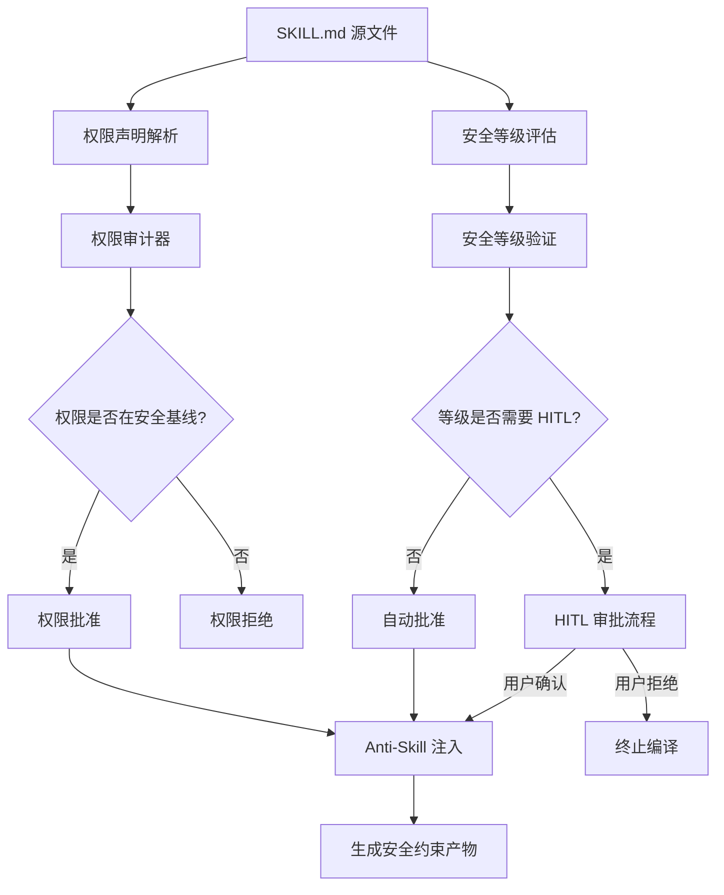
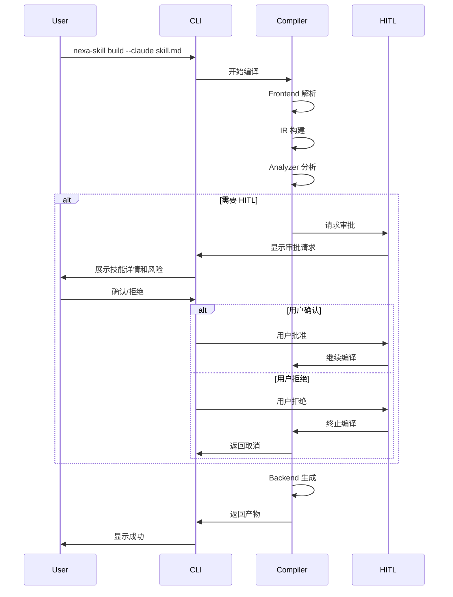

# 安全模型设计

> **权限系统、安全等级、Anti-Skill 注入机制与 Human-In-The-Loop 审批流程**

> ✅ **实现状态声明 (Updated 2026-04-15):** 本文档描述的安全模型设计已全部在源码中实现。详见 [审查报告](../plans/REPO_AUDIT_REPORT.md)。实现状态如下：
>
> | 文档描述 | 实现状态 |
> |----------|---------|
> | `SecurityBaseline`（允许的网络域名/文件路径/数据库操作等） | ✅ `baseline.rs` 已创建 |
> | `PermissionRequest` 结构 | ✅ `permission.rs` 中定义 |
> | `DangerousKeyword` 含 `required_scope` 字段 | ✅ `required_scope` 字段已添加 |
> | `security/permission.rs` 完整实现 | ✅ `PermissionRequest` 定义存在 |
> | `security/level.rs` 完整实现 | ✅ `AuditCheck` + `SecurityLevelValidator` |
> | 权限范围格式验证（URL pattern/路径 pattern等） | ✅ `SecurityBaseline::validate_scope_format()` |
> | `read_only` 权限标记 | ✅ `SecurityBaseline::derive_read_only()` |
> | description XML标签验证（编译期报错） | ✅ frontmatter 编译期报错 + `SchemaValidator` 检测 |

---

## 1. 安全模型概述

NSC 的安全模型旨在防止 Agent 技能执行过程中的安全风险，包括但不限于：

- **权限越界**：技能执行超出声明的权限范围
- **数据泄露**：敏感信息被非授权访问或传输
- **破坏性操作**：未经审批的危险操作（如删除数据）
- **提示词注入**：恶意输入影响 Agent 行为

### 1.1 安全设计原则

| 原则 | 描述 |
|------|------|
| **最小权限** | 技能只能声明和获取必需的最小权限 |
| **显式审批** | 敏感操作必须经过人工确认 |
| **防御深度** | 多层安全检查，不依赖单一防线 |
| **可审计** | 所有安全决策都有日志记录 |

### 1.2 安全架构图



---

## 2. 权限系统

### 2.1 权限类型定义

```rust
// nexa-skill-core/src/security/permission.rs

use serde::{Serialize, Deserialize};

/// 权限类型
#[derive(Debug, Clone, Copy, PartialEq, Eq, Hash, Serialize, Deserialize)]
#[serde(rename_all = "lowercase")]
pub enum PermissionKind {
    /// 网络访问权限
    /// 
    /// 控制对外部 URL 的访问
    Network,
    
    /// 文件系统权限
    /// 
    /// 控制对文件和目录的读写
    #[serde(alias = "fs")]
    FileSystem,
    
    /// 数据库权限
    /// 
    /// 控制对数据库的操作
    #[serde(alias = "db")]
    Database,
    
    /// 命令执行权限
    /// 
    /// 控制可执行的命令
    #[serde(alias = "exec")]
    Execute,
    
    /// MCP 服务器权限
    /// 
    /// 控制可访问的 MCP 服务器
    MCP,
    
    /// 环境变量权限
    /// 
    /// 控制可访问的环境变量
    Environment,
}

/// 权限声明
#[derive(Debug, Clone, Serialize, Deserialize)]
pub struct Permission {
    /// 权限类型
    pub kind: PermissionKind,
    
    /// 权限范围
    /// 
    /// 格式取决于 kind：
    /// - Network: URL pattern (e.g., "https://api.github.com/*")
    /// - FileSystem: 文件路径 pattern (e.g., "/tmp/skill-*")
    /// - Database: "db_type:db_name:operation" (e.g., "postgres:staging:SELECT")
    /// - Execute: 命令 pattern (e.g., "git:*")
    /// - MCP: MCP 服务器名称
    /// - Environment: 环境变量名 pattern (e.g., "API_KEY_*")
    pub scope: String,
    
    /// 权限描述
    #[serde(skip_serializing_if = "Option::is_none")]
    pub description: Option<String>,
    
    /// 是否只读
    #[serde(default)]
    pub read_only: bool,
}

/// 权限请求
#[derive(Debug, Clone)]
pub struct PermissionRequest {
    /// 请求的权限
    pub permission: Permission,
    
    /// 请求来源（哪个步骤需要）
    pub source_step: Option<u32>,
    
    /// 请求原因
    pub reason: String,
}
```

### 2.2 权限范围格式

| 权限类型 | Scope 格式 | 示例 | 说明 |
|----------|-----------|------|------|
| `network` | URL Pattern | `https://api.github.com/*` | 支持 `*` 通配符 |
| `filesystem` | 路径 Pattern | `/tmp/skill-*`, `/home/user/.config/**` | 支持 `*` 和 `**` |
| `database` | `db_type:db_name:operation` | `postgres:staging:SELECT` | 操作可以是 `SELECT`, `INSERT`, `UPDATE`, `DELETE`, `ALTER`, `ALL` |
| `execute` | 命令 Pattern | `git:*`, `npm:install` | `*` 表示任意参数 |
| `mcp` | 服务器名称 | `filesystem-server` | 精确匹配 |
| `environment` | 变量名 Pattern | `API_KEY_*` | 支持 `*` 通配符 |

### 2.3 权限审计器

```rust
// nexa-skill-core/src/security/permission_auditor.rs

use crate::ir::{SkillIR, Permission, PermissionKind};
use crate::error::{Diagnostic, AnalyzeError};

/// 权限审计器
pub struct PermissionAuditor {
    /// 安全基线（允许的权限范围）
    security_baseline: SecurityBaseline,
    
    /// 高危关键词映射
    dangerous_keywords: Vec<DangerousKeyword>,
}

/// 安全基线
#[derive(Debug, Clone)]
pub struct SecurityBaseline {
    /// 允许的网络域名
    allowed_networks: Vec<String>,
    
    /// 允许的文件路径
    allowed_paths: Vec<String>,
    
    /// 允许的数据库操作
    allowed_db_operations: Vec<DbOperation>,
    
    /// 允许的命令
    allowed_commands: Vec<String>,
    
    /// 允许的 MCP 服务器
    allowed_mcp_servers: Vec<String>,
}

/// 高危关键词定义
#[derive(Debug, Clone)]
struct DangerousKeyword {
    keyword: String,
    required_permission: PermissionKind,
    required_scope: String,
    severity: KeywordSeverity,
}

#[derive(Debug, Clone, Copy)]
enum KeywordSeverity {
    Warning,
    Error,
    Critical,
}

impl PermissionAuditor {
    /// 创建默认审计器
    pub fn new() -> Self {
        Self {
            security_baseline: SecurityBaseline::default(),
            dangerous_keywords: Self::load_default_keywords(),
        }
    }
    
    /// 加载默认高危关键词
    fn load_default_keywords() -> Vec<DangerousKeyword> {
        vec![
            // 文件系统高危操作
            DangerousKeyword {
                keyword: "rm -rf".to_string(),
                required_permission: PermissionKind::FileSystem,
                required_scope: "write".to_string(),
                severity: KeywordSeverity::Critical,
            },
            DangerousKeyword {
                keyword: "delete file".to_string(),
                required_permission: PermissionKind::FileSystem,
                required_scope: "write".to_string(),
                severity: KeywordSeverity::Error,
            },
            DangerousKeyword {
                keyword: "format".to_string(),
                required_permission: PermissionKind::FileSystem,
                required_scope: "write".to_string(),
                severity: KeywordSeverity::Critical,
            },
            
            // 数据库高危操作
            DangerousKeyword {
                keyword: "DROP".to_string(),
                required_permission: PermissionKind::Database,
                required_scope: "write".to_string(),
                severity: KeywordSeverity::Critical,
            },
            DangerousKeyword {
                keyword: "DELETE".to_string(),
                required_permission: PermissionKind::Database,
                required_scope: "write".to_string(),
                severity: KeywordSeverity::Error,
            },
            DangerousKeyword {
                keyword: "TRUNCATE".to_string(),
                required_permission: PermissionKind::Database,
                required_scope: "write".to_string(),
                severity: KeywordSeverity::Critical,
            },
            DangerousKeyword {
                keyword: "UPDATE".to_string(),
                required_permission: PermissionKind::Database,
                required_scope: "write".to_string(),
                severity: KeywordSeverity::Warning,
            },
            DangerousKeyword {
                keyword: "ALTER".to_string(),
                required_permission: PermissionKind::Database,
                required_scope: "write".to_string(),
                severity: KeywordSeverity::Error,
            },
            DangerousKeyword {
                keyword: "GRANT".to_string(),
                required_permission: PermissionKind::Database,
                required_scope: "admin".to_string(),
                severity: KeywordSeverity::Critical,
            },
            
            // 系统高危操作
            DangerousKeyword {
                keyword: "shutdown".to_string(),
                required_permission: PermissionKind::Execute,
                required_scope: "system".to_string(),
                severity: KeywordSeverity::Critical,
            },
            DangerousKeyword {
                keyword: "reboot".to_string(),
                required_permission: PermissionKind::Execute,
                required_scope: "system".to_string(),
                severity: KeywordSeverity::Critical,
            },
        ]
    }
    
    /// 审计权限声明
    pub fn audit(&self, ir: &SkillIR) -> Result<Vec<Diagnostic>, AnalyzeError> {
        let mut diagnostics = Vec::new();
        
        // 1. 检查权限声明是否在安全基线内
        for permission in &ir.permissions {
            if !self.is_permission_allowed(permission) {
                diagnostics.push(Diagnostic::warning(
                    format!("Permission '{}' may exceed security baseline", permission.scope),
                    "nsc::security::permission_warning",
                ));
            }
        }
        
        // 2. 检查 Procedures 中的高危关键词
        for step in &ir.procedures {
            for keyword in &self.dangerous_keywords {
                if step.instruction.contains(&keyword.keyword) {
                    let has_permission = self.check_permission_for_keyword(
                        &ir.permissions,
                        keyword,
                    );
                    
                    if !has_permission {
                        let diag = match keyword.severity {
                            KeywordSeverity::Critical => Diagnostic::error(
                                format!(
                                    "Critical keyword '{}' found in step {} without required permission",
                                    keyword.keyword, step.order
                                ),
                                "nsc::security::missing_critical_permission",
                            ),
                            KeywordSeverity::Error => Diagnostic::error(
                                format!(
                                    "Dangerous keyword '{}' found in step {} without permission declaration",
                                    keyword.keyword, step.order
                                ),
                                "nsc::security::missing_permission",
                            ),
                            KeywordSeverity::Warning => Diagnostic::warning(
                                format!(
                                    "Keyword '{}' in step {} may require additional permission",
                                    keyword.keyword, step.order
                                ),
                                "nsc::security::permission_warning",
                            ),
                        };
                        diagnostics.push(diag);
                    }
                }
            }
        }
        
        Ok(diagnostics)
    }
    
    /// 检查权限是否在安全基线内
    fn is_permission_allowed(&self, permission: &Permission) -> bool {
        match permission.kind {
            PermissionKind::Network => {
                self.security_baseline.allowed_networks.iter()
                    .any(|pattern| Self::match_pattern(&permission.scope, pattern))
            }
            PermissionKind::FileSystem => {
                self.security_baseline.allowed_paths.iter()
                    .any(|pattern| Self::match_pattern(&permission.scope, pattern))
            }
            PermissionKind::Database => {
                self.security_baseline.allowed_db_operations.iter()
                    .any(|op| Self::match_db_operation(&permission.scope, op))
            }
            PermissionKind::Execute => {
                self.security_baseline.allowed_commands.iter()
                    .any(|pattern| Self::match_pattern(&permission.scope, pattern))
            }
            PermissionKind::MCP => {
                self.security_baseline.allowed_mcp_servers.contains(&permission.scope)
            }
            PermissionKind::Environment => true, // 环境变量默认允许
            PermissionKind::Unknown => false,
        }
    }
    
    /// 检查关键词是否有对应权限
    fn check_permission_for_keyword(
        &self,
        permissions: &[Permission],
        keyword: &DangerousKeyword,
    ) -> bool {
        permissions.iter().any(|p| {
            p.kind == keyword.required_permission &&
            Self::match_permission_scope(&p.scope, &keyword.required_scope)
        })
    }
    
    /// 匹配模式
    fn match_pattern(value: &str, pattern: &str) -> bool {
        // 简单的通配符匹配实现
        if pattern.ends_with('*') {
            value.starts_with(&pattern[..pattern.len()-1])
        } else if pattern.starts_with('*') {
            value.ends_with(&pattern[1..])
        } else {
            value == pattern
        }
    }
    
    /// 匹配权限范围
    fn match_permission_scope(declared: &str, required: &str) -> bool {
        declared == "ALL" || declared == required || declared.contains(required)
    }
    
    /// 匹配数据库操作
    fn match_db_operation(scope: &str, allowed: &DbOperation) -> bool {
        // 解析 scope: "postgres:staging:SELECT"
        let parts: Vec<&str> = scope.split(':').collect();
        if parts.len() != 3 {
            return false;
        }
        
        parts[0] == allowed.db_type &&
        (parts[1] == allowed.db_name || parts[1] == "*") &&
        (parts[2] == allowed.operation || parts[2] == "ALL")
    }
}
```

---

## 3. 安全等级系统

### 3.1 安全等级定义

```rust
// nexa-skill-core/src/security/level.rs

use serde::{Serialize, Deserialize};

/// 安全等级
/// 
/// 决定编译期的审计强度和运行时的行为
#[derive(Debug, Clone, Copy, PartialEq, Eq, Serialize, Deserialize)]
#[serde(rename_all = "lowercase")]
pub enum SecurityLevel {
    /// 低安全等级
    /// 
    /// - 仅基础格式校验
    /// - 适合只读操作
    /// - 无需 HITL
    Low,
    
    /// 中等安全等级（默认）
    /// 
    /// - 权限声明检查
    /// - 适合一般操作
    /// - 可选 HITL
    Medium,
    
    /// 高安全等级
    /// 
    /// - 强制 HITL
    /// - 高危词汇扫描
    /// - 适合写操作
    High,
    
    /// 关键安全等级
    /// 
    /// - 禁止自动执行
    /// - 必须人工审批
    /// - 适合危险操作
    Critical,
}

impl SecurityLevel {
    /// 获取审计强度描述
    pub fn audit_intensity(&self) -> &'static str {
        match self {
            SecurityLevel::Low => "仅基础格式校验",
            SecurityLevel::Medium => "权限声明检查",
            SecurityLevel::High => "强制 HITL，高危词汇扫描",
            SecurityLevel::Critical => "禁止自动执行，必须人工审批",
        }
    }
    
    /// 是否需要强制 HITL
    pub fn requires_hitl(&self) -> bool {
        matches!(self, SecurityLevel::High | SecurityLevel::Critical)
    }
    
    /// 是否禁止自动执行
    pub fn blocks_auto_execution(&self) -> bool {
        matches!(self, SecurityLevel::Critical)
    }
    
    /// 获取审计检查项
    pub fn audit_checks(&self) -> Vec<AuditCheck> {
        match self {
            SecurityLevel::Low => vec![
                AuditCheck::FormatValidation,
                AuditCheck::SchemaValidation,
            ],
            SecurityLevel::Medium => vec![
                AuditCheck::FormatValidation,
                AuditCheck::SchemaValidation,
                AuditCheck::PermissionDeclaration,
                AuditCheck::MCPAllowlist,
            ],
            SecurityLevel::High => vec![
                AuditCheck::FormatValidation,
                AuditCheck::SchemaValidation,
                AuditCheck::PermissionDeclaration,
                AuditCheck::MCPAllowlist,
                AuditCheck::DangerousKeywordScan,
                AuditCheck::HITLRequired,
            ],
            SecurityLevel::Critical => vec![
                AuditCheck::FormatValidation,
                AuditCheck::SchemaValidation,
                AuditCheck::PermissionDeclaration,
                AuditCheck::MCPAllowlist,
                AuditCheck::DangerousKeywordScan,
                AuditCheck::HITLRequired,
                AuditCheck::ManualApproval,
            ],
        }
    }
}

/// 审计检查项
#[derive(Debug, Clone, Copy)]
pub enum AuditCheck {
    /// 格式校验
    FormatValidation,
    /// Schema 校验
    SchemaValidation,
    /// 权限声明检查
    PermissionDeclaration,
    /// MCP 白名单检查
    MCPAllowlist,
    /// 高危关键词扫描
    DangerousKeywordScan,
    /// HITL 要求检查
    HITLRequired,
    /// 人工审批要求
    ManualApproval,
}

impl Default for SecurityLevel {
    fn default() -> Self {
        SecurityLevel::Medium
    }
}
```

### 3.2 安全等级验证器

```rust
// nexa-skill-core/src/security/level_validator.rs

use crate::ir::SkillIR;
use crate::security::SecurityLevel;
use crate::error::{Diagnostic, AnalyzeError};

/// 安全等级验证器
pub struct SecurityLevelValidator;

impl SecurityLevelValidator {
    /// 验证安全等级与配置一致性
    pub fn validate(ir: &SkillIR) -> Result<Vec<Diagnostic>, AnalyzeError> {
        let mut diagnostics = Vec::new();
        
        // 1. 检查 HITL 要求
        if ir.security_level.requires_hitl() && !ir.hitl_required {
            diagnostics.push(Diagnostic::error(
                format!(
                    "Security level '{}' requires hitl_required to be true",
                    ir.security_level.to_string()
                ),
                "nsc::security::hitl_required",
            ).with_help("Set hitl_required: true in the frontmatter"));
        }
        
        // 2. 检查 Critical 级别的额外要求
        if ir.security_level == SecurityLevel::Critical {
            // 必须有权限声明
            if ir.permissions.is_empty() {
                diagnostics.push(Diagnostic::error(
                    "Critical security level requires explicit permission declarations",
                    "nsc::security::missing_permissions",
                ));
            }
            
            // 必须有 pre_conditions
            if ir.pre_conditions.is_empty() {
                diagnostics.push(Diagnostic::warning(
                    "Critical security level should have pre-conditions defined",
                    "nsc::security::missing_preconditions",
                ));
            }
            
            // 必须有 fallbacks
            if ir.fallbacks.is_empty() {
                diagnostics.push(Diagnostic::warning(
                    "Critical security level should have fallback strategies defined",
                    "nsc::security::missing_fallbacks",
                ));
            }
        }
        
        // 3. 检查权限与安全等级匹配
        for permission in &ir.permissions {
            if permission.kind == PermissionKind::Database && 
               permission.scope.contains("ALL") &&
               ir.security_level < SecurityLevel::High {
                diagnostics.push(Diagnostic::warning(
                    "Database ALL permission should be used with High or Critical security level",
                    "nsc::security::permission_level_mismatch",
                ));
            }
        }
        
        Ok(diagnostics)
    }
}
```

---

## 4. Anti-Skill 注入机制

### 4.1 Anti-Skill 概念

Anti-Skill 是从历史失败轨迹（Failed Trajectories）中提炼出的"负向知识"，用于防止 Agent 执行过程中的常见错误。

**形式化定义**：
$$S' = S \cup \{C_1, C_2, ..., C_n\}$$

其中 $S$ 是原始技能节点，$S'$ 是优化后的技能节点，$C_i$ 是注入的防错约束。

### 4.2 反向模式库

```rust
// nexa-skill-core/src/security/anti_skill.rs

use std::collections::HashMap;
use serde::{Serialize, Deserialize};

/// 反向模式定义
#[derive(Debug, Clone, Serialize, Deserialize)]
pub struct AntiPattern {
    /// 模式 ID
    pub id: String,
    
    /// 触发关键词
    pub trigger_keywords: Vec<String>,
    
    /// 注入的约束内容
    pub constraint_content: String,
    
    /// 约束级别
    pub constraint_level: ConstraintLevel,
    
    /// 应用范围
    pub scope: ConstraintScope,
    
    /// 模式描述
    pub description: String,
    
    /// 来源（文档/经验）
    pub source: String,
}

/// 约束级别
#[derive(Debug, Clone, Copy, Serialize, Deserialize)]
#[serde(rename_all = "lowercase")]
pub enum ConstraintLevel {
    /// 警告：提示但不阻断
    Warning,
    /// 错误：阻断执行
    Error,
    /// 阻断：强制人工干预
    Block,
}

/// 约束应用范围
#[derive(Debug, Clone, Serialize, Deserialize)]
#[serde(rename_all = "lowercase")]
pub enum ConstraintScope {
    /// 应用到所有步骤
    Global,
    /// 应用到特定步骤
    SpecificSteps { step_ids: Vec<u32> },
    /// 应用到关键词匹配的步骤
    KeywordMatch { keywords: Vec<String> },
}

/// 反向模式库
pub struct AntiPatternLibrary {
    patterns: HashMap<String, AntiPattern>,
}

impl AntiPatternLibrary {
    /// 加载默认模式库
    pub fn load_default() -> Self {
        let mut patterns = HashMap::new();
        
        // HTTP 请求相关
        patterns.insert("http-timeout".to_string(), AntiPattern {
            id: "http-timeout".to_string(),
            trigger_keywords: vec!["HTTP GET", "HTTP POST", "fetch", "request", "curl", "axios"],
            constraint_content: "ANTI-SKILL: Never execute an HTTP request without a timeout parameter (default 10s). Do not retry more than 3 times on 403 Forbidden errors to avoid IP blocking.".to_string(),
            constraint_level: ConstraintLevel::Warning,
            scope: ConstraintScope::Global,
            description: "HTTP 请求必须有超时设置".to_string(),
            source: "Web scraping best practices".to_string(),
        });
        
        patterns.insert("http-auth".to_string(), AntiPattern {
            id: "http-auth".to_string(),
            trigger_keywords: vec!["Authorization", "Bearer", "API key", "token"],
            constraint_content: "ANTI-SKILL: Never hardcode credentials in HTTP requests. Use environment variables or secure credential storage.".to_string(),
            constraint_level: ConstraintLevel::Error,
            scope: ConstraintScope::Global,
            description: "禁止硬编码认证信息".to_string(),
            source: "Security best practices".to_string(),
        });
        
        // HTML 解析相关
        patterns.insert("html-parse".to_string(), AntiPattern {
            id: "html-parse".to_string(),
            trigger_keywords: vec!["BeautifulSoup", "HTML parse", "parse HTML", "scrape", "xpath"],
            constraint_content: "ANTI-SKILL: Do not attempt to parse raw JavaScript variables using HTML parsers. Fallback to Regex or Selenium if <script> tags are encountered.".to_string(),
            constraint_level: ConstraintLevel::Warning,
            scope: ConstraintScope::Global,
            description: "HTML 解析器无法处理 JavaScript".to_string(),
            source: "Web scraping experience".to_string(),
        });
        
        // 数据库操作相关
        patterns.insert("db-cascade".to_string(), AntiPattern {
            id: "db-cascade".to_string(),
            trigger_keywords: vec!["CASCADE", "drop table", "DROP TABLE"],
            constraint_content: "ANTI-SKILL: Never use CASCADE without explicit user approval. Always list affected tables before executing. CASCADE operations are irreversible.".to_string(),
            constraint_level: ConstraintLevel::Block,
            scope: ConstraintScope::Global,
            description: "CASCADE 操作必须人工确认".to_string(),
            source: "Database administration experience".to_string(),
        });
        
        patterns.insert("db-transaction".to_string(), AntiPattern {
            id: "db-transaction".to_string(),
            trigger_keywords: vec!["BEGIN", "COMMIT", "ROLLBACK", "transaction"],
            constraint_content: "ANTI-SKILL: Always wrap multiple DML statements in a transaction. Ensure ROLLBACK is possible on error.".to_string(),
            constraint_level: ConstraintLevel::Warning,
            scope: ConstraintScope::Global,
            description: "多语句操作应使用事务".to_string(),
            source: "Database best practices".to_string(),
        });
        
        patterns.insert("sql-injection".to_string(), AntiPattern {
            id: "sql-injection".to_string(),
            trigger_keywords: vec!["execute", "query", "SQL", "SELECT", "INSERT", "UPDATE", "DELETE"],
            constraint_content: "ANTI-SKILL: Never execute raw SQL with user input directly concatenated. Use parameterized queries or prepared statements.".to_string(),
            constraint_level: ConstraintLevel::Error,
            scope: ConstraintScope::Global,
            description: "防止 SQL 注入".to_string(),
            source: "OWASP security guidelines".to_string(),
        });
        
        // 文件操作相关
        patterns.insert("file-delete".to_string(), AntiPattern {
            id: "file-delete".to_string(),
            trigger_keywords: vec!["rm", "delete file", "remove file", "unlink", "rmdir"],
            constraint_content: "ANTI-SKILL: Always confirm file deletion with user. Never delete files outside declared scope. Consider moving to trash instead of permanent deletion.".to_string(),
            constraint_level: ConstraintLevel::Error,
            scope: ConstraintScope::Global,
            description: "文件删除需要确认".to_string(),
            source: "File system safety".to_string(),
        });
        
        patterns.insert("file-overwrite".to_string(), AntiPattern {
            id: "file-overwrite".to_string(),
            trigger_keywords: vec!["write file", "save file", "overwrite", "create file"],
            constraint_content: "ANTI-SKILL: Check if file exists before overwriting. Create backup for important files. Use atomic write operations when possible.".to_string(),
            constraint_level: ConstraintLevel::Warning,
            scope: ConstraintScope::Global,
            description: "文件覆盖前应检查".to_string(),
            source: "File system best practices".to_string(),
        });
        
        // Git 操作相关
        patterns.insert("git-force".to_string(), AntiPattern {
            id: "git-force".to_string(),
            trigger_keywords: vec!["git push --force", "force push", "git push -f"],
            constraint_content: "ANTI-SKILL: Never force push to main/master branches. Force push can overwrite team members' work. Use with extreme caution.".to_string(),
            constraint_level: ConstraintLevel::Block,
            scope: ConstraintScope::Global,
            description: "禁止强制推送到主分支".to_string(),
            source: "Git best practices".to_string(),
        });
        
        patterns.insert("git-history".to_string(), AntiPattern {
            id: "git-history".to_string(),
            trigger_keywords: vec!["git rebase", "git reset", "amend"],
            constraint_content: "ANTI-SKILL: Be careful with commands that rewrite git history. Ensure you understand the implications before executing.".to_string(),
            constraint_level: ConstraintLevel::Warning,
            scope: ConstraintScope::Global,
            description: "Git 历史重写需谨慎".to_string(),
            source: "Git best practices".to_string(),
        });
        
        Self { patterns }
    }
    
    /// 从文件加载自定义模式库
    pub fn from_file(path: &str) -> Result<Self, LoadError> {
        let content = std::fs::read_to_string(path)?;
        let patterns: HashMap<String, AntiPattern> = serde_json::from_str(&content)?;
        Ok(Self { patterns })
    }
    
    /// 匹配触发关键词
    pub fn match_keywords(&self, text: &str) -> Vec<&AntiPattern> {
        self.patterns.values()
            .filter(|pattern| {
                pattern.trigger_keywords.iter().any(|keyword| {
                    text.to_lowercase().contains(&keyword.to_lowercase())
                })
            })
            .collect()
    }
    
    /// 获取所有模式
    pub fn all_patterns(&self) -> &HashMap<String, AntiPattern> {
        &self.patterns
    }
}
```

### 4.3 Anti-Skill 注入器

```rust
// nexa-skill-core/src/security/anti_skill_injector.rs

use crate::ir::{SkillIR, Constraint, ConstraintLevel as IRConstraintLevel};
use crate::security::{AntiPatternLibrary, ConstraintLevel};
use crate::analyzer::Analyzer;
use crate::error::{Diagnostic, AnalyzeError};

/// Anti-Skill 注入器
pub struct AntiSkillInjector {
    /// 反向模式库
    library: AntiPatternLibrary,
}

impl AntiSkillInjector {
    pub fn new() -> Self {
        Self {
            library: AntiPatternLibrary::load_default(),
        }
    }
    
    /// 使用自定义模式库
    pub fn with_library(library: AntiPatternLibrary) -> Self {
        Self { library }
    }
}

impl Analyzer for AntiSkillInjector {
    fn name(&self) -> &'static str {
        "anti-skill-injector"
    }
    
    fn priority(&self) -> u8 {
        40  // 最后执行，确保所有约束已收集
    }
    
    fn analyze(&self, ir: &mut SkillIR) -> Result<Vec<Diagnostic>, AnalyzeError> {
        // 遍历所有 Procedures
        for step in &ir.procedures {
            // 匹配触发关键词
            let matched_patterns = self.library.match_keywords(&step.instruction);
            
            // 注入约束
            for pattern in matched_patterns {
                ir.anti_skill_constraints.push(Constraint {
                    source: pattern.id.clone(),
                    content: pattern.constraint_content.clone(),
                    level: Self::convert_constraint_level(pattern.constraint_level),
                    scope: Self::convert_constraint_scope(&pattern.scope),
                });
            }
        }
        
        // 检查 pre_conditions 和 fallbacks 中的关键词
        for condition in &ir.pre_conditions {
            let matched = self.library.match_keywords(condition);
            for pattern in matched {
                ir.anti_skill_constraints.push(Constraint {
                    source: pattern.id.clone(),
                    content: pattern.constraint_content.clone(),
                    level: Self::convert_constraint_level(pattern.constraint_level),
                    scope: crate::ir::ConstraintScope::Global,
                });
            }
        }
        
        // Anti-Skill 注入不产生诊断信息（静默执行）
        Ok(Vec::new())
    }
    
    fn convert_constraint_level(level: ConstraintLevel) -> IRConstraintLevel {
        match level {
            ConstraintLevel::Warning => IRConstraintLevel::Warning,
            ConstraintLevel::Error => IRConstraintLevel::Error,
            ConstraintLevel::Block => IRConstraintLevel::Block,
        }
    }
    
    fn convert_constraint_scope(scope: &ConstraintScope) -> crate::ir::ConstraintScope {
        match scope {
            ConstraintScope::Global => crate::ir::ConstraintScope::Global,
            ConstraintScope::SpecificSteps { step_ids } => {
                crate::ir::ConstraintScope::SpecificSteps { step_ids: step_ids.clone() }
            }
            ConstraintScope::KeywordMatch { keywords } => {
                crate::ir::ConstraintScope::KeywordMatch { keywords: keywords.clone() }
            }
        }
    }
}
```

---

## 5. Human-In-The-Loop (HITL) 审批流程

### 5.1 HITL 触发条件

| 条件 | 描述 |
|------|------|
| `hitl_required: true` | Frontmatter 显式声明 |
| `security_level: high` | 高安全等级自动触发 |
| `security_level: critical` | 关键安全等级强制触发 |
| 高危关键词检测 | 检测到 Critical 级别关键词 |
| 权限越界警告 | 权限声明超出安全基线 |

### 5.2 HITL 审批流程



### 5.3 HITL 实现代码

```rust
// nexa-skill-core/src/security/hitl.rs

use crate::ir::SkillIR;
use crate::security::SecurityLevel;

/// HITL 审批请求
#[derive(Debug, Clone)]
pub struct HITLRequest {
    /// 技能名称
    pub skill_name: String,
    
    /// 审批原因
    pub reason: HITLReason,
    
    /// 风险描述
    pub risk_description: String,
    
    /// 相关步骤
    pub affected_steps: Vec<u32>,
    
    /// 权限请求
    pub permissions: Vec<String>,
}

/// HITL 触发原因
#[derive(Debug, Clone)]
pub enum HITLReason {
    /// 显式声明
    ExplicitDeclaration,
    /// 安全等级要求
    SecurityLevelRequired(SecurityLevel),
    /// 高危关键词检测
    DangerousKeywordDetected { keyword: String, step: u32 },
    /// 权限越界
    PermissionExceedsBaseline { permission: String },
}

/// HITL 审批结果
#[derive(Debug, Clone)]
pub enum HITLResult {
    /// 用户批准
    Approved,
    /// 用户拒绝
    Rejected { reason: String },
    /// 超时
    Timeout,
}

/// HITL 管理器
pub struct HITLManager {
    /// 是否启用交互模式
    interactive: bool,
    
    /// 超时时间（秒）
    timeout: u64,
}

impl HITLManager {
    pub fn new(interactive: bool, timeout: u64) -> Self {
        Self { interactive, timeout }
    }
    
    /// 检查是否需要 HITL
    pub fn requires_hitl(&self, ir: &SkillIR) -> Option<HITLRequest> {
        // 1. 检查显式声明
        if ir.hitl_required {
            return Some(HITLRequest {
                skill_name: ir.name.to_string(),
                reason: HITLReason::ExplicitDeclaration,
                risk_description: "Skill explicitly requires human approval".to_string(),
                affected_steps: ir.procedures.iter().map(|s| s.order).collect(),
                permissions: ir.permissions.iter().map(|p| format!("{:?}:{}", p.kind, p.scope)).collect(),
            });
        }
        
        // 2. 检查安全等级
        if ir.security_level.requires_hitl() {
            return Some(HITLRequest {
                skill_name: ir.name.to_string(),
                reason: HITLReason::SecurityLevelRequired(ir.security_level),
                risk_description: format!(
                    "Security level '{}' requires human approval",
                    ir.security_level.to_string()
                ),
                affected_steps: ir.procedures.iter().map(|s| s.order).collect(),
                permissions: ir.permissions.iter().map(|p| format!("{:?}:{}", p.kind, p.scope)).collect(),
            });
        }
        
        // 3. 检查 Anti-Skill 约束中的 Block 级别
        for constraint in &ir.anti_skill_constraints {
            if constraint.level == crate::ir::ConstraintLevel::Block {
                return Some(HITLRequest {
                    skill_name: ir.name.to_string(),
                    reason: HITLReason::DangerousKeywordDetected {
                        keyword: constraint.source.clone(),
                        step: 0,
                    },
                    risk_description: constraint.content.clone(),
                    affected_steps: vec![],
                    permissions: vec![],
                });
            }
        }
        
        None
    }
    
    /// 请求用户审批
    pub fn request_approval(&self, request: &HITLRequest) -> HITLResult {
        if !self.interactive {
            // 非交互模式，默认拒绝
            return HITLResult::Rejected {
                reason: "Non-interactive mode".to_string(),
            };
        }
        
        // 显示审批请求
        println!("\n{}", "=".repeat(60));
        println!("⚠️  Human-In-The-Loop Approval Required");
        println!("{}", "=".repeat(60));
        println!("\n📋 Skill: {}", request.skill_name);
        println!("\n📝 Reason: {}", Self::format_reason(&request.reason));
        println!("\n⚠️  Risk: {}", request.risk_description);
        
        if !request.permissions.is_empty() {
            println!("\n🔐 Requested Permissions:");
            for perm in &request.permissions {
                println!("   - {}", perm);
            }
        }
        
        if !request.affected_steps.is_empty() {
            println!("\n📌 Affected Steps: {:?}", request.affected_steps);
        }
        
        println!("\n{}", "=".repeat(60));
        
        // 使用 dialoguer 获取用户输入
        use dialoguer::Confirm;
        
        let confirmed = Confirm::new()
            .with_prompt("Do you approve this skill execution?")
            .default(false)
            .interact()
            .unwrap_or(false);
        
        if confirmed {
            HITLResult::Approved
        } else {
            HITLResult::Rejected {
                reason: "User denied".to_string(),
            }
        }
    }
    
    fn format_reason(reason: &HITLReason) -> String {
        match reason {
            HITLReason::ExplicitDeclaration => "Explicitly declared in frontmatter".to_string(),
            HITLReason::SecurityLevelRequired(level) => format!("Security level: {}", level.to_string()),
            HITLReason::DangerousKeywordDetected { keyword, step } => {
                format!("Dangerous keyword '{}' detected in step {}", keyword, step)
            }
            HITLReason::PermissionExceedsBaseline { permission } => {
                format!("Permission '{}' exceeds security baseline", permission)
            }
        }
    }
}
```

---

## 6. 安全审计日志

### 6.1 审计日志结构

```rust
// nexa-skill-core/src/security/audit_log.rs

use chrono::{DateTime, Utc};
use serde::{Serialize, Deserialize};

/// 安全审计日志条目
#[derive(Debug, Clone, Serialize, Deserialize)]
pub struct AuditLogEntry {
    /// 时间戳
    pub timestamp: DateTime<Utc>,
    
    /// 事件类型
    pub event_type: AuditEventType,
    
    /// 技能名称
    pub skill_name: String,
    
    /// 用户标识
    pub user_id: Option<String>,
    
    /// 决策结果
    pub decision: AuditDecision,
    
    /// 详细信息
    pub details: serde_json::Value,
}

/// 审计事件类型
#[derive(Debug, Clone, Serialize, Deserialize)]
pub enum AuditEventType {
    /// 权限检查
    PermissionCheck,
    /// 安全等级验证
    SecurityLevelValidation,
    /// Anti-Skill 注入
    AntiSkillInjection,
    /// HITL 审批请求
    HITLRequest,
    /// HITL 审批结果
    HITLResult,
    /// 编译完成
    CompilationComplete,
}

/// 审计决策
#[derive(Debug, Clone, Serialize, Deserialize)]
pub enum AuditDecision {
    /// 允许
    Allowed,
    /// 拒绝
    Denied { reason: String },
    /// 需要审批
    RequiresApproval,
    /// 已批准
    Approved,
    /// 已拒绝
    Rejected { reason: String },
}

/// 审计日志管理器
pub struct AuditLogger {
    entries: Vec<AuditLogEntry>,
}

impl AuditLogger {
    pub fn new() -> Self {
        Self { entries: Vec::new() }
    }
    
    /// 记录审计事件
    pub fn log(&mut self, entry: AuditLogEntry) {
        self.entries.push(entry);
    }
    
    /// 导出为 JSON
    pub fn to_json(&self) -> Result<String, serde_json::Error> {
        serde_json::to_string_pretty(&self.entries)
    }
    
    /// 获取所有条目
    pub fn entries(&self) -> &[AuditLogEntry] {
        &self.entries
    }
}
```

---

## 7. 相关文档

- [COMPILER_PIPELINE.md](COMPILER_PIPELINE.md) - Analyzer 阶段安全检查
- [IR_DESIGN.md](IR_DESIGN.md) - 权限和约束数据结构
- [ERROR_HANDLING.md](ERROR_HANDLING.md) - 安全相关错误处理
- [CLI_DESIGN.md](CLI_DESIGN.md) - HITL 交互设计