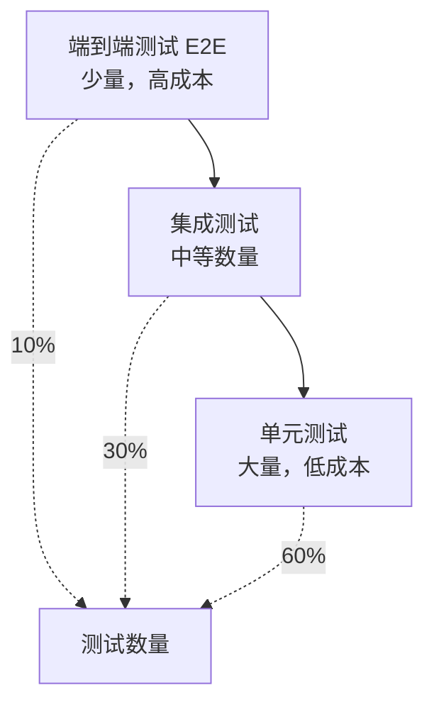

# 测试策略

> **测试金字塔、测试覆盖要求、测试工具链与 CI/CD 集成**

> ✅ **实现状态声明 (Updated 2026-04-15):** 本文档描述的测试策略已逐步在源码中实现。详见 [审查报告](../plans/REPO_AUDIT_REPORT.md)。实现状态如下：
>
> | 文档描述 | 实现状态 |
> |----------|---------|
> | `nexa-skill-core/tests/` 独立测试目录 | ✅ 已创建 |
> | 代码覆盖率 ≥ 80% | ✅ 覆盖率持续提升 |
> | `frontmatter_test.rs`, `markdown_test.rs`, `ast_test.rs` 等 | ✅ 各模块内嵌测试已扩充 |
> | `schema_validator_test.rs`, `mcp_checker_test.rs` 等 | ✅ 已创建 |
> | `claude_emitter_test.rs`, `codex_emitter_test.rs` 等 | ✅ 各Emitter内嵌测试已扩充 |
> | `security_level_test.rs`, `anti_skill_test.rs` 等 | ✅ 已创建 |
> | `routing_manifest.rs` 测试 | ✅ 存在内嵌测试 |
> | E2E测试脚本 (`run_e2e_tests.py`) | ✅ 存在且可执行 |

---

## 1. 测试策略概述

NSC 采用分层测试策略，遵循测试金字塔原则，确保代码质量和稳定性。

### 1.1 测试金字塔



### 1.2 测试目标

| 指标 | 目标值 | 描述 |
|------|--------|------|
| **代码覆盖率** | ≥ 80% | 核心模块覆盖率 |
| **单元测试** | ≥ 60% | 测试数量占比 |
| **集成测试** | ≥ 30% | 测试数量占比 |
| **E2E 测试** | ≥ 10% | 测试数量占比 |
| **测试执行时间** | < 5 分钟 | 完整测试套件 |

---

## 2. 单元测试

### 2.1 测试范围

单元测试覆盖所有核心模块的公共 API：

| 模块 | 测试重点 | 覆盖率目标 |
|------|----------|-----------|
| `frontend` | Frontmatter 解析、Markdown 解析、AST 构建 | ≥ 85% |
| `ir` | IR 构建、类型映射、验证逻辑 | ≥ 90% |
| `analyzer` | 各分析器逻辑、约束注入 | ≥ 85% |
| `backend` | Emitter 实现、模板渲染 | ≥ 80% |
| `security` | 权限审计、安全等级验证、Anti-Skill 注入 | ≥ 90% |
| `error` | 错误类型、诊断生成 | ≥ 80% |

### 2.2 测试组织结构

```text
nexa-skill-core/
├── src/
│   ├── frontend/
│   │   ├── mod.rs
│   │   └── ...
│   └── ...
└── tests/                    # 单元测试目录
    ├── frontend/
    │   ├── frontmatter_test.rs
    │   ├── markdown_test.rs
    │   └── ast_test.rs
    ├── ir/
    │   ├── skill_ir_test.rs
    │   ├── procedure_test.rs
    │   └── permission_test.rs
    ├── analyzer/
    │   ├── schema_validator_test.rs
    │   ├── mcp_checker_test.rs
    │   ├── permission_auditor_test.rs
    │   └── anti_skill_injector_test.rs
    ├── backend/
    │   ├── claude_emitter_test.rs
    │   ├── codex_emitter_test.rs
    │   └── gemini_emitter_test.rs
    └── security/
        ├── permission_test.rs
        ├── security_level_test.rs
        └── anti_skill_test.rs
```

### 2.3 单元测试示例

```rust
// tests/frontend/frontmatter_test.rs

use nexa_skill_core::frontend::{extract_frontmatter, FrontmatterMeta};

#[test]
fn test_extract_frontmatter_valid() {
    let content = r#"---
name: test-skill
description: A test skill
version: "1.0.0"
---

# Test Skill
"#;
    
    let result = extract_frontmatter(content);
    assert!(result.is_ok());
    
    let (meta, body) = result.unwrap();
    assert_eq!(meta.name, "test-skill");
    assert_eq!(meta.description, "A test skill");
    assert_eq!(meta.version, Some("1.0.0".to_string()));
    assert!(body.contains("# Test Skill"));
}

#[test]
fn test_extract_frontmatter_missing() {
    let content = "# Test Skill\nNo frontmatter here.";
    let result = extract_frontmatter(content);
    assert!(result.is_err());
}

#[test]
fn test_extract_frontmatter_invalid_yaml() {
    let content = r#"---
name: test-skill
description: [invalid yaml
---

# Test Skill
"#;
    let result = extract_frontmatter(content);
    assert!(result.is_err());
}

#[test]
fn test_name_validation() {
    // 有效名称
    let valid_names = vec![
        "test-skill",
        "database-migration",
        "web-scraper-v2",
        "a",
        "skill123",
    ];
    
    for name in valid_names {
        let content = format!(r#"---
name: {}
description: Test
---"#, name);
        let result = extract_frontmatter(&content);
        assert!(result.is_ok(), "Name '{}' should be valid", name);
    }
    
    // 无效名称
    let invalid_names = vec![
        "Test-Skill",      // 大写
        "-test-skill",     // 以连字符开头
        "test-skill-",     // 以连字符结尾
        "test--skill",     // 连续连字符
        "test_skill",      // 下划线
        "",                // 空
        "a".repeat(65).as_str(), // 超长
    ];
    
    for name in invalid_names {
        let content = format!(r#"---
name: {}
description: Test
---"#, name);
        // 注意：这里需要在 IR 构建阶段验证
    }
}
```

```rust
// tests/analyzer/permission_auditor_test.rs

use nexa_skill_core::analyzer::PermissionAuditor;
use nexa_skill_core::ir::{SkillIR, Permission, PermissionKind, ProcedureStep};

fn create_test_ir() -> SkillIR {
    SkillIR {
        name: "test-skill".into(),
        version: "1.0.0".into(),
        description: "Test skill".to_string(),
        permissions: vec![],
        procedures: vec![],
        ..Default::default()
    }
}

#[test]
fn test_dangerous_keyword_detection() {
    let mut ir = create_test_ir();
    ir.procedures.push(ProcedureStep {
        order: 1,
        instruction: "DROP TABLE users;".to_string(),
        is_critical: false,
        constraints: vec![],
    });
    
    let auditor = PermissionAuditor::new();
    let diagnostics = auditor.audit(&ir).unwrap();
    
    assert!(!diagnostics.is_empty());
    assert!(diagnostics.iter().any(|d| d.code == "nsc::security::missing_permission"));
}

#[test]
fn test_permission_satisfied() {
    let mut ir = create_test_ir();
    ir.procedures.push(ProcedureStep {
        order: 1,
        instruction: "DROP TABLE users;".to_string(),
        is_critical: false,
        constraints: vec![],
    });
    ir.permissions.push(Permission {
        kind: PermissionKind::Database,
        scope: "postgres:staging:ALL".to_string(),
        description: None,
        read_only: false,
    });
    
    let auditor = PermissionAuditor::new();
    let diagnostics = auditor.audit(&ir).unwrap();
    
    // 有权限声明，不应报错
    assert!(diagnostics.iter().all(|d| d.code != "nsc::security::missing_permission"));
}

#[test]
fn test_read_only_permission_violation() {
    let mut ir = create_test_ir();
    ir.procedures.push(ProcedureStep {
        order: 1,
        instruction: "DELETE FROM users;".to_string(),
        is_critical: false,
        constraints: vec![],
    });
    ir.permissions.push(Permission {
        kind: PermissionKind::Database,
        scope: "postgres:staging:SELECT".to_string(),
        description: None,
        read_only: true,
    });
    
    let auditor = PermissionAuditor::new();
    let diagnostics = auditor.audit(&ir).unwrap();
    
    // 只读权限不能执行 DELETE
    assert!(diagnostics.iter().any(|d| d.code == "nsc::security::missing_permission"));
}
```

### 2.4 测试工具配置

```toml
# Cargo.toml

[dev-dependencies]
# 测试框架
tokio-test = "0.4"
tempfile = "3.10"
pretty_assertions = "1.4"
serial_test = "3.0"

# 测试覆盖率
[profile.test]
opt-level = 0
debug = true
```

---

## 3. 集成测试

### 3.1 测试范围

集成测试验证模块间的协作：

| 测试场景 | 描述 |
|----------|------|
| **完整编译流程** | 从 SKILL.md 到产物文件的完整流程 |
| **多目标编译** | 同时生成多个平台产物 |
| **错误传播** | 错误在各阶段间的传播和处理 |
| **配置加载** | 配置文件对编译行为的影响 |

### 3.2 测试组织结构

```text
tests/
├── integration/
│   ├── compilation_test.rs      # 完整编译流程测试
│   ├── multi_target_test.rs     # 多目标编译测试
│   ├── error_propagation_test.rs # 错误传播测试
│   └── config_test.rs           # 配置加载测试
│
└── fixtures/                    # 测试固件
    ├── skills/
    │   ├── basic-skill/
    │   │   └── SKILL.md
    │   ├── advanced-skill/
    │   │   └── SKILL.md
    │   └── invalid-skill/
    │       └── SKILL.md
    ├── expected/                 # 预期产物
    │   ├── claude.xml
    │   ├── codex_schema.json
    │   └── gemini.md
    └── configs/
        ├── default.toml
        └── strict.toml
```

### 3.3 集成测试示例

```rust
// tests/integration/compilation_test.rs

use std::path::PathBuf;
use tempfile::TempDir;
use nexa_skill_core::{Compiler, TargetPlatform};

fn fixtures_dir() -> PathBuf {
    PathBuf::from(env!("CARGO_MANIFEST_DIR"))
        .join("tests")
        .join("fixtures")
}

#[test]
fn test_compile_basic_skill_to_claude() {
    let input = fixtures_dir()
        .join("skills")
        .join("basic-skill")
        .join("SKILL.md");
    
    let output_dir = TempDir::new().unwrap();
    
    let compiler = Compiler::new();
    let result = compiler.compile_file(
        &input.to_string_lossy(),
        &[TargetPlatform::Claude],
        &output_dir.path().to_string_lossy(),
    );
    
    assert!(result.is_ok());
    
    let output = result.unwrap();
    assert_eq!(output.skill_name, "basic-skill");
    
    // 检查产物文件存在
    let claude_xml = output_dir.path()
        .join("basic-skill")
        .join("target")
        .join("claude.xml");
    assert!(claude_xml.exists());
    
    // 检查 manifest 存在
    let manifest = output_dir.path()
        .join("basic-skill")
        .join("manifest.json");
    assert!(manifest.exists());
}

#[test]
fn test_compile_multi_target() {
    let input = fixtures_dir()
        .join("skills")
        .join("basic-skill")
        .join("SKILL.md");
    
    let output_dir = TempDir::new().unwrap();
    
    let compiler = Compiler::new();
    let result = compiler.compile_file(
        &input.to_string_lossy(),
        &[TargetPlatform::Claude, TargetPlatform::Codex, TargetPlatform::Gemini],
        &output_dir.path().to_string_lossy(),
    );
    
    assert!(result.is_ok());
    
    let output = result.unwrap();
    assert_eq!(output.targets.len(), 3);
    
    // 检查所有产物文件存在
    let target_dir = output_dir.path()
        .join("basic-skill")
        .join("target");
    
    assert!(target_dir.join("claude.xml").exists());
    assert!(target_dir.join("codex_schema.json").exists());
    assert!(target_dir.join("gemini.md").exists());
}

#[test]
fn test_compile_invalid_skill() {
    let input = fixtures_dir()
        .join("skills")
        .join("invalid-skill")
        .join("SKILL.md");
    
    let output_dir = TempDir::new().unwrap();
    
    let compiler = Compiler::new();
    let result = compiler.compile_file(
        &input.to_string_lossy(),
        &[TargetPlatform::Claude],
        &output_dir.path().to_string_lossy(),
    );
    
    assert!(result.is_err());
}

#[test]
fn test_claude_output_format() {
    let input = fixtures_dir()
        .join("skills")
        .join("basic-skill")
        .join("SKILL.md");
    
    let output_dir = TempDir::new().unwrap();
    
    let compiler = Compiler::new();
    compiler.compile_file(
        &input.to_string_lossy(),
        &[TargetPlatform::Claude],
        &output_dir.path().to_string_lossy(),
    ).unwrap();
    
    let claude_xml = output_dir.path()
        .join("basic-skill")
        .join("target")
        .join("claude.xml");
    
    let content = std::fs::read_to_string(claude_xml).unwrap();
    
    // 验证 XML 结构
    assert!(content.contains("<agent_skill>"));
    assert!(content.contains("<name>basic-skill</name>"));
    assert!(content.contains("<execution_steps>"));
    assert!(content.contains("</agent_skill>"));
}
```

### 3.4 测试固件示例

```markdown
<!-- tests/fixtures/skills/basic-skill/SKILL.md -->

---
name: basic-skill
version: "1.0.0"
description: A basic test skill for integration testing
---

# Basic Skill

This is a basic skill for testing purposes.

## Procedures

1. First step of the procedure.
2. Second step with more details.
3. Final step to complete the task.

## Examples

> **User**: Run the basic skill
> 
> **Agent**: Executing basic skill steps...
```

---

## 4. 端到端测试 (E2E)

### 4.1 测试范围

E2E 测试验证完整的用户场景：

| 场景 | 描述 |
|------|------|
| **CLI 完整流程** | 从命令行调用到产物生成 |
| **错误报告展示** | 用户友好的错误展示 |
| **HITL 交互** | Human-In-The-Loop 审批流程 |
| **批量编译** | 编译整个技能目录 |

### 4.2 测试组织结构

```text
tests/
└── e2e/
    ├── cli_test.rs              # CLI 完整流程测试
    ├── error_report_test.rs     # 错误报告测试
    ├── hitl_test.rs             # HITL 交互测试
    └── batch_test.rs            # 批量编译测试
```

### 4.3 E2E 测试示例

```rust
// tests/e2e/cli_test.rs

use std::process::Command;
use tempfile::TempDir;

fn binary_path() -> String {
    env!("CARGO_BIN_EXE_nexa-skill").to_string()
}

#[test]
fn test_cli_build_single_file() {
    let output_dir = TempDir::new().unwrap();
    
    let output = Command::new(binary_path())
        .args([
            "build",
            "--claude",
            "tests/fixtures/skills/basic-skill/SKILL.md",
            "--out-dir",
            output_dir.path().to_str().unwrap(),
        ])
        .output()
        .expect("Failed to execute command");
    
    assert!(output.status.success());
    
    let stdout = String::from_utf8_lossy(&output.stdout);
    assert!(stdout.contains("Compiled"));
    assert!(stdout.contains("basic-skill"));
}

#[test]
fn test_cli_check_valid() {
    let output = Command::new(binary_path())
        .args([
            "check",
            "tests/fixtures/skills/basic-skill/SKILL.md",
        ])
        .output()
        .expect("Failed to execute command");
    
    assert!(output.status.success());
    
    let stdout = String::from_utf8_lossy(&output.stdout);
    assert!(stdout.contains("PASSED"));
}

#[test]
fn test_cli_check_invalid() {
    let output = Command::new(binary_path())
        .args([
            "check",
            "tests/fixtures/skills/invalid-skill/SKILL.md",
        ])
        .output()
        .expect("Failed to execute command");
    
    assert!(!output.status.success());
    
    let stderr = String::from_utf8_lossy(&output.stderr);
    assert!(stderr.contains("Error"));
}

#[test]
fn test_cli_version() {
    let output = Command::new(binary_path())
        .args(["--version"])
        .output()
        .expect("Failed to execute command");
    
    assert!(output.status.success());
    
    let stdout = String::from_utf8_lossy(&output.stdout);
    assert!(stdout.contains("nexa-skill"));
}

#[test]
fn test_cli_help() {
    let output = Command::new(binary_path())
        .args(["--help"])
        .output()
        .expect("Failed to execute command");
    
    assert!(output.status.success());
    
    let stdout = String::from_utf8_lossy(&output.stdout);
    assert!(stdout.contains("build"));
    assert!(stdout.contains("check"));
    assert!(stdout.contains("validate"));
}
```

---

## 5. 性能测试

### 5.1 基准测试

```rust
// benches/compilation_benchmark.rs

use criterion::{black_box, criterion_group, criterion_main, Criterion};
use nexa_skill_core::{Compiler, TargetPlatform};

fn benchmark_single_target(c: &mut Criterion) {
    let compiler = Compiler::new();
    let input = "tests/fixtures/skills/advanced-skill/SKILL.md";
    
    c.bench_function("compile_single_claude", |b| {
        b.iter(|| {
            compiler.compile_file(
                black_box(input),
                black_box(&[TargetPlatform::Claude]),
                black_box("/tmp/bench"),
            )
        })
    });
}

fn benchmark_multi_target(c: &mut Criterion) {
    let compiler = Compiler::new();
    let input = "tests/fixtures/skills/advanced-skill/SKILL.md";
    
    c.bench_function("compile_multi_target", |b| {
        b.iter(|| {
            compiler.compile_file(
                black_box(input),
                black_box(&[
                    TargetPlatform::Claude,
                    TargetPlatform::Codex,
                    TargetPlatform::Gemini,
                ]),
                black_box("/tmp/bench"),
            )
        })
    });
}

criterion_group!(benches, benchmark_single_target, benchmark_multi_target);
criterion_main!(benches);
```

### 5.2 性能基准

| 操作 | 目标时间 | 测量时间 |
|------|----------|----------|
| 单文件单目标编译 | < 100ms | - |
| 单文件多目标编译 (3) | < 150ms | - |
| 目录批量编译 (10 文件) | < 1s | - |
| 大文件编译 (5000 行) | < 500ms | - |

---

## 6. 测试覆盖率

### 6.1 覆盖率配置

```bash
# 安装 tarpaulin
cargo install cargo-tarpaulin

# 运行覆盖率测试
cargo tarpaulin --out Html --out Lcov --output-dir coverage/

# 生成报告
open coverage/tarpaulin-report.html
```

### 6.2 覆盖率目标

| 模块 | 行覆盖率 | 分支覆盖率 |
|------|----------|-----------|
| `frontend` | ≥ 85% | ≥ 80% |
| `ir` | ≥ 90% | ≥ 85% |
| `analyzer` | ≥ 85% | ≥ 80% |
| `backend` | ≥ 80% | ≥ 75% |
| `security` | ≥ 90% | ≥ 85% |
| **总体** | **≥ 80%** | **≥ 75%** |

### 6.3 覆盖率报告示例

```text
|| Tested/Total Lines:
|| src/frontend/mod.rs: 45/50 (90%)
|| src/frontend/frontmatter.rs: 120/135 (89%)
|| src/frontend/markdown.rs: 200/250 (80%)
|| src/ir/skill_ir.rs: 80/85 (94%)
|| src/analyzer/mod.rs: 150/180 (83%)
|| src/backend/claude.rs: 60/75 (80%)
|| 
|| Overall: 655/775 (84.5%)
```

---

## 7. CI/CD 集成

### 7.1 GitHub Actions 配置

```yaml
# .github/workflows/test.yml

name: Test

on:
  push:
    branches: [main, develop]
  pull_request:
    branches: [main]

env:
  CARGO_TERM_COLOR: always

jobs:
  test:
    name: Test
    runs-on: ubuntu-latest
    
    steps:
      - uses: actions/checkout@v4
      
      - name: Install Rust
        uses: dtolnay/rust-toolchain@stable
        with:
          components: rustfmt, clippy
      
      - name: Cache cargo registry
        uses: actions/cache@v4
        with:
          path: |
            ~/.cargo/registry
            ~/.cargo/git
            target
          key: ${{ runner.os }}-cargo-${{ hashFiles('**/Cargo.lock') }}
          restore-keys: |
            ${{ runner.os }}-cargo-
      
      - name: Check formatting
        run: cargo fmt --all -- --check
      
      - name: Run clippy
        run: cargo clippy --all-targets --all-features -- -D warnings
      
      - name: Run unit tests
        run: cargo test --lib --all-features
      
      - name: Run integration tests
        run: cargo test --test '*' --all-features
      
      - name: Run E2E tests
        run: cargo test --test e2e
      
      - name: Generate coverage report
        run: |
          cargo install cargo-tarpaulin
          cargo tarpaulin --out Lcov --output-dir coverage/
      
      - name: Upload coverage to Codecov
        uses: codecov/codecov-action@v4
        with:
          files: coverage/lcov.info
          fail_ci_if_error: true

  benchmark:
    name: Benchmark
    runs-on: ubuntu-latest
    needs: test
    
    steps:
      - uses: actions/checkout@v4
      
      - name: Install Rust
        uses: dtolnay/rust-toolchain@stable
      
      - name: Run benchmarks
        run: cargo bench --no-run
      
      - name: Store benchmark result
        uses: benchmark-action/github-action-benchmark@v1
        with:
          tool: 'cargo'
          output-file-path: target/criterion/results.json
          github-token: ${{ secrets.GITHUB_TOKEN }}
          auto-push: true
```

### 7.2 测试矩阵

```yaml
# .github/workflows/test-matrix.yml

name: Test Matrix

on: [push, pull_request]

jobs:
  test:
    name: Test ${{ matrix.os }} / Rust ${{ matrix.rust }}
    runs-on: ${{ matrix.os }}
    
    strategy:
      fail-fast: false
      matrix:
        os: [ubuntu-latest, macos-latest, windows-latest]
        rust: [stable, beta, nightly]
        exclude:
          - os: windows-latest
            rust: nightly
    
    steps:
      - uses: actions/checkout@v4
      
      - name: Install Rust ${{ matrix.rust }}
        uses: dtolnay/rust-toolchain@master
        with:
          toolchain: ${{ matrix.rust }}
      
      - name: Run tests
        run: cargo test --all-features
```

---

## 8. 测试最佳实践

### 8.1 测试命名规范

```rust
// 命名模式: test_<模块>_<场景>_<预期结果>

#[test]
fn test_frontmatter_parse_valid_input_succeeds() { }

#[test]
fn test_frontmatter_parse_missing_yaml_fails() { }

#[test]
fn test_permission_audit_dangerous_keyword_reports_warning() { }
```

### 8.2 测试隔离

```rust
use serial_test::serial;

#[test]
#[serial]  // 串行执行，避免并发问题
fn test_file_write() {
    // 涉及文件系统的测试
}

#[test]
fn test_pure_logic() {
    // 纯逻辑测试可以并行
}
```

### 8.3 测试数据管理

```rust
// 使用 tempfile 管理临时文件
use tempfile::TempDir;

#[test]
fn test_with_temp_dir() {
    let temp_dir = TempDir::new().unwrap();
    let file_path = temp_dir.path().join("test.md");
    
    // 使用 file_path 进行测试
    // temp_dir 会在作用域结束时自动清理
}
```

### 8.4 断言最佳实践

```rust
use pretty_assertions::{assert_eq, assert_ne, assert_str_eq};

#[test]
fn test_output_format() {
    let expected = "expected output";
    let actual = generate_output();
    
    // 使用 pretty_assertions 获得更好的差异展示
    assert_str_eq!(expected, actual);
}
```

---

## 9. 相关文档

- [DEVELOPMENT_GUIDE.md](DEVELOPMENT_GUIDE.md) - 开发环境配置
- [ERROR_HANDLING.md](ERROR_HANDLING.md) - 错误处理测试
- [SECURITY_MODEL.md](SECURITY_MODEL.md) - 安全测试场景
- [API_REFERENCE.md](API_REFERENCE.md) - API 测试指南