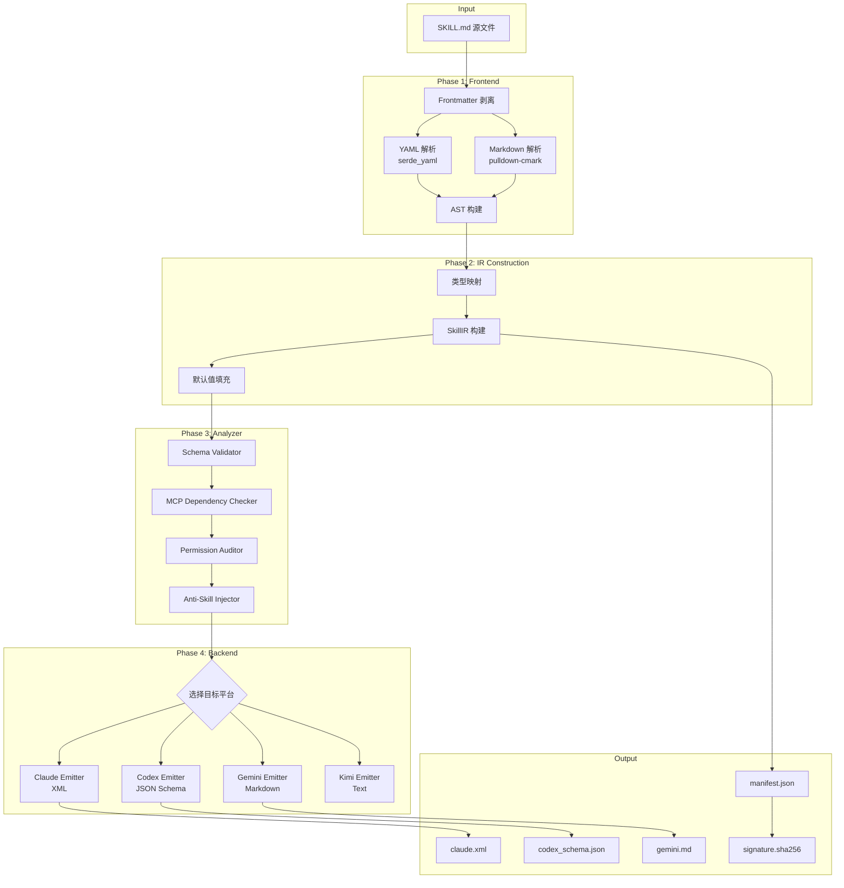
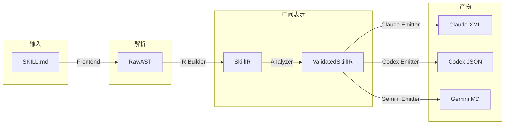
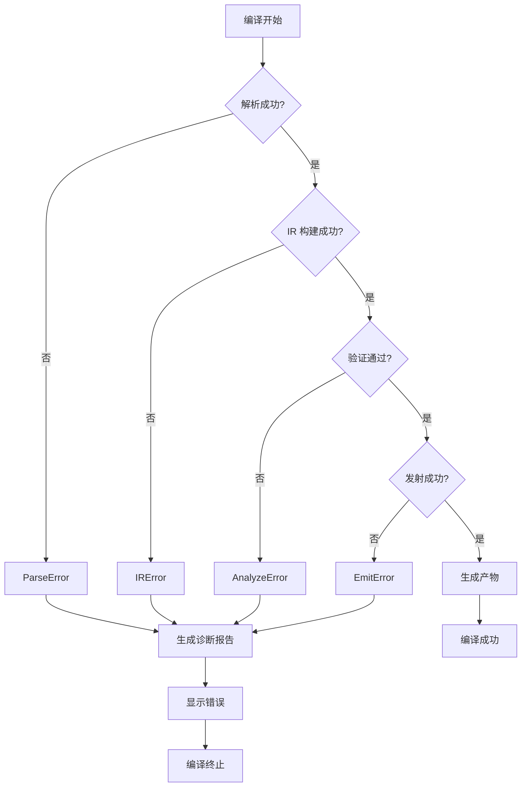
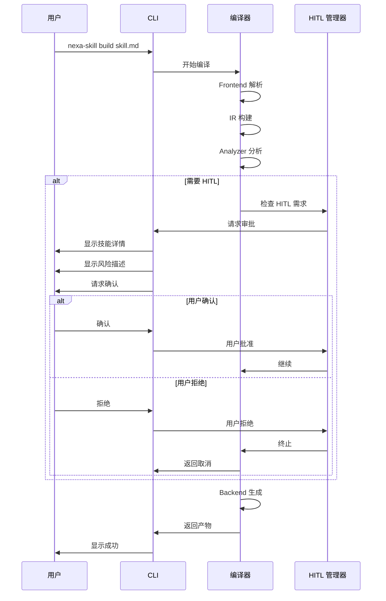

# 编译流程图

> **Nexa Skill Compiler 完整编译流程的可视化展示**

---

## 编译管线流程图

---

## 数据流图

---

## 错误处理流程

---

## HITL 审批流程

---

## 相关文档

- [ARCHITECTURE.md](../ARCHITECTURE.md) - 系统架构总览
- [COMPILER_PIPELINE.md](../COMPILER_PIPELINE.md) - 编译管线详细设计
- [SECURITY_MODEL.md](../SECURITY_MODEL.md) - HITL 审批流程