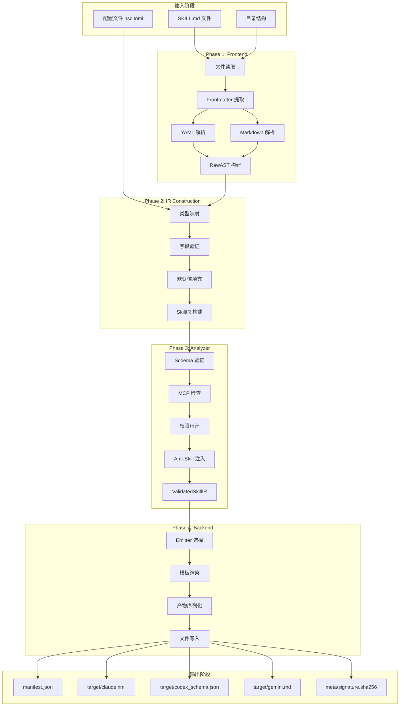
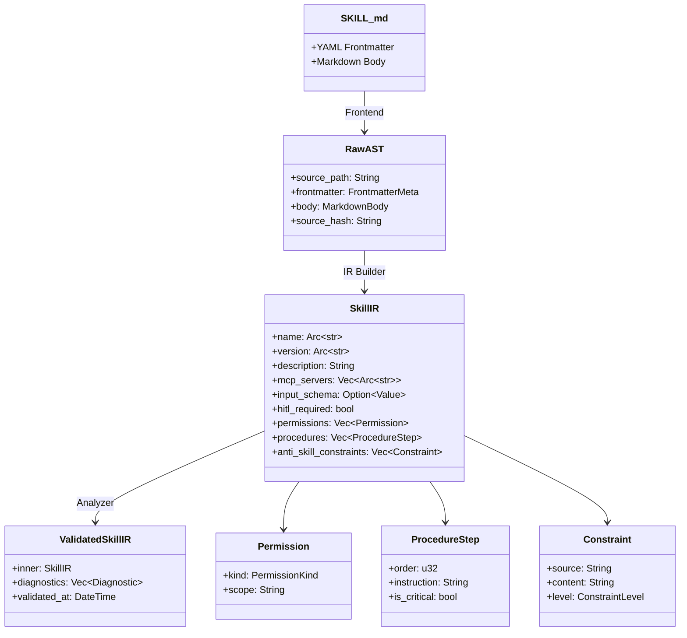
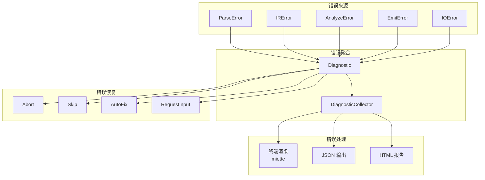
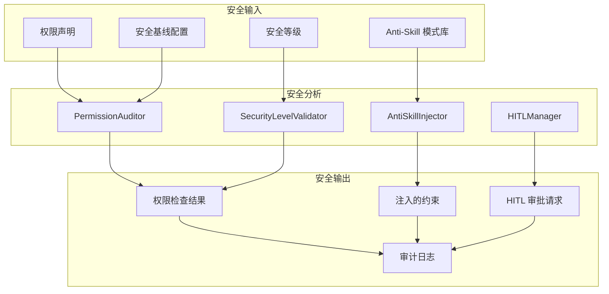
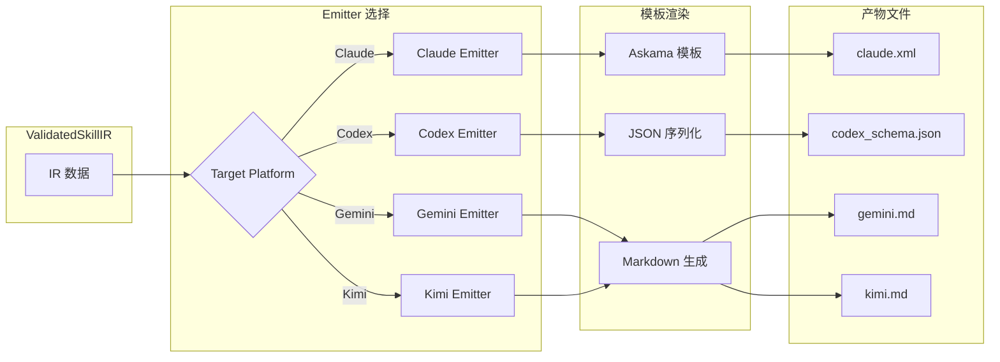

# 数据流图

> **Nexa Skill Compiler 数据在各阶段之间的流动**

---

## 完整数据流

---

## SkillIR 数据结构流

---

## 错误数据流

---

## 安全数据流

---

## 产物生成数据流

---

## 相关文档

- [ARCHITECTURE.md](../ARCHITECTURE.md) - 系统架构总览
- [IR_DESIGN.md](../IR_DESIGN.md) - 中间表示设计
- [COMPILER_PIPELINE.md](../COMPILER_PIPELINE.md) - 编译管线详细设计
- [SECURITY_MODEL.md](../SECURITY_MODEL.md) - 安全模型设计