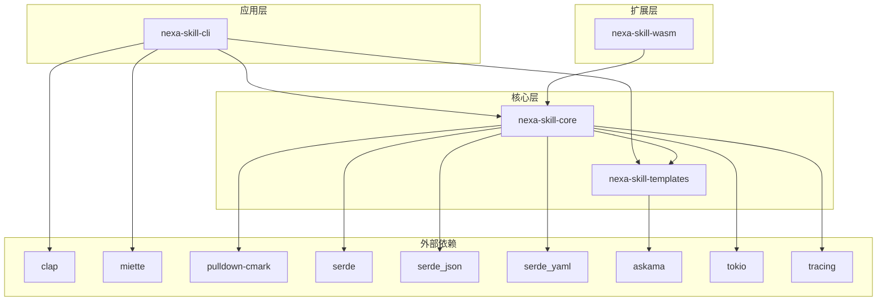
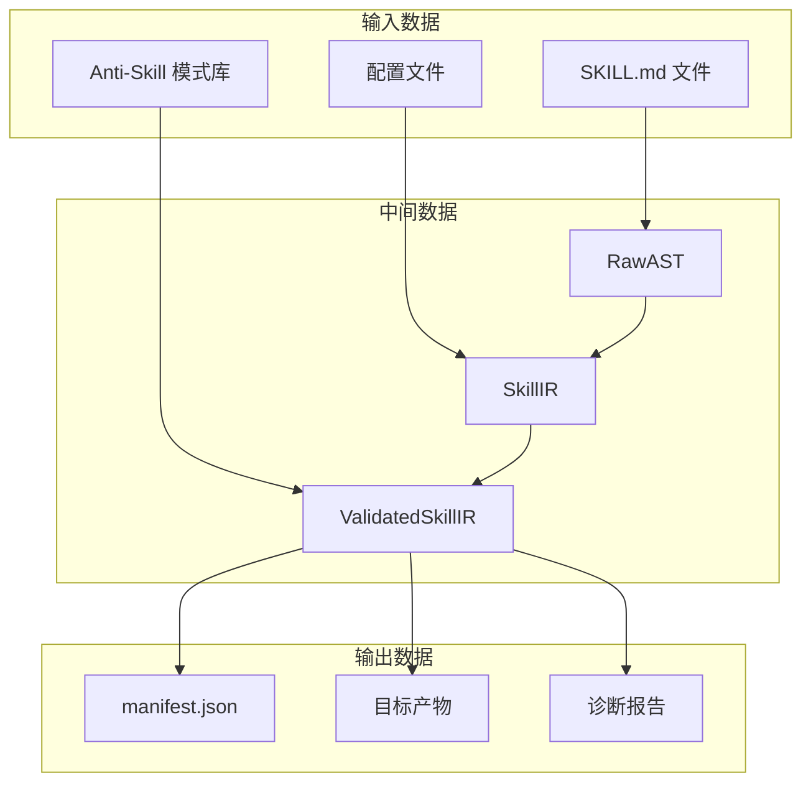
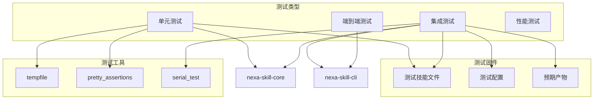

# 模块依赖关系图

> **Nexa Skill Compiler 各模块之间的依赖关系**

---

## Crate 依赖关系



---

## 核心模块依赖

```mermaid
graph LR
    subgraph "Frontend"
        FM[frontmatter]
        MD[markdown]
        AST[ast]
    end
    
    subgraph "IR"
        IR[skill_ir]
        PROC[procedure]
        PERM[permission]
        CONS[constraint]
    end
    
    subgraph "Analyzer"
        SCH[schema]
        MCP[mcp]
        PAUD[permission]
        ANTI[anti_skill]
    end
    
    subgraph "Backend"
        EMIT[emitter]
        CLAUDE[claude]
        CODEX[codex]
        GEMINI[gemini]
    end
    
    subgraph "Security"
        SEC_LVL[level]
        SEC_PERM[permission]
        HITL[hitl]
    end
    
    subgraph "Error"
        DIAG[diagnostic]
        CODES[codes]
    end
    
    FM --> AST
    MD --> AST
    AST --> IR
    
    IR --> PROC
    IR --> PERM
    IR --> CONS
    
    IR --> SCH
    IR --> MCP
    IR --> PAUD
    IR --> ANTI
    
    IR --> EMIT
    EMIT --> CLAUDE
    EMIT --> CODEX
    EMIT --> GEMINI
    
    IR --> SEC_LVL
    IR --> SEC_PERM
    IR --> HITL
    
    AST --> DIAG
    IR --> DIAG
    ANTI --> DIAG
```

---

## 数据流依赖



---

## 测试依赖



---

## 相关文档

- [ARCHITECTURE.md](../ARCHITECTURE.md) - 系统架构总览
- [DEVELOPMENT_GUIDE.md](../DEVELOPMENT_GUIDE.md) - 开发指南
- [TESTING_STRATEGY.md](../TESTING_STRATEGY.md) - 测试策略